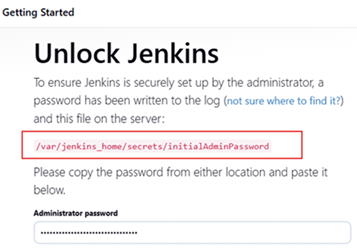
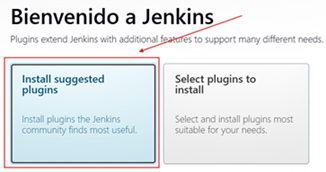
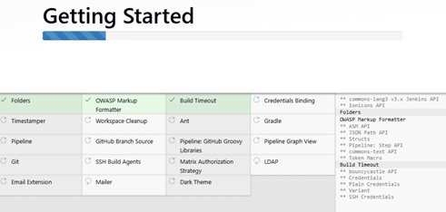
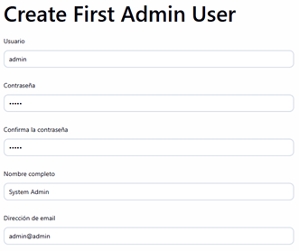
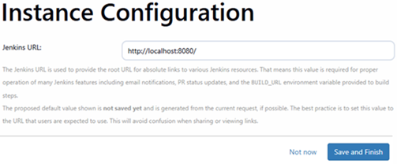
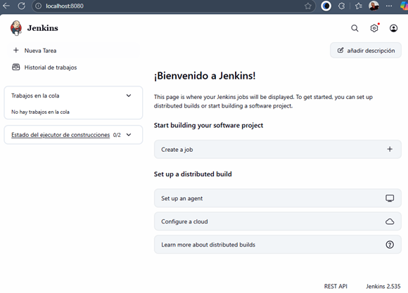

# 📦 Sección 3: Instalación y teoría de Jenkins

---

## 🧠 ¿Qué es Jenkins?

`Jenkins` es un `servidor de automatización de código abierto` ampliamente utilizado para implementar prácticas de
`Integración Continua (CI)` y `Entrega/Despliegue Continuo (CD)`.

Permite automatizar tareas como la compilación, prueba, empaquetado, análisis de calidad y despliegue de aplicaciones.

### 🔍 Características clave

- 🛠️ `Herramienta CI/CD de código abierto`, escrita completamente en Java.
- 🧩 Ofrece más de 1800 plugins para integrar con herramientas como Git, Maven, Docker, SonarQube, Kubernetes, Slack,
  entre otros.
- 💡 Permite automatizar tareas como:
    - Compilación de código (`Build`).
    - Ejecución de pruebas (`Test`).
    - Análisis de calidad (`Code Quality`).
    - Empaquetado y despliegue (`Package & Deploy`).
- 🌐 Accesible vía navegador en http://localhost:8080 (por defecto).
- 💰 Totalmente gratuito, mantenido por la comunidad y la Fundación Jenkins.

### 🚀 ¿Por qué usar Jenkins?

`Jenkins` es ideal para equipos que buscan:

- Automatizar el ciclo de vida de desarrollo.
- Detectar errores rápidamente mediante pipelines de CI.
- Preparar artefactos listos para producción (`Entrega Continua`).
- Desplegar automáticamente en ambientes reales (`Despliegue Continuo`).
- Integrarse con herramientas corporativas y flujos DevOps.

### 📌 En resumen

> `Jenkins` es una herramienta de automatización que permite construir, probar y entregar software de forma confiable,
> repetible y escalable.

## 🐳 Instalación de Jenkins en Docker

En esta sección instalaremos `Jenkins` utilizando `Docker`, que es la forma más común y recomendada en entornos de
desarrollo modernos. Esta aproximación nos permite:

- ✅ Tener Jenkins ejecutándose en minutos.
- ✅ Aislar Jenkins del sistema operativo host.
- ✅ Facilitar la portabilidad entre diferentes máquinas.
- ✅ Simplificar actualizaciones y mantenimiento.

#### 📚 Fuentes oficiales consultadas

> - [Imagen oficial de Jenkins en Docker Hub](https://hub.docker.com/r/jenkins/jenkins)
> - [Documentación de Jenkins en GitHub](https://github.com/jenkinsci/docker/blob/master/README.md)
> - [Página oficial de Jenkins](https://www.jenkins.io/)

### 🧰 Configuración del Docker Compose

En nuestro proyecto `jenkins-guide` creamos el archivo de configuración en la ruta `docker/compose.yml` con el siguiente
contenido:

````yml
services:
  s-jenkins:
    image: jenkins/jenkins:2.535-jdk21
    container_name: c-jenkins
    restart: unless-stopped
    ports:
      - '8080:8080'     # 🌐 Acceso web a Jenkins
      - '50000:50000'   # 🔗 Comunicación con agentes remotos
    volumes:
      - jenkins_home:/var/jenkins_home
      - /var/run/docker.sock:/var/run/docker.sock
    networks:
      - jenkins-net

volumes:
  jenkins_home:
    name: jenkins_home

networks:
  jenkins-net:
    name: jenkins-net
````

📋 Explicación detallada de la configuración

- Puerto `8080:8080`
    - Puerto principal de la `interfaz web de Jenkins`.
    - Aquí accederás a Jenkins desde tu navegador: `http://localhost:8080`
    - Es donde configurarás `jobs`, verás `pipelines`, revisarás `logs`, etc.
- Puerto `50000:50000`
    - Puerto usado para la comunicación con agentes Jenkins (Jenkins agents/slaves).
    - Permite que nodos adicionales se conecten al master Jenkins para ejecutar trabajos de forma distribuida.
    - Útil cuando necesitas escalar horizontalmente (múltiples máquinas ejecutando builds en paralelo).
    - 🏢 En empresas: Es común tener un Jenkins master (controlador) y varios agents (nodos workers) para distribuir la
      carga de trabajo. El puerto 50000 facilita esta comunicación.
- Named Volume: `jenkins_home:/var/jenkins_home`
    - `jenkins_home`: Volumen con nombre gestionado por Docker.
    - `/var/jenkins_home`: Directorio dentro del contenedor donde `Jenkins` almacena toda su información.
    - ⚠️ `Importante`: Si eliminas el contenedor pero conservas este volumen, no perderás tu configuración de Jenkins.
      Puedes recrear el contenedor y todo seguirá funcionando.
- Bind Mount: `/var/run/docker.sock:/var/run/docker.sock`
    - Este es uno de los conceptos más importantes para entender cómo `Jenkins` puede interactuar con `Docker`.
    - El archivo `/var/run/docker.sock` en tu máquina es el canal de comunicación entre el cliente Docker y el daemon
      Docker.
    - Al montar el socket Docker `(/var/run/docker.sock)` del host dentro del contenedor de Jenkins, estás dándole a
      Jenkins la capacidad de comunicarse directamente con el Docker daemon del host. Esto significa que Jenkins
      (corriendo dentro de un contenedor) puede:
        - ✅ Construir imágenes Docker: `docker build -t mi-app:1.0 .`
        - ✅ Ejecutar contenedores: `docker run -d mi-app:1.0`
        - ✅ Listar contenedores: `docker container ls`
        - ✅ Eliminar contenedores/imágenes
        - ✅ Ejecutar `Docker Compose`.
    - Es como si Jenkins estuviera instalado directamente en tu máquina host, con acceso total a Docker.

### 📁 ¿Dónde está `/var/run/docker.sock` si estás en Windows?

En sistemas Linux, ese archivo existe físicamente en `/var/run/docker.sock`. Pero en Windows, especialmente si usas
`Docker Desktop`, el entorno es diferente:

#### ¿Qué pasa en Windows?

- Docker Desktop para Windows corre sobre una máquina virtual ligera (WSL2 o Hyper-V).
- El archivo `/var/run/docker.sock` no está en tu sistema de archivos Windows directamente  (no en `C:\` ni `D:\`),
  sino dentro de esa `VM` de `WSL2` que Docker Desktop gestiona automáticamente.
- Cuando usas Docker Compose en Windows, `Docker Desktop` emula esa ruta para que el `bind mount` funcione como si
  estuvieras en Linux.

> ✅ `Conclusión`: Aunque no veas `/var/run/docker.sock` en tu disco `C:`, `Docker Desktop` lo expone virtualmente para
> que puedas usarlo en bind mounts como si estuvieras en Linux.
>
> Por eso esta línea funciona igual en Windows, Mac y Linux: `/var/run/docker.sock:/var/run/docker.sock`.
>
> 💡 `En la práctica`: No necesitas hacer nada especial en Windows. Docker Desktop se encarga de todo automáticamente.

### 📌 Diferencia entre volumen y bind mount

| Tipo         | ¿Qué es?                                     | Ejemplo                                      | ¿Quién lo gestiona?       |
|--------------|----------------------------------------------|----------------------------------------------|---------------------------|
| `Bind mount` | Montaje directo de una ruta del host         | `/var/run/docker.sock:/var/run/docker.sock ` | Tú lo defines manualmente |
| `Volume`     | Área gestionada por Docker para persistencia | `jenkins_home:/var/jenkins_home`             | Docker lo crea y gestiona |

#### 🧠 Nota técnica sobre bind mounts en Windows

> En Windows, los `bind mounts` usan rutas como `D:\data:/app/data`. Sin embargo, rutas como `/var/run/docker.sock`
> funcionan porque `Docker Desktop` las emula internamente para permitir acceso al daemon Docker desde contenedores.

## 🚀 Levantando el contenedor de Jenkins

En esta sección ejecutamos nuestro archivo `compose.yml` para levantar el contenedor de `Jenkins` y completar la
configuración inicial desde el navegador.

### 🐳 Paso 1: Ejecutar Docker Compose

Desde la raíz del proyecto, ejecutamos el siguiente comando:

````bash
D:\programming\jenkins\jenkins-guide (section-03)
$ docker compose -f ./docker/compose.yml up -d   
[+] Running 13/13                                
 ✔ s-jenkins Pulled                              
...                
[+] Running 3/3                                  
 ✔ Network jenkins-net  Created                  
 ✔ Volume jenkins_home  Created                  
 ✔ Container c-jenkins  Started                   
````

📦 Esto realiza las siguientes acciones:

- Descarga la imagen `jenkins/jenkins:2.535-jdk21`.
- Crea la red `jenkins-net`.
- Crea el volumen persistente `jenkins_home`.
- Inicia el contenedor `c-jenkins`.

### 🔍 Paso 2: Verificar que Jenkins está corriendo

Listamos los contenedores activos:

````bash
$ docker container ls -a
CONTAINER ID   IMAGE                         COMMAND                  CREATED              STATUS          PORTS                                                                                          NAMES
b0398924ad26   jenkins/jenkins:2.535-jdk21   "/usr/bin/tini -- /u…"   About a minute ago   Up 49 seconds   0.0.0.0:8080->8080/tcp, [::]:8080->8080/tcp, 0.0.0.0:50000->50000/tcp, [::]:50000->50000/tcp   c-jenkins 
````

### 🔐 Paso 3: Obtener la contraseña inicial de administrador

`Jenkins` genera una contraseña temporal para el primer acceso. Podemos obtenerla de dos formas:

#### Opción A: Comando directo

````bash
D:\programming\jenkins\jenkins-guide (section-03)
$ docker container exec c-jenkins cat /var/jenkins_home/secrets/initialAdminPassword
69ad09721dc649bb81a1a1394a9fc78b
````

#### Opción B: Acceder al contenedor manualmente

````bash
D:\programming\jenkins\jenkins-guide (section-03)
$ docker container exec -it c-jenkins /bin/sh
$ cd /var/jenkins_home/secrets/
$ ls -l
total 16
-rw-r--r-- 1 jenkins jenkins  48 Nov  6 17:54 hudson.model.User.DIRNAMES
-rw-r----- 1 jenkins jenkins  33 Nov  6 17:54 initialAdminPassword
-rw-r--r-- 1 jenkins jenkins  32 Nov  6 17:54 jenkins.model.Jenkins.crumbSalt
-rw-r--r-- 1 jenkins jenkins 256 Nov  6 17:54 master.key
$ cat initialAdminPassword
69ad09721dc649bb81a1a1394a9fc78b
````

📁 Este archivo contiene la contraseña que `Jenkins` nos pedirá al ingresar por primera vez.

### 🌐 Paso 4: Acceder a Jenkins desde el navegador

Abrimos http://localhost:8080 y veremos la pantalla de desbloqueo:



Ingresamos la contraseña obtenida en el paso anterior y continuamos.

### 🔌 Paso 5: Instalar plugins recomendados

`Jenkins` nos da dos opciones:

- Instalar plugins recomendados ✅
- Seleccionar plugins manualmente

Seleccionamos la primera opción:



🔄 Esperamos a que finalice la instalación:



### 👤 Paso 6: Crear usuario administrador

Luego de finalizada la instalación de los plugins, nos mostrará una interfaz para poder crear un usuario administrador.
En mi caso usaré la siguiente información:

````bash
usuario: admin
contraseña: admin
Nombre completo: System Admin
Dirección de email: admin@admin
````



### 🔗 Paso 7: Confirmar URL y finalizar

`Jenkins` nos muestra la URL base del servidor `http://localhost:8080`. Confirmamos y finalizamos:



### ✅ Paso 8: Jenkins está listo

Vemos la pantalla de bienvenida:


Al hacer clic en Start using Jenkins, accedemos al panel principal:



### 🧠 Notas técnicas

- El archivo `initialAdminPassword` se genera automáticamente en el volumen `jenkins_home`.
- Si reinicias el contenedor, `Jenkins` conservará la configuración gracias al volumen persistente.
- Puedes acceder al contenedor en cualquier momento con `docker container exec -it c-jenkins /bin/sh`.
