# 📘 Sección 4: Empecemos con Jenkins

---

## 🏗️ Arquitectura de Jenkins

`Jenkins` se basa en una arquitectura distribuida que permite ejecutar tareas de automatización en distintos nodos. A
continuación, se describen sus componentes principales.

### ⚙️ Jenkins Job

Un `Job en Jenkins` es una unidad de trabajo automatizada que puede realizar tareas como:

- Compilar código
- Ejecutar pruebas
- Generar artefactos
- Desplegar aplicaciones

Los `Jobs` son definidos por el usuario y supervisados por `Jenkins`. Por ejemplo, podríamos tener un `job` que realice
las siguientes tareas de forma automática:

1. Descargar el código fuente desde GitHub.
2. Ejecutar `mvn clean package` para compilar y generar el `.jar`.
3. Construir una imagen Docker con tu aplicación.
4. Ejecutar pruebas automatizadas o desplegar la app en un entorno de pruebas.

📌 `Objetivo principal`: automatizar tareas repetitivas del ciclo de vida del desarrollo.

### 🧭 Cambios de terminología en Jenkins

| **Término antiguo** | **Nuevo término (actual)** | **Descripción actualizada**                                                                                                                              |
|---------------------|----------------------------|----------------------------------------------------------------------------------------------------------------------------------------------------------|
| `Master`            | **Controller**             | Es la instancia principal de Jenkins que orquesta y coordina la ejecución de *jobs*. Se encarga de programar, asignar tareas y gestionar los resultados. |
| `Slave`             | **Agent**                  | Es una máquina (física, virtual o contenedor) que realiza los *builds* o tareas que el *controller* le asigna.                                           |
| `Build Node`        | **Node**                   | Hace referencia genérica tanto al *controller* como a los *agents*.                                                                                      |
| `Build Executor`    | **Executor**               | Permite ejecutar uno o varios *jobs* en paralelo dentro de un nodo.                                                                                      |

### 🧠 Jenkins Controller (antes “Master”)

El `Controller` (anteriormente llamado `“Master”`) es el núcleo de `Jenkins`. Sus responsabilidades incluyen:

- Programar y coordinar los Jobs
- Asignar tareas a los agentes disponibles
- Supervisar la ejecución y registrar los resultados
- Ejecutar Jobs si no hay agentes disponibles

`Nota moderna`: Aunque históricamente se usaban los términos `“master”` y `“slave”`, `Jenkins` ha adoptado los
términos `controller` y `agent` para promover una terminología más inclusiva y clara.

### 🖥️ Jenkins Agent (antes “Slave”)

Un `Agent` es una máquina (física o virtual) que `ejecuta los Jobs` asignados por el Controller. Puede ser:

- Un contenedor Docker
- Una VM Linux
- Un servidor remoto

📦 Ejemplo típico:

> Un Agent con entorno Java configurado que se encarga exclusivamente de compilar proyectos Spring Boot o ejecutar
> pruebas de integración.

### 🔄 Jenkins Executor

Un `Executor` es una `unidad de ejecución dentro de un Agent`. Permite ejecutar múltiples `Jobs` en paralelo en el
mismo nodo.

- Cada `Agent` puede tener uno o más `Executors`.
- Si un Agent tiene 2 Executors, puede ejecutar 2 Jobs simultáneamente.

En nuestro entorno local (`Docker Desktop`), el contenedor `Jenkins` normalmente tiene 1 executor por defecto.

### 🧩 Plugins de Jenkins

Los `plugins` son extensiones que amplían la funcionalidad de `Jenkins`. Existen más de 1800 plugins disponibles para:

- Integración con Git, Maven, Docker, Slack, SonarQube, etc.
- Visualización de resultados
- Gestión de credenciales
- Seguridad y autenticación

Los plugins son clave para adaptar Jenkins a cualquier flujo DevOps moderno.

### 🧭 Resumen visual

````bash
+------------------------------------+
|      Jenkins Controller (Master)   |
|        (Orquesta y coordina)       |
+---------------+--------------------+
                |
                v
+---------------+--------------------+
|      Jenkins Agent (Slave)         |
|      (Ejecuta los builds)          |
+---------------+--------------------+
                |
                v
+---------------+--------------------+
|       Jenkins Executors            |
|       (Jobs en paralelo)           |
+---------------+--------------------+
````

Aunque en la documentación o interfaces antiguas aún veas `“master”` o `“slave”`, en la documentación oficial de
`Jenkins` y en las versiones recientes (2.3xx en adelante), el lenguaje correcto es:

````bash
controller + Agent architecture
````

## 🚀 Primer Job en Jenkins

En esta lección crearemos nuestro `primer Job (tarea)` en `Jenkins`, para comprender el flujo básico de creación,
ejecución y revisión de resultados.

### 🧩 Creación del Job

En el panel principal de `Jenkins`, seleccionamos `“Nueva tarea”` o `“New Item”`.

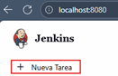

Escribimos un nombre para nuestro Job (`Primer Job del Curso`) y seleccionamos el tipo
`Crear un proyecto de estilo libre`.

💡 ¿Qué es un proyecto de estilo libre?
> Es el tipo de proyecto más básico en `Jenkins`. Permite ejecutar comandos o scripts (`shell`, `batch`, etc.) y
> configurar manualmente todo el flujo sin necesidad de usar un `Jenkinsfile` o un `pipeline declarativo`.
> Es ideal para comenzar a familiarizarse con la herramienta.

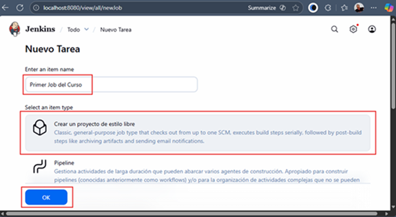

Al hacer clic en `OK`, accedemos a la configuración del `Job`. En el campo de `Descripción`, agregamos un texto
explicativo como: `Primer Job del curso de Jenkins`.


A continuación nos vamos al final de la página y en la sección `Build Steps` seleccionamos `Ejecutar línea de comandos
(shell)`.

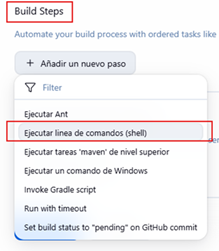

Se abrirá un campo donde podemos ingresar comandos como si estuviéramos en una terminal. En este ejemplo, escribimos un
comando para imprimir un mensaje.

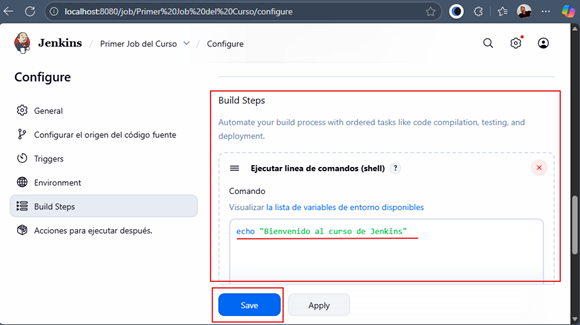

Al hacer clic en `Guardar`, `Jenkins` nos lleva a la página principal del `Job` recién creado.

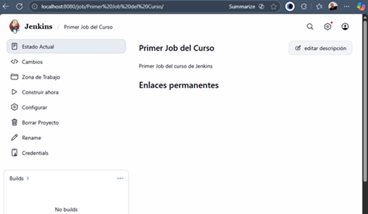

Para lanzar el `Job`, hacemos clic en `“Construir ahora”.` Veremos una ejecución registrada en la parte inferior con
su fecha y estado.

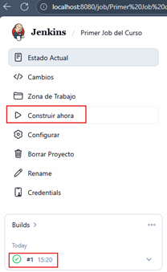

Hacemos clic en el ícono de ejecución y seleccionamos `“Console Output”` para ver el resultado del comando.

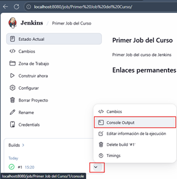

La salida muestra el mensaje que escribimos en el paso anterior.

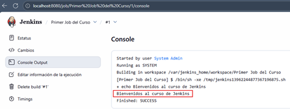

🧠 Nota técnica
> `Jenkins` genera un script temporal con los comandos definidos y lo ejecuta internamente.
> Ejemplo: `/tmp/jenkins13962244877367196875.sh`

Finalmente, si vamos al panel de control veremos los detalles de la ejecución de nuestro job con los siguientes
detalles:

- Tiempo desde la última ejecución exitosa.
- Número total de ejecuciones.
- Último fallo (si lo hubo).
- Duración de la última ejecución.

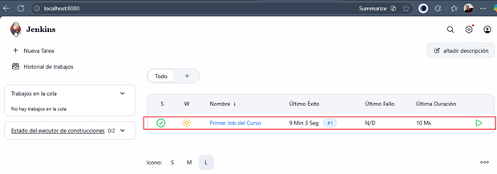

### 💡 Conclusión

> Con este primer ejercicio, comprobamos que `Jenkins` puede ejecutar comandos directamente dentro de su entorno. En
> adelante, reemplazaremos estos comandos por scripts más avanzados que construyan, prueben y desplieguen aplicaciones
> reales.

## ✏️ Modificando el comando del Job

En esta lección aprenderemos cómo editar un Job existente para actualizar los comandos que ejecuta.

### 🔧 Editando la configuración

Desde el panel principal de `Jenkins`, ingresamos al Job `“Primer Job del curso”` y hacemos clic en la opción
`“Configurar” (Configure)`.

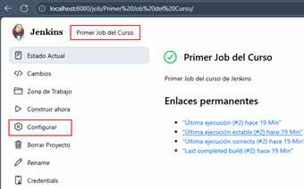

Nos desplazamos hasta la sección `“Build Steps”` (Pasos de construcción) y modificamos el comando anterior por el
siguiente:

````bash
date +"%T"
````

Este comando imprimirá la hora actual en formato de `24 horas (HH:MM:SS)`.

Hacemos clic en `“Guardar (Save)”` para aplicar los cambios.

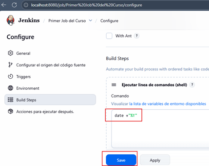

### ▶️ Ejecutando nuevamente el Job

- Desde la página principal del Job, seleccionamos `“Construir ahora (Build Now)”` para lanzar una nueva ejecución.
- Veremos una nueva entrada en el historial de builds (por ejemplo, `#5 16:15` si ya hemos ejecutado varias veces).
- Ingresamos a esa ejecución y abrimos la opción `“Console Output”` para revisar la salida.

Allí veremos el resultado exitoso mostrando la hora actual:

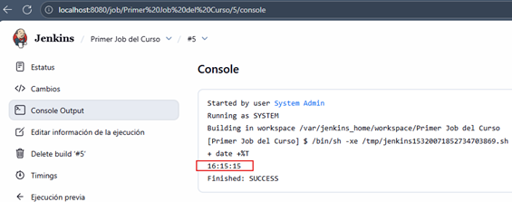

💡 Nota

> Con este ejercicio comprobamos que `Jenkins` no solo permite ejecutar comandos simples, sino también editar
> y versionar fácilmente los pasos de ejecución de un Job.  
> Esta flexibilidad será clave cuando más adelante definamos pipelines automatizados con múltiples etapas.