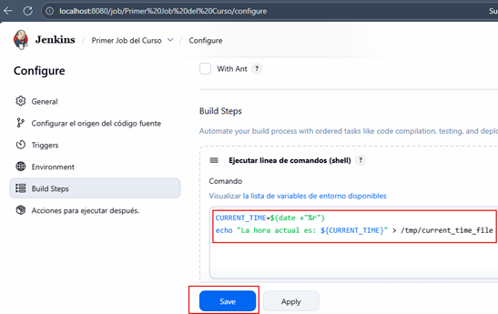
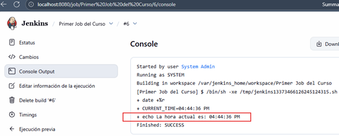
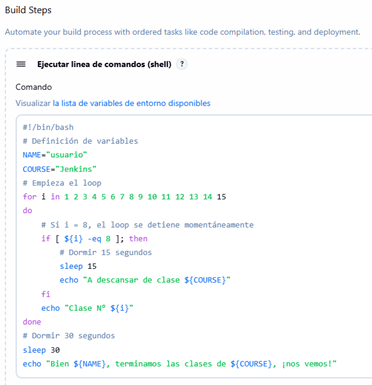
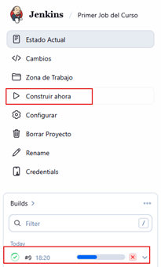
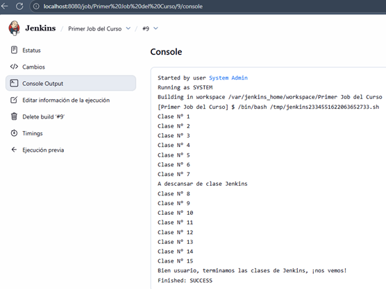

# 📘 Sección 4: Empecemos con Jenkins

---

## 🏗️ Arquitectura de Jenkins

`Jenkins` se basa en una arquitectura distribuida que permite ejecutar tareas de automatización en distintos nodos. A
continuación, se describen sus componentes principales.

### ⚙️ Jenkins Job

Un `Job en Jenkins` es una unidad de trabajo automatizada que puede realizar tareas como:

- Compilar código
- Ejecutar pruebas
- Generar artefactos
- Desplegar aplicaciones

Los `Jobs` son definidos por el usuario y supervisados por `Jenkins`. Por ejemplo, podríamos tener un `job` que realice
las siguientes tareas de forma automática:

1. Descargar el código fuente desde GitHub.
2. Ejecutar `mvn clean package` para compilar y generar el `.jar`.
3. Construir una imagen Docker con tu aplicación.
4. Ejecutar pruebas automatizadas o desplegar la app en un entorno de pruebas.

📌 `Objetivo principal`: automatizar tareas repetitivas del ciclo de vida del desarrollo.

### 🧭 Cambios de terminología en Jenkins

| **Término antiguo** | **Nuevo término (actual)** | **Descripción actualizada**                                                                                                                              |
|---------------------|----------------------------|----------------------------------------------------------------------------------------------------------------------------------------------------------|
| `Master`            | **Controller**             | Es la instancia principal de Jenkins que orquesta y coordina la ejecución de *jobs*. Se encarga de programar, asignar tareas y gestionar los resultados. |
| `Slave`             | **Agent**                  | Es una máquina (física, virtual o contenedor) que realiza los *builds* o tareas que el *controller* le asigna.                                           |
| `Build Node`        | **Node**                   | Hace referencia genérica tanto al *controller* como a los *agents*.                                                                                      |
| `Build Executor`    | **Executor**               | Permite ejecutar uno o varios *jobs* en paralelo dentro de un nodo.                                                                                      |

### 🧠 Jenkins Controller (antes “Master”)

El `Controller` (anteriormente llamado `“Master”`) es el núcleo de `Jenkins`. Sus responsabilidades incluyen:

- Programar y coordinar los Jobs
- Asignar tareas a los agentes disponibles
- Supervisar la ejecución y registrar los resultados
- Ejecutar Jobs si no hay agentes disponibles

`Nota moderna`: Aunque históricamente se usaban los términos `“master”` y `“slave”`, `Jenkins` ha adoptado los
términos `controller` y `agent` para promover una terminología más inclusiva y clara.

### 🖥️ Jenkins Agent (antes “Slave”)

Un `Agent` es una máquina (física o virtual) que `ejecuta los Jobs` asignados por el Controller. Puede ser:

- Un contenedor Docker
- Una VM Linux
- Un servidor remoto

📦 Ejemplo típico:

> Un Agent con entorno Java configurado que se encarga exclusivamente de compilar proyectos Spring Boot o ejecutar
> pruebas de integración.

### 🔄 Jenkins Executor

Un `Executor` es una `unidad de ejecución dentro de un Agent`. Permite ejecutar múltiples `Jobs` en paralelo en el
mismo nodo.

- Cada `Agent` puede tener uno o más `Executors`.
- Si un Agent tiene 2 Executors, puede ejecutar 2 Jobs simultáneamente.

En nuestro entorno local (`Docker Desktop`), el contenedor `Jenkins` normalmente tiene 1 executor por defecto.

### 🧩 Plugins de Jenkins

Los `plugins` son extensiones que amplían la funcionalidad de `Jenkins`. Existen más de 1800 plugins disponibles para:

- Integración con Git, Maven, Docker, Slack, SonarQube, etc.
- Visualización de resultados
- Gestión de credenciales
- Seguridad y autenticación

Los plugins son clave para adaptar Jenkins a cualquier flujo DevOps moderno.

### 🧭 Resumen visual

````bash
+------------------------------------+
|      Jenkins Controller (Master)   |
|        (Orquesta y coordina)       |
+---------------+--------------------+
                |
                v
+---------------+--------------------+
|      Jenkins Agent (Slave)         |
|      (Ejecuta los builds)          |
+---------------+--------------------+
                |
                v
+---------------+--------------------+
|       Jenkins Executors            |
|       (Jobs en paralelo)           |
+---------------+--------------------+
````

Aunque en la documentación o interfaces antiguas aún veas `“master”` o `“slave”`, en la documentación oficial de
`Jenkins` y en las versiones recientes (2.3xx en adelante), el lenguaje correcto es:

````bash
controller + Agent architecture
````

## 🚀 Primer Job en Jenkins

En esta lección crearemos nuestro `primer Job (tarea)` en `Jenkins`, para comprender el flujo básico de creación,
ejecución y revisión de resultados.

### 🧩 Creación del Job

En el panel principal de `Jenkins`, seleccionamos `“Nueva tarea”` o `“New Item”`.


Escribimos un nombre para nuestro Job (`Primer Job del Curso`) y seleccionamos el tipo
`Crear un proyecto de estilo libre`.

💡 ¿Qué es un proyecto de estilo libre?
> Es el tipo de proyecto más básico en `Jenkins`. Permite ejecutar comandos o scripts (`shell`, `batch`, etc.) y
> configurar manualmente todo el flujo sin necesidad de usar un `Jenkinsfile` o un `pipeline declarativo`.
> Es ideal para comenzar a familiarizarse con la herramienta.


Al hacer clic en `OK`, accedemos a la configuración del `Job`. En el campo de `Descripción`, agregamos un texto
explicativo como: `Primer Job del curso de Jenkins`.


A continuación nos vamos al final de la página y en la sección `Build Steps` seleccionamos `Ejecutar línea de comandos
(shell)`.


Se abrirá un campo donde podemos ingresar comandos como si estuviéramos en una terminal. En este ejemplo, escribimos un
comando para imprimir un mensaje.


Al hacer clic en `Guardar`, `Jenkins` nos lleva a la página principal del `Job` recién creado.


Para lanzar el `Job`, hacemos clic en `“Construir ahora”.` Veremos una ejecución registrada en la parte inferior con
su fecha y estado.


Hacemos clic en el ícono de ejecución y seleccionamos `“Console Output”` para ver el resultado del comando.


La salida muestra el mensaje que escribimos en el paso anterior.


🧠 Nota técnica
> `Jenkins` genera un script temporal con los comandos definidos y lo ejecuta internamente.
> Ejemplo: `/tmp/jenkins13962244877367196875.sh`

Finalmente, si vamos al panel de control veremos los detalles de la ejecución de nuestro job con los siguientes
detalles:

- Tiempo desde la última ejecución exitosa.
- Número total de ejecuciones.
- Último fallo (si lo hubo).
- Duración de la última ejecución.


### 💡 Conclusión

> Con este primer ejercicio, comprobamos que `Jenkins` puede ejecutar comandos directamente dentro de su entorno. En
> adelante, reemplazaremos estos comandos por scripts más avanzados que construyan, prueben y desplieguen aplicaciones
> reales.

## ✏️ Modificando el comando del Job

En esta lección aprenderemos cómo editar un Job existente para actualizar los comandos que ejecuta.

### 🔧 Editando la configuración

Desde el panel principal de `Jenkins`, ingresamos al Job `“Primer Job del curso”` y hacemos clic en la opción
`“Configurar” (Configure)`.


Nos desplazamos hasta la sección `“Build Steps”` (Pasos de construcción) y modificamos el comando anterior por el
siguiente:

````bash
date +"%T"
````

Este comando imprimirá la hora actual en formato de `24 horas (HH:MM:SS)`.

Hacemos clic en `“Guardar (Save)”` para aplicar los cambios.


### ▶️ Ejecutando nuevamente el Job

- Desde la página principal del Job, seleccionamos `“Construir ahora (Build Now)”` para lanzar una nueva ejecución.
- Veremos una nueva entrada en el historial de builds (por ejemplo, `#5 16:15` si ya hemos ejecutado varias veces).
- Ingresamos a esa ejecución y abrimos la opción `“Console Output”` para revisar la salida.

Allí veremos el resultado exitoso mostrando la hora actual:


💡 Nota

> Con este ejercicio comprobamos que `Jenkins` no solo permite ejecutar comandos simples, sino también editar
> y versionar fácilmente los pasos de ejecución de un Job.  
> Esta flexibilidad será clave cuando más adelante definamos pipelines automatizados con múltiples etapas.

## 🧩 Agregando variables a nuestro Job

En esta lección haremos uso de variables dentro de un `Job de Jenkins`, para almacenar información temporal y
reutilizarla dentro de los comandos ejecutados en el `build step`.

### 🧱 Modificando el comando del Job

Ingresamos nuevamente al Job `“Primer Job del Curso”` y seleccionamos la opción `“Configurar”`.
En la sección `Build Steps`, reemplazamos el comando anterior por el siguiente script:

````bash
CURRENT_TIME=$(date +"%r")
echo "La hora actual es: ${CURRENT_TIME}" > /tmp/current_time_file 
````



⚙️ Explicación técnica

- `CURRENT_TIME=$(date +"%r")`. Captura la hora actual del sistema en formato de `12 horas (AM/PM)`.
- `echo "La hora actual es: ${CURRENT_TIME}" > /tmp/current_time_file`. Imprime el mensaje con la hora y redirige la
  salida al archivo `/tmp/current_time_file` dentro del contenedor de `Jenkins`.

> 💡 `Nota`: El uso de variables en los comandos shell dentro de `Jenkins` permite construir scripts más dinámicos y
> reutilizables, una práctica común cuando se parametrizan builds más complejos.

### Ejecutando el Job

Guardamos los cambios y hacemos clic en `“Construir ahora”`. Luego, ingresamos al registro de la ejecución y
seleccionamos `“Console Output”`.



Como vemos, la salida en consola será similar a la siguiente:

````bash
Started by user System Admin
Running as SYSTEM
Building in workspace /var/jenkins_home/workspace/Primer Job del Curso
[Primer Job del Curso] $ /bin/sh -xe /tmp/jenkins13373466126245124315.sh
+ date +%r
+ CURRENT_TIME=04:44:36 PM
+ echo La hora actual es: 04:44:36 PM
Finished: SUCCESS 
````

### 📂 Verificando el archivo generado

Como el comando redirige la salida al archivo `/tmp/current_time_file`, debemos ingresar al contenedor de `Jenkins`
para comprobar que fue creado correctamente:

````bash
$ docker container exec -it c-jenkins /bin/sh
$ ls -l
total 48
lrwxrwxrwx   1 root root    7 Aug 24 16:20 bin -> usr/bin
drwxr-xr-x   2 root root 4096 Aug 24 16:20 boot
drwxr-xr-x   5 root root  340 Nov 10 14:49 dev
drwxr-xr-x   1 root root 4096 Nov  7 22:10 etc
drwxr-xr-x   2 root root 4096 Aug 24 16:20 home
lrwxrwxrwx   1 root root    7 Aug 24 16:20 lib -> usr/lib
lrwxrwxrwx   1 root root    9 Aug 24 16:20 lib64 -> usr/lib64
drwxr-xr-x   2 root root 4096 Oct 20 00:00 media
drwxr-xr-x   2 root root 4096 Oct 20 00:00 mnt
drwxr-xr-x   1 root root 4096 Nov  4 14:30 opt
dr-xr-xr-x 242 root root    0 Nov 10 14:49 proc
drwx------   1 root root 4096 Nov  4 14:29 root
drwxr-xr-x   1 root root 4096 Nov  4 14:29 run
lrwxrwxrwx   1 root root    8 Aug 24 16:20 sbin -> usr/sbin
drwxr-xr-x   2 root root 4096 Oct 20 00:00 srv
dr-xr-xr-x  11 root root    0 Nov 10 14:49 sys
drwxrwxrwt   1 root root 4096 Nov 10 16:44 tmp
drwxr-xr-x   1 root root 4096 Oct 20 00:00 usr
drwxr-xr-x   1 root root 4096 Nov  4 14:29 var
$ cd tmp
$ ls -l
total 14264
-rw-r--r-- 1 jenkins jenkins      31 Nov 10 16:44 current_time_file
drwxr-xr-x 2 jenkins jenkins    4096 Nov 10 14:49 hsperfdata_jenkins
drwxr-xr-x 2 jenkins jenkins    4096 Nov 10 14:46 jetty-0_0_0_0-8080-war-_-any-15640770411439023241
drwxr-xr-x 2 jenkins jenkins    4096 Nov  7 22:10 jetty-0_0_0_0-8080-war-_-any-3268185369218364970
drwxr-xr-x 2 jenkins jenkins    4096 Nov 10 14:49 jetty-0_0_0_0-8080-war-_-any-7966640425464047279
-rw-r--r-- 1 jenkins jenkins 4859617 Nov  7 22:10 winstone2345313983222269754.jar
-rw-r--r-- 1 jenkins jenkins 4859617 Nov 10 14:46 winstone4424607586868482556.jar
-rw-r--r-- 1 jenkins jenkins 4859617 Nov 10 14:49 winstone6653401717919977852.jar
$ cat current_time_file
La hora actual es: 04:44:36 PM
````

💡 Nota final

> `Jenkins` ejecuta los `Build Steps` en su propio entorno dentro del contenedor, por lo tanto, cualquier archivo
> generado (como `/tmp/current_time_file`) existe únicamente dentro del contenedor de `Jenkins`, a menos que se
> configure un volumen compartido para persistirlo o exportarlo.

## 🚀 Job v2.0 — Creando un Script más Complejo

En esta lección llevaremos nuestro primer `Job` de `Jenkins` a un siguiente nivel. Modificaremos el comando anterior
para ejecutar un `script de shell` más completo, que incluye variables, bucles, condicionales y pausas controladas
`(sleep`).

### 🧩 Script de ejemplo

````bash
#!/bin/bash 

# Definición de variables
NAME="usuario"
COURSE="Jenkins"

# Empieza el loop
for i in 1 2 3 4 5 6 7 8 9 10 11 12 13 14 15
do
	# Si i = 8, el loop se detiene momentáneamente
    if [ ${i} -eq 8 ]; then
    	# Dormir 15 segundos
        sleep 15
        echo "A descansar de clase ${COURSE}"
    fi
    echo "Clase N° ${i}"
done

# Dormir 30 segundos
sleep 30
echo "Bien ${NAME}, terminamos las clases de ${COURSE}, ¡nos vemos!"
````

📸 Agregamos este script dentro del paso `Build Steps` → `Ejecutar línea de comandos (shell)`



### ⚙️ Desglose técnico del script

| Elemento                         | Descripción                                                                                                                                                                                 |
|----------------------------------|---------------------------------------------------------------------------------------------------------------------------------------------------------------------------------------------|
| `#!/bin/bash`                    | 🔹 Conocido como `shebang`, indica al sistema operativo que el script debe ser ejecutado con el intérprete **Bash**. Esto garantiza compatibilidad y control sobre la ejecución del script. |
| `for i in {1..15}`               | 🔁 Inicia un bucle que recorre los números del 1 al 15.                                                                                                                                     |
| `if [ ${i} -eq 8 ]; then ... fi` | ⚡ Estructura condicional que detiene momentáneamente la ejecución cuando `i` es igual a `8`.                                                                                                |
| `sleep 15` y `sleep 30`          | ⏱️ Detienen el flujo por un número determinado de segundos. Muy útil en pipelines donde se deben esperar respuestas de servicios externos.                                                  |
| `echo`                           | 🖨️ Imprime mensajes en la salida estándar (consola). Jenkins capturará estos mensajes y los mostrará en el `Console Output`.                                                               |

### ▶️ Ejecución del Job

Una vez guardado el script, haz clic en `“Construir ahora”`. Durante la ejecución verás una barra de progreso
dinámica, ya que el script contiene pausas (`sleep`) programadas.



Al finalizar, consulta el `Console Output`. Podrás ver cómo `Jenkins` ejecuta paso a paso el script con las variables
correctamente interpoladas:



### 💡 Diferencia entre `#!/bin/sh` y `#!/bin/bash`

| Intérprete    | Descripción                                                                                                | Uso recomendado                                            |
|---------------|------------------------------------------------------------------------------------------------------------|------------------------------------------------------------|
| `#!/bin/sh`   | Shell más básico y compatible con la mayoría de los sistemas Unix. Ideal para scripts simples y portables. | ✅ Scripts ligeros y universales.                           |
| `#!/bin/bash` | Versión extendida con soporte para arrays, condicionales avanzadas, globbing, autocompletado y funciones.  | 💪 Scripts complejos como los usados en Jenkins Pipelines. |

🧠 Conclusión
> En este caso usamos `#!/bin/bash` porque nos da acceso a estructuras de control más potentes y es el estándar de
> facto en entornos de automatización modernos.

### 🧱 En un entorno real (para desarrolladores Java/Spring Boot)

En equipos backend, scripts como este pueden servir para:

- Ejecutar tests automatizados antes de un build Maven.
- Limpiar directorios temporales o generar logs.
- Desplegar artefactos `.jar` en entornos de prueba.
- Controlar dependencias o pausar procesos hasta que un contenedor esté listo (por ejemplo, esperar a que una base de
  datos se levante antes de ejecutar pruebas de integración).

### 💼 Buena práctica

En pipelines reales, estos comandos no se escriben manualmente en cada `Job`. En su lugar, se centralizan en scripts
almacenados y versionados dentro del repositorio (por ejemplo, `scripts/build.sh`).

`Jenkins` clona el repositorio y ejecuta estos scripts como parte del proceso de construcción, garantizando así que la
lógica de build esté sincronizada con el código del proyecto.
