# ⚙️ Parametrizando Jenkins Jobs

---

## 🧩 Agregando parámetros

Iniciamos creando una `nueva vista`. La opción `"Nueva vista" (New View)` en el panel principal de `Jenkins` sirve para
*crear una página personalizada que agrupa y muestra un subconjunto específico de tus trabajos (`Jobs`).*

💡 Concepto clave:
> Una vista es una forma de `organizar y filtrar proyectos`, ideal cuando tienes muchos `Jobs` y deseas agruparlos
> según un equipo, propósito o entorno específico.

### ➕ Creación de la vista

Damos clic en el ícono del más `(+)`.


Asignamos un nombre —por ejemplo— `Jobs Parametrizados`. En la sección `Type` se nos presentan dos opciones:

- 🧾 `Lista de vistas`: muestra proyectos en formato de lista.
- 🔒 `Mi vista`: muestra tareas a las que el usuario tiene acceso directo.

Seleccionamos `Lista de vistas` y presionamos `Create`.

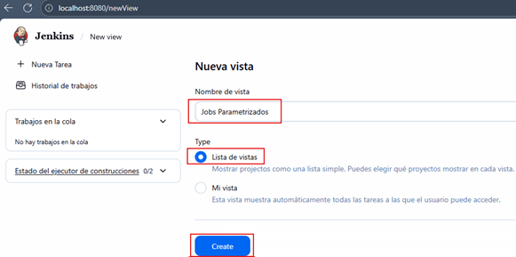

Agregamos una pequeña descripción a nuestra vista y damos clic en `Save`.

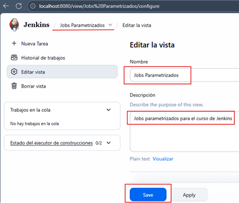

A continuación veremos nuestra vista recién creada `Jobs Parametrizados`, donde agruparemos los distintos `Jobs` que
configuraremos en esta sección.

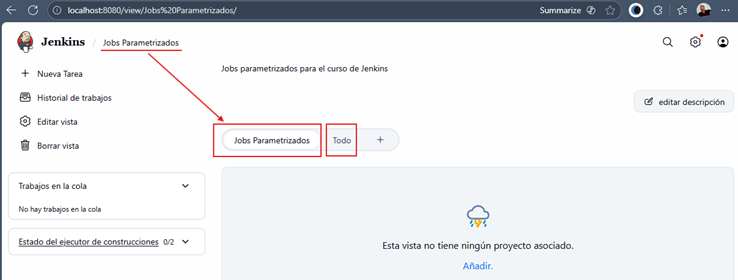

💡 Nota:
> `Jenkins` crea automáticamente la vista `Todo (All)` donde se listan todos los `Jobs del sistema`. En cambio,
> en nuestra nueva vista solo aparecerán los `Jobs` que agreguemos manualmente.

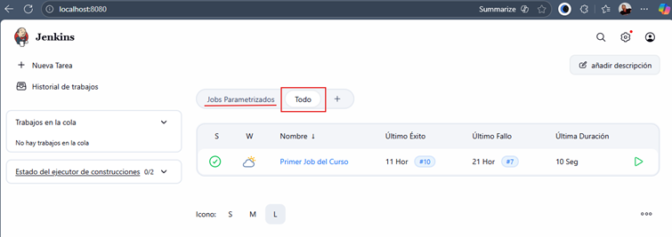

### 🧱 Creando un nuevo Job parametrizado

Con la vista `Jobs Parametrizados` seleccionada, damos clic en `Nueva tarea`.

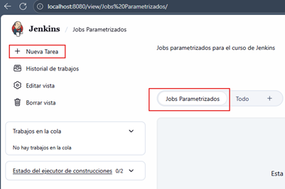

Le asignamos el nombre `Job Parametrizado 1`, elegimos `Crear un proyecto de estilo libre`, y verificamos que el
check `Add to current view` esté activado, para añadirlo a la vista actual.

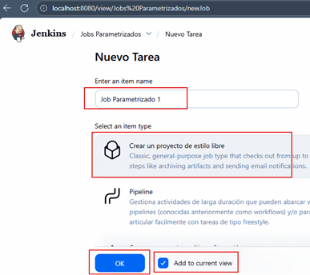

### 🧹 Configuración básica de mantenimiento

Habilitamos la opción `Desechar ejecuciones antiguas`, que controla la `retención de logs`, `artefactos` y
`metadatos` de compilaciones pasadas.

Podemos definir los criterios de eliminación usando:

- ⏳ `Build age`: descarta compilaciones después de cierta antigüedad (por ejemplo, 7 días).
- 🔢 `Build count`: mantiene un número máximo de compilaciones (por ejemplo, 50).

En nuestro caso:

- **Número de días para mantener ejecuciones:** 5
- **Número máximo de ejecuciones:** 6

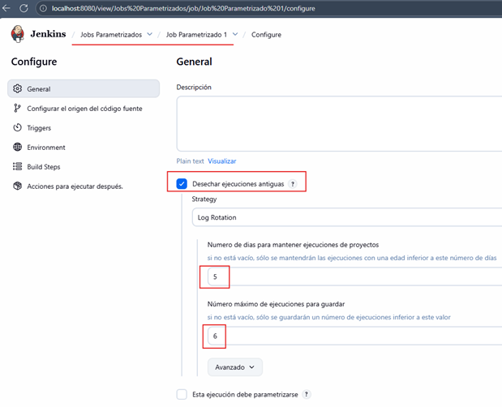

### 💻 Añadiendo un paso de construcción

En la sección `Build Steps`, seleccionamos la opción `Ejecutar línea de comandos (shell)`.

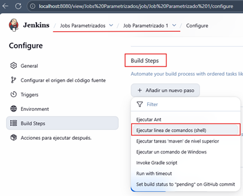

### 📜 Creando el script `params_script.sh`

Antes de mostrar la vista `Ejecutar linea de comandos (shell)` vamos a crear un nuevo script en este proyecto llamado
`params_script.sh`. Como observamos, este script no tiene las variables `NAME` ni `COURSE` inicializadas, dado que
se espera que estas variables estén disponibles en el entorno de Jenkins cuando los agreguemos a través de su interfaz.

````bash
#!/bin/bash

# --------------------------------------------------------------------------------------
# Este script NO declara las variables NAME y COURSE internamente.
#
# La razón es que este script está diseñado para ser ejecutado como un paso
# de 'Execute shell' en un Job de Jenkins configurado como Parametrizado.
#
# Jenkins inyectará automáticamente los valores para las variables de entorno
# $NAME y $COURSE (definidas en la configuración del Job) antes de ejecutar el script.
#
# Al no redefinirlas aquí, se garantiza que los valores pasados desde la interfaz
# de usuario de Jenkins son los que se utilizarán durante la ejecución.
# --------------------------------------------------------------------------------------

# Empieza el loop
for i in 1 2 3 4 5 6 7 8 9 10 11 12 13 14 15
do
	# Si i = 8, el loop se detiene momentáneamente
    if [ ${i} -eq 8 ]; then
    	# Dormir 5 segundos
        sleep 5
        echo "A descansar de clase ${COURSE}"
    fi
    echo "Clase N° ${i}"
done

# Dormir 5 segundos
sleep 5
echo "Bien ${NAME}, terminamos las clases de ${COURSE}, ¡nos vemos!"
````

📂 Copiamos el script dentro del contenedor de `Jenkins`.

````bash
D:\programming\jenkins\jenkins-guide (section-05)
$ docker container cp .\scripts\params_script.sh c-jenkins:/opt
Successfully copied 3.07kB to c-jenkins:/opt
````

Podemos ejecutar el siguiente comando para ver el contendio del archivo `params_script.sh` dentro del contenedor de
jenkins.

````bash
$ docker container exec c-jenkins cat /opt/params_script.sh
#!/bin/bash

# --------------------------------------------------------------------------------------
# Este script NO declara las variables NAME y COURSE internamente.
#
# La razón es que este script está diseñado para ser ejecutado como un paso
# de 'Execute shell' en un Job de Jenkins configurado como Parametrizado.
#
# Jenkins inyectará automáticamente los valores para las variables de entorno
# $NAME y $COURSE (definidas en la configuración del Job) antes de ejecutar el script.
#
# Al no redefinirlas aquí, se garantiza que los valores pasados desde la interfaz
# de usuario de Jenkins son los que se utilizarán durante la ejecución.
# --------------------------------------------------------------------------------------

# Empieza el loop
for i in 1 2 3 4 5 6 7 8 9 10 11 12 13 14 15
do
        # Si i = 8, el loop se detiene momentáneamente
    if [ ${i} -eq 8 ]; then
        # Dormir 5 segundos
        sleep 5
        echo "A descansar de clase ${COURSE}"
    fi
    echo "Clase N° ${i}"
done

# Dormir 5 segundos
sleep 5
echo "Bien ${NAME}, terminamos las clases de ${COURSE}, ¡nos vemos!" 
````

### ⚙️ Configurando la ejecución en Jenkins

En el campo de `Ejecutar linea de comandos (shell)`, escribimos la ruta al script dentro del contenedor:
`/opt/params_script.sh`.

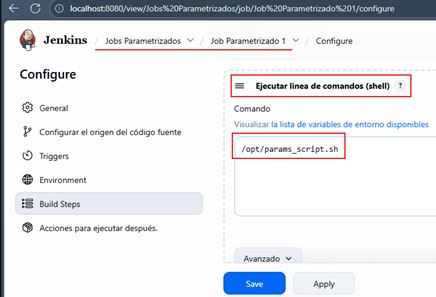

### 🧠 Habilitando la parametrización del Job

Marcamos la opción `Esta ejecución debe parametrizarse` y añadimos parámetros de cadena (String parameters) para las
variables esperadas: `NAME` y `COURSE`.

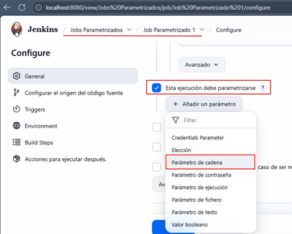

Definimos cada parámetro con su valor predeterminado:

- `NAME` = Milagros
- `COURSE` = La Guía de Jenkins

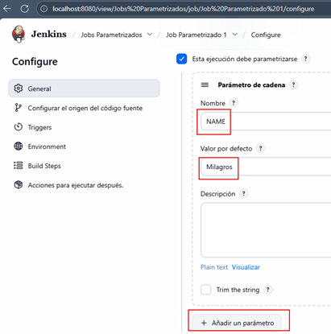


### 🚀 Ejecutando el Job parametrizado

Al guardar la configuración, se habilita la opción `Build with Parameters`. Allí podemos ajustar los valores de `NAME`
y `COURSE` antes de ejecutar. En nuestro caso ejecutamos con los valores por defecto:

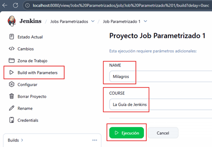

Finalmente, abrimos el `Console Output` y observamos cómo `Jenkins` interpreta y usa los valores inyectados.

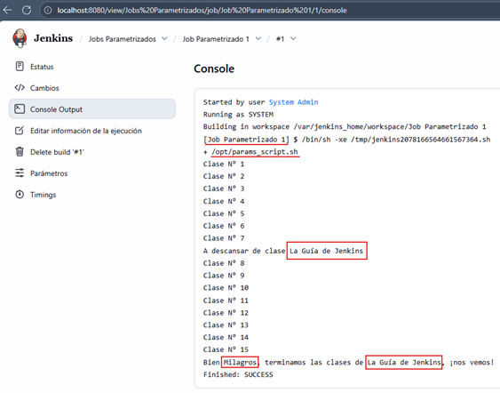

💡 Resultado esperado:
> El script imprime las iteraciones del bucle, realiza una pausa intermedia y muestra los mensajes personalizados con
> los valores definidos.

### 🧭 Conclusión

En esta lección aprendimos a:

- Organizar Jobs mediante `vistas personalizadas`.
- Crear un `Job parametrizado` con variables de entorno inyectadas desde `Jenkins`.
- Ejecutar scripts externos y observar cómo Jenkins pasa dinámicamente los parámetros definidos por el usuario.

## 🎛️ Parámetro de elección en Jenkins

### 🧩 Modificando el Job parametrizado

En esta lección continuamos trabajando con el `Job parametrizado 1`, pero ahora introduciremos un nuevo tipo de
parámetro: `“Parámetro de elección”` (Choice Parameter).

Primero, abrimos el job y seleccionamos `Configurar → Build Steps`.

💡 Recordatorio:
> Anteriormente, habíamos definido en la sección `Ejecutar línea de comandos (shell)` la ruta del script parametrizado:
> `/opt/params_script.sh`

### ✍️ Incorporando nuevas variables

Esta vez copiaremos el contenido de ese script directamente dentro del campo de comandos de `Jenkins`, y además
agregaremos una nueva variable llamada `LANGUAGE`.

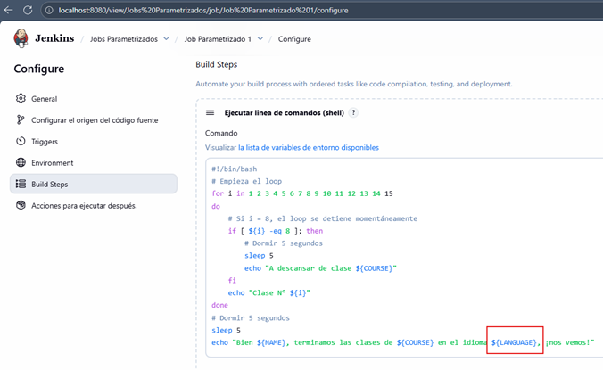

### 🧱 Redefiniendo parámetros

Subimos hacia la parte superior del formulario y en la sección `“Esta ejecución debe parametrizarse”` haremos los
siguientes ajustes:

- ❌ Eliminamos el parámetro anterior `COURSE`.
- ➕ Lo volvemos a añadir, pero ahora seleccionamos el tipo `“Elección”` (Choice Parameter).

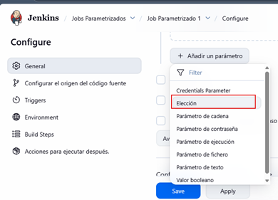

### 🧮 Definiendo opciones de elección

Volvemos a escribir el nombre de la variable `COURSE`, y en el campo de opciones listamos los valores posibles que el
usuario podrá seleccionar antes de ejecutar el `Job`.

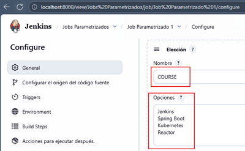

Hacemos lo mismo para la nueva variable `LANGUAGE`, también usando un parámetro de tipo `Elección`.

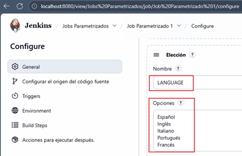

💡 Ventaja:
> Los `Choice Parameters` son útiles cuando queremos limitar las opciones de entrada y garantizar que el usuario
> seleccione solo valores válidos, evitando errores por texto libre.

### 🚀 Ejecutando el Job con parámetros de elección

Guardamos los cambios y presionamos `Build with Parameters`. La vista lateral derecha mostrará las variables
configuradas, pero ahora con listas desplegables para `COURSE` y `LANGUAGE`.

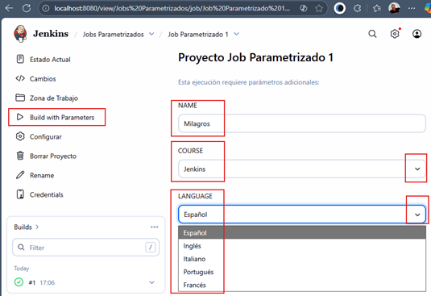

🔽 Como observamos, ya no podemos escribir los valores manualmente; debemos seleccionarlos desde las opciones definidas.

### 🧾 Verificando la salida

Ejecutamos el Job y revisamos el resultado en la pestaña `Console Output`.

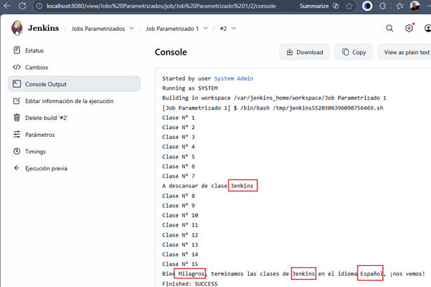

Podemos confirmar que los valores seleccionados en los desplegables de `COURSE` y `LANGUAGE` fueron inyectados
correctamente en la ejecución del script y se muestran en la salida de consola.
