# 📩 Integración de Jenkins con Email y Slack

---

## 🧭 ¿Por qué integrar Jenkins con Email y Slack?

La integración de `Jenkins` con sistemas de notificación como `Email` y `Slack` tiene un propósito esencial en los
entornos de `CI/CD (Integración y Despliegue Continuos)`: mantener al equipo `informado en tiempo real` sobre el
estado de las ejecuciones.

### 🎯 Objetivos principales

- 📢 `Alertar al equipo de forma inmediata` ante una compilación fallida (`broken build`).
- 🚀 `Aumentar la productividad` y capacidad de respuesta del equipo de desarrollo.
- 👀 `Monitorear automáticamente` los trabajos sin necesidad de revisar manualmente el panel de `Jenkins`.
- 🔄 `Reaccionar rápidamente` ante fallas para evitar la propagación de errores a entornos posteriores.

### 💡 Ejemplo real en empresas

En una pipeline real, los equipos configuran `Jenkins` para notificar:

- Éxito o fallo de un build.
- Resultados de pruebas unitarias o de integración.
- Despliegues completados en entornos de staging o producción.

De esta forma, un DevOps engineer o un desarrollador puede actuar inmediatamente ante un problema sin necesidad de
abrir Jenkins.

### ⚙️ Cómo funciona la comunicación

Existen dos enfoques principales para mantener a `Jenkins` y los desarrolladores sincronizados:

| Tipo de flujo                    | Descripción                                                                                                                                                                                    |
|----------------------------------|------------------------------------------------------------------------------------------------------------------------------------------------------------------------------------------------|
| `Pull` (consulta periódica)      | Jenkins consulta el sistema de control de versiones (por ejemplo, GitHub o GitLab) cada cierto intervalo de tiempo para detectar cambios.                                                      |
| `Push` (notificación automática) | El sistema de control de versiones envía directamente una notificación (`webhook`) a Jenkins cada vez que hay un nuevo `commit` o `push`. Este método es el más eficiente y usado actualmente. |

💡 Mejor práctica recomendada
> Las empresas modernas prefieren el modelo `“push”` usando `webhooks`, ya que reduce la carga de `Jenkins` y garantiza
> una respuesta inmediata a los cambios de código.

## 📧 Instalación del Email Extension Plugin

Por defecto, cuando instalamos `Jenkins`, el sistema incluye el plugin de correo electrónico básico, encargado de enviar
notificaciones simples. Sin embargo, para obtener más flexibilidad y control sobre el formato y los destinatarios, es
recomendable usar el `Email Extension Plugin` (`Email-ext`).

Para comprobar si ya está instalado:

1. Navega a: `Administrar Jenkins` → `Plugins`

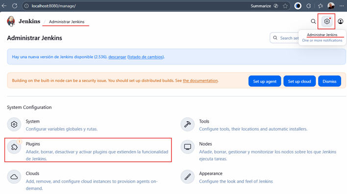

2. Selecciona la pestaña `Installed plugins` (Plugins instalados)
3. En el campo de búsqueda escribe: `Email`

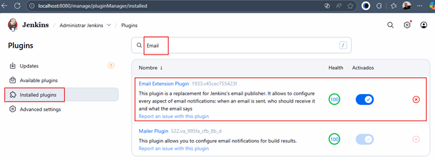

Como vemos, el resultado anterior muestra el plugin `Email Extension Plugin`, eso significa que ya lo tenemos instalado.

> Con esta comprobación podemos concluir que el plugin de Email se encuentra correctamente instalado y disponible para
> configurar notificaciones.

### 💡 Nota

El `Email Extension Plugin` amplía las capacidades del plugin de correo estándar. Permite:

- Personalizar el asunto y cuerpo del mensaje (incluso usando variables de entorno de `Jenkins`).
- Definir `plantillas HTML` para reportes más visuales.
- Enviar notificaciones condicionadas (por ejemplo, solo cuando el build falla).

## 📬 Integración de Jenkins con Gmail

### ✨ Configuración general

El objetivo de esta sección es permitir que `Jenkins pueda enviar correos automáticos` ante eventos relevantes, como
fallos de compilación o ejecuciones exitosas. Para este ejemplo usaremos `Gmail como servidor SMTP`, lo que nos
permitirá realizar pruebas reales sin necesidad de un servidor de correo propio.

### 🔐 Crear una contraseña de aplicación en Gmail

Para mantener la seguridad de tu cuenta, `no se debe usar la contraseña real de Gmail en Jenkins`. En su lugar, se crea
una `contraseña de aplicación`, especialmente diseñada para integraciones con terceros.

🔗 `Referencia oficial`:
[Iniciar sesión con contraseñas de aplicación](https://support.google.com/accounts/answer/185833?hl=es)

🧭 Pasos para generar la contraseña

1. Accede a tu [cuenta de Google](https://myaccount.google.com/).
2. Selecciona la pestaña `Seguridad`.
3. En la sección `Cómo inicias sesión en Google`, activa o revisa la `Verificación en dos pasos`.
4. Una vez activada, aparecerá una nueva opción: `Contraseñas de aplicación`.
5. Crea una nueva contraseña con un nombre descriptivo, por ejemplo: `Jenkins CI/CD`.
6. Google mostrará una contraseña de `16 caracteres`. Copia esta contraseña y guárdala en un lugar seguro, ya que será
   la que `Jenkins` usará para autenticar el envío de correos.

🔗 `Acceso directo`: Puedes ir directamente al `paso 5` ingresando a https://myaccount.google.com/apppasswords

⚙️ Explicación técnica

> Las `contraseñas de aplicación` son tokens únicos generados por Google para reemplazar tu contraseña real cuando un
> servicio (como Jenkins) se conecta mediante SMTP. No requieren verificación de dos pasos y pueden revocarse en
> cualquier momento.

### ⚙️ Configurar el servidor SMTP en Jenkins

Como siguiente paso vamos a configurar el servidor de correo. Para eso seguimos los siguientes pasos:

1. En el panel principal de Jenkins, dirígete a: `Administrar Jenkins` → `System`

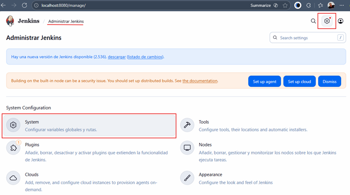

2. Desplázate hasta la sección `Notificación por correo electrónico` y completa los campos con la siguiente información:

| Campo              | Valor                             |
|--------------------|-----------------------------------|
| Servidor SMTP      | `smtp.gmail.com`                  |
| Autenticación SMTP | ✅ Activado                        |
| Usuario            | `tucorreo@gmail.com`              |
| Contraseña         | Contraseña de aplicación generada |
| Seguridad SSL      | ✅ Activado                        |
| Puerto SMTP        | `465`                             |

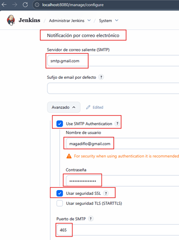

3. Antes de guardar, realiza una `prueba de envío de correo`:

- Marca la casilla `“Probar la configuración enviando un correo de prueba”`.
- Introduce un correo destinatario válido.
- Haz clic en `“Probar configuración”`.

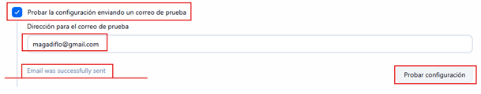

4. Si la prueba es exitosa, aparecerá el mensaje: `Email was successfully sent`. Y recibirás un correo con un mensaje de
   prueba:

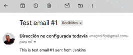

✅ Resultado esperado:
> El correo de prueba llega correctamente, confirmando que `Jenkins` puede conectarse con el servidor `SMTP` de `Gmail`.

### ✉️ Configurar Extended E-mail Notification (Email-ext)

Para aprovechar las capacidades avanzadas del plugin `Email Extension Plugin`, configuramos su sección específica:

1. En la misma página de configuración del sistema, busca `“Extended E-mail Notification”` y agrega el `SMTP Server` y
   `SMTP Port`.

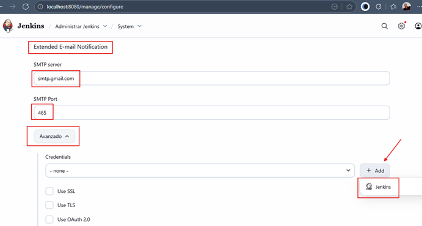

2. Haz clic en `Add` → `Jenkins` para agregar nuevas credenciales.

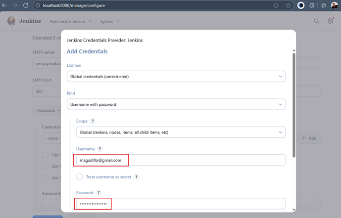

3. Completa los campos:

- `Username`: tu correo de Gmail.
- `Password`: la contraseña de aplicación generada.
- Luego selecciona la credencial creada en el campo `Credentials`.
- Marca la opción `Use SSL`.

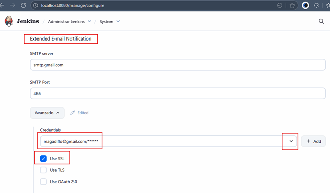

4. Configura los `triggers` predeterminados (cuándo se enviarán las notificaciones):

- 🟡 Before Build
- 🔴 Failure - Any
- 🟢 Success

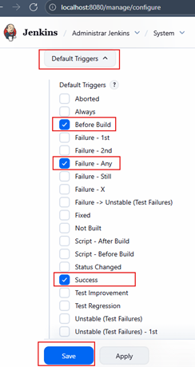

5. Finalmente, haz clic en `Save` para guardar los cambios.

### 👥 Agregar destinatarios en un Job específico

1. Abre tu Job (por ejemplo, `Primer Job del Curso`), seleccionamos `configurar`.

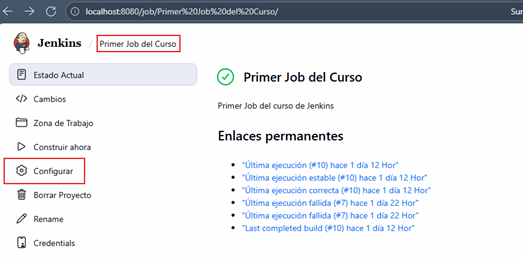

2. Nos vamos a la parte inferior en el apartado `Acciones para ejecutar después`. En el desplegable seleccionamos la
   acción `Editable Email Notification`.

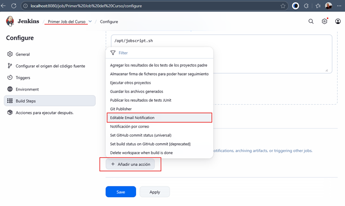

3. En el campo de destinatarios, agrega los correos a los que Jenkins enviará las notificaciones.

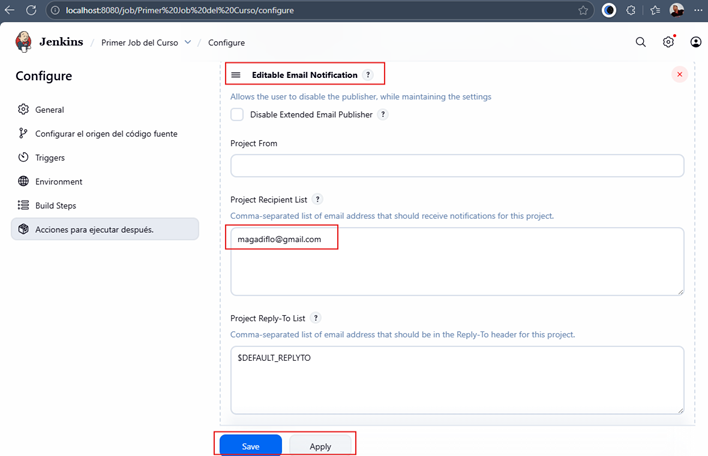

4. Guarda los cambios con `Apply` → `Save`.

### 🧪 Prueba de envío de notificaciones

1. Ejecuta el Job haciendo clic en `“Construir ahora”`.

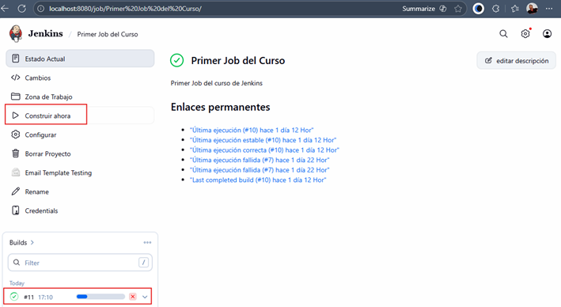

2. En la consola de salida, deberías ver mensajes como los siguientes:

````bash
Email was triggered for: Before Build
Sending email for trigger: Before Build
Sending email to: magadiflo@gmail.com
Email was triggered for: Success
Sending email for trigger: Success 
````

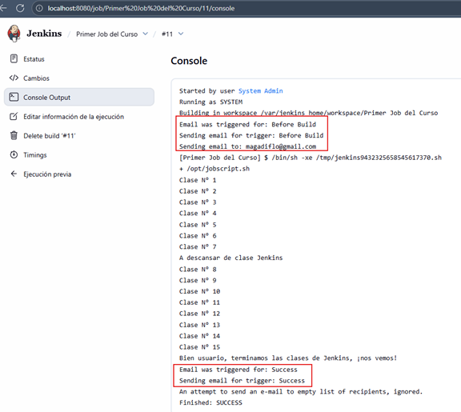

3. Revisa tu bandeja de entrada: deberías recibir un correo con un asunto similar a:
   `“Primer Job del Curso - Build #11 - Building!”`


4. Al hacer clic en el enlace del mensaje, serás redirigido a Jenkins para visualizar el estado del Job.

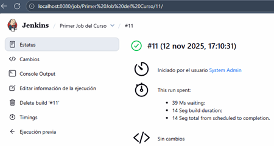

### 🧠 Conclusión

Has configurado exitosamente la integración de `Jenkins con Gmail`, lo que permite que tu servidor notifique
automáticamente los resultados de cada ejecución. Esta funcionalidad es fundamental en entornos de integración continua,
ya que:

- Permite detectar fallas de forma temprana.
- Facilita la colaboración entre equipos.
- Mejora la observabilidad del pipeline.

💡 En entornos empresariales:
> En lugar de Gmail, se suele integrar Jenkins con servidores corporativos SMTP (como Microsoft Exchange, AWS SES o
> SendGrid) para tener mayor control, trazabilidad y cumplimiento de políticas de seguridad.

## 💼 Integración de Jenkins con Slack

El objetivo de esta lección es permitir que Jenkins pueda enviar mensajes automáticos ante eventos relevantes,
como fallos de compilación o ejecuciones exitosas a Slack.

### 🔌 Agregando Plugin de Slack en Jenkins

Nos vamos a `Administrar Jenkins` -> `Plugins` -> `Available plugins` y buscamos el plugin `Slack Notification`.

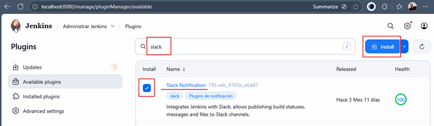

Luego de dar en `Install` nos mostrará una página donde aparecerá el progreso de instalación. En esa misma página
marcamos la casilla `Reiniciar Jenkins cuando termine la instalación y no queden trabajos en ejecución`.

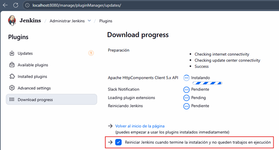

Luego de finalizada la instalación, vemos que nuestro plugin ya se encuentra instalado y esta vez está en la sección
`Installed plugins`.

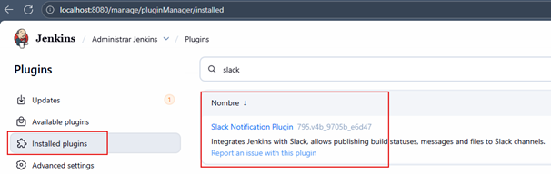

### Iniciando Sesión con Slack y Creando un espacio de trabajo

Nos vamos a la siguiente dirección de Slack: https://slack.com/intl/es-pe y damos clic en `COMENZAR`.

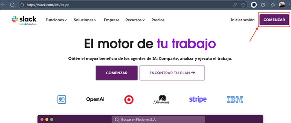

En la página que se nos abre seleccionamos nuestra cuenta de `GMAIL` para iniciar sesión. Luego, en la siguiente página
damos clic en `Crear un espacio de trabajo`.

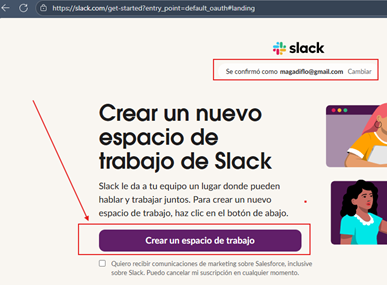

En la siguiente página nos pregunta ¿Cómo se llama nuestra empresa o equipo?, nosotros le ponemos `Jenkins Guide`. Este
nombre nos permite identificar nuestro espacio de trabajo.

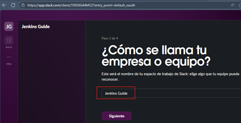

Seguimos avanzando hasta la siguiente página donde damos en `Omitir este paso`

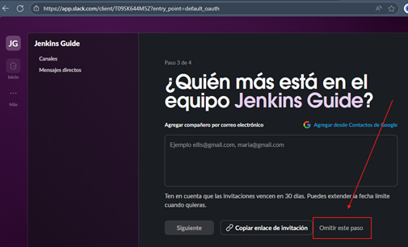

En la siguiente página seleccionamos la versión limitada gratuita.

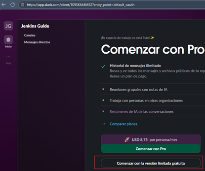

### Creando un nuevo canal

En el espacio de trabajo `Jenkins Guide`, creamos un nuevo canal llamado `alertas-jenkins`.

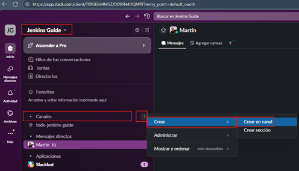

Luego de crear el canal `alertas-jenkins` tendremos un chat especial para dicho canal.

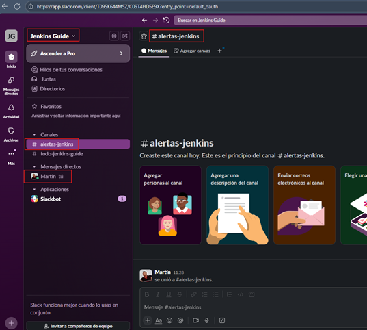

### Agregar integración de Slack con Jenkins

En la página de Slack vamos nuestro espacio de trabajo `Jenkins Guide` > `Herramientas y ajustes` >
`Administrar aplicaciones`.

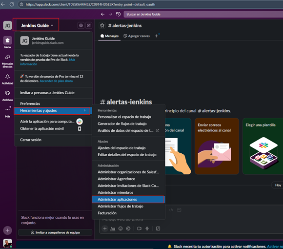

En la siguiente página que se nos abre, buscamos `Jenkins CI` y lo seleccionamos.

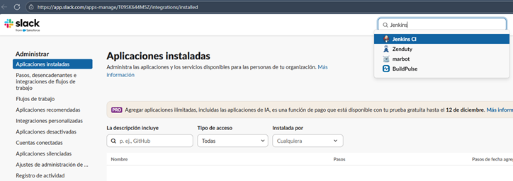

Procedemos a `Agregar a Slack`.

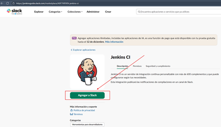

En la siguiente ventana seleccionamos el canal que creamos anteriormente `#alertas-jenkins` y damos en
`Agregar Integración con Jenkins CI`.

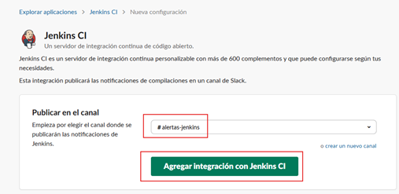

En la siguiente página nos mostrará los pasos para integrar nuestro jenkins con slack. En este punto el paso que más
nos interesa es el `Paso 3`, dado que aquí tiene datos que nos permitirá hacer esa integración.

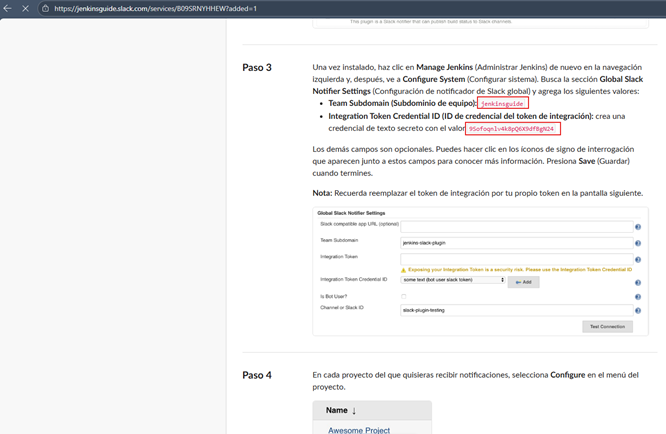

### Configurar en Jenkins integración de Slack

Si nos vamos a `Administrar Jenkins` > `System` y vamos al final de la página podremos ver la sección de `Slack`.

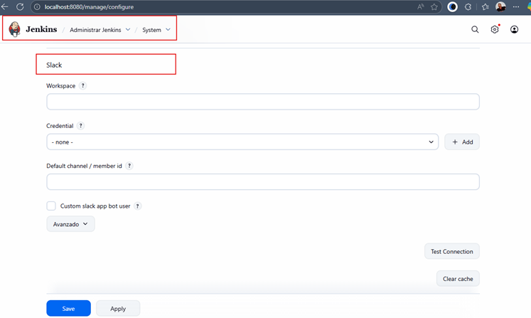

En esta sección de `Slack` procederemos a configurar con los datos proporcionados en el `Paso 3`.

- En el `Workspace` agregamos el valor proporcionado en `Team Subdomain`: `jenkinsguide`.
- En `Kind` seleccionamos `Secret text`.
- En Secret colocamos el valor proporcionado en `Integration Token Credential ID`:
  `9Sofoqnlv4k8pQ6X9dfBgN24nlv4k8pQ6X9dfBgN24`
- En ID, le agregamos un identificador único que nos permitirá identificar las credenciales en trabajos y otras
  configuraciones: `credentials-jenkins-guide`.

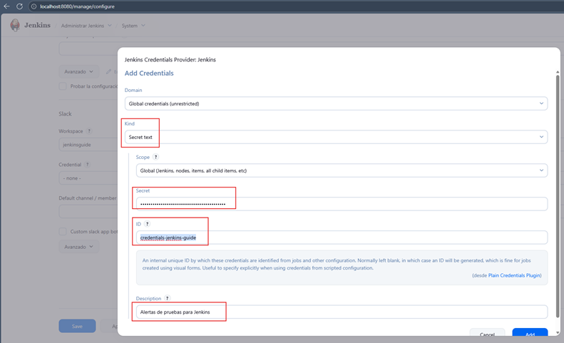

Luego de completar todos los campos requeridos damos en `Test Connection` y vemos que nos muestra `Success`.

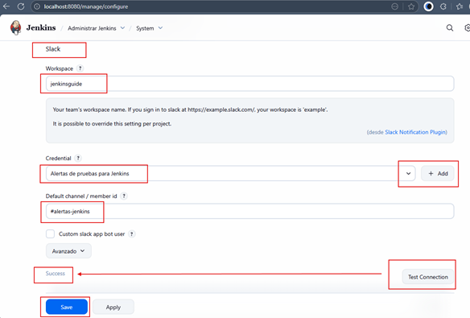

Luego de dar en el botón `Save` nos vamos a la página de `Slack` y vemos que nos ha llegado un mensaje a nuestro canal
configurado: `Slack/Jenkins plugin: you're all set on http://localhost:8080/`.

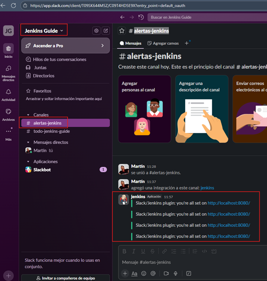

### Probando integración de Jenkins con Slack

Nos vamos al `Job Parametrizado 1` y en el apartado de `Build Steps` deliberadamente provocaremos un error, en vez de
`echo` lo dejaremos como `cho`, es decir es un comando que no existe así que debe provocar un error.

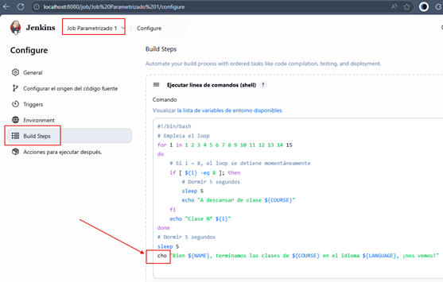

Luego, en la parte final `Acciones para ejecutar después` vamos a `Añadir una acción` y seleccionamos
`Slack Notifications`.

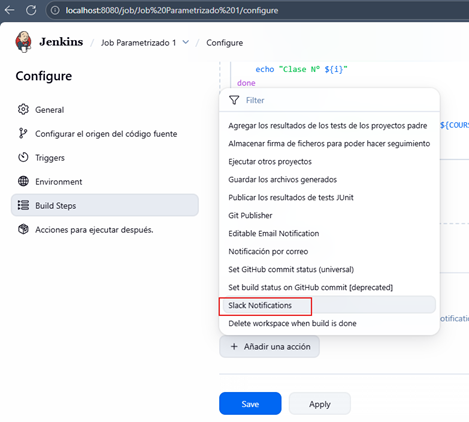

Luego seleccionamos, para este ejemplo, que nos notifique cuando ocurre un fallo o cuando todo vuelve a la normalidad.

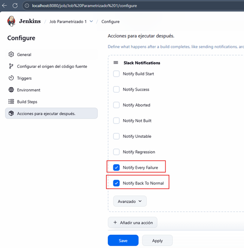

Procedemos a construir el `Job Parametrizado 1` y como era de esperarse falla la construcción.

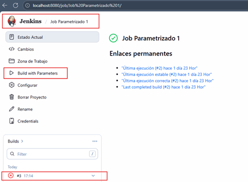

Ahora, si regresamos a nuestro canal de `Slack`, vemos que nos ha llegado un mensaje con el fallo:
`Job Parametrizado 1 - #3 Failure after 8.8 sec (Open)`

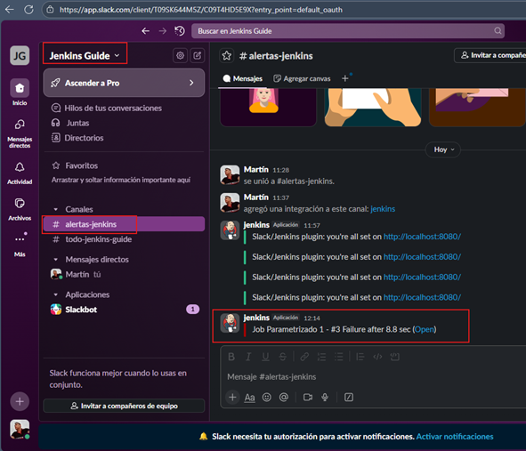

Procedemos a arreglar el error y volvemos a construir el Job. Esta vez todo se construye correctamente.

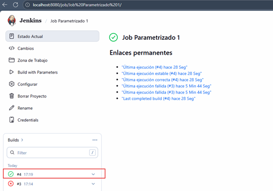

Finalmente, revisamos nuestra canal de `Slack` y vemos que nos ha llegado la notificación de que todo está funcionando
con normalidad: `Job Parametrizado 1 - #4 Back to normal after 5 min 16 sec (Open)`.

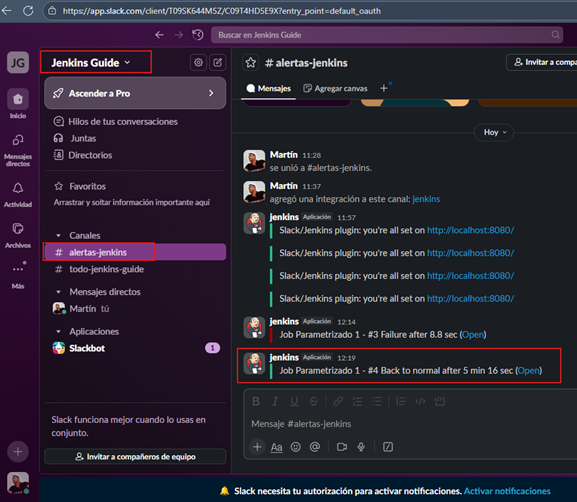
