# ⚙️ Sección 7: Integración de Jenkins con una App Java + Maven

---

### 🚀 Objetivo de la sección

En esta sección implementaremos un `flujo completo de Integración Continua (CI)` utilizando `Jenkins`, una aplicación
`Java con Maven` y un repositorio alojado en `GitHub`.

El objetivo es que Jenkins `detecte cambios en el código fuente`, descargue automáticamente la última versión,
`compile el proyecto`, `ejecute pruebas unitarias` y `genere artefactos` listos para desplegar.

💡 Concepto clave:

> La `Integración Continua (CI)` es una práctica esencial en `DevOps` que permite detectar errores de integración
> de forma temprana, garantizando que el software esté siempre en un estado funcional y desplegable.

## 🔗 Flujo general de integración continua con Jenkins

A continuación, se detalla el flujo de trabajo que implementaremos paso a paso:

1. 🔌 `Instalación de plugins y configuración base`. Configuraremos los plugins requeridos por `Maven`, `Git` y
   `GitHub`, así como las variables necesarias para la ejecución del pipeline.
2. ⬇️ `Pull del repositorio GitHub en Jenkins`. Jenkins clonará automáticamente el repositorio del proyecto Maven cada
   vez que se detecten nuevos commits.
3. 🏗️ `Construcción del proyecto con Maven`. Se ejecutará el comando `mvn clean install` o equivalente para compilar el
   código fuente y generar los artefactos (`.jar` o `.war`).
4. 🧪 `Ejecución de pruebas unitarias`. Durante el build, Maven ejecutará las pruebas definidas con JUnit, Mockito, u
   otros frameworks de testing configurados en el proyecto.
5. ▶️ `Ejecución de la aplicación`. Finalmente, Jenkins podrá ejecutar o desplegar la aplicación, ya sea localmente o
   en un contenedor Docker, dependiendo del entorno.

### ⚙️ Jenkins + GitHub + Maven en acción

El flujo completo será similar al siguiente:

````
[GitHub Repo] ──push──▶ [Jenkins Job] ──build+test──▶ [Artefacto Maven listo para despliegue] 
````

Cada cambio en GitHub disparará una nueva ejecución automática en Jenkins, garantizando que la aplicación Java:

- Compile sin errores.
- Pase las pruebas unitarias.
- Genere un artefacto válido (por ejemplo, un `.jar` funcional).

## 🔌 1. Instalación de plugins y configuración base

### 🧩 Instalación del plugin `Maven Integration Plugin`

Para comenzar con la integración continua usando una aplicación Java con Maven, primero debemos instalar el plugin que
permite a `Jenkins` ejecutar `builds Maven`.

1. Ve a: `Administrar Jenkins` → `Plugins` → `Available plugins`
2. Busca: `Maven Integration`
3. Selecciona el plugin y procede con la instalación.

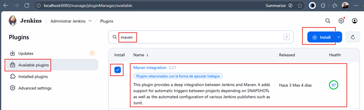

Este plugin no solo permite ejecutar builds Maven dentro de Jenkins, sino que además:

- Integra la fase de build con el ciclo estándar de Jenkins (detecta pom.xml, usa el Maven home configurado en Tools y
  expone pasos Maven en freestyle jobs).
- Permite el seguimiento de artefactos generados, pruebas, reportes y resultados JUnit.
- Facilita la creación de proyectos tipo “Maven project” (si no se usa Pipeline).

> 💡 `Nota`: aunque hoy en día casi todo se implementa con Pipelines (Jenkinsfile), muchos plugins heredados siguen
> dependiendo de esta integración para reportes de pruebas, cobertura, etc.

En la siguiente pantalla se mostrará el progreso de instalación. Es recomendable marcar la opción
`“Reiniciar Jenkins cuando finalice la instalación”` para completar la configuración.

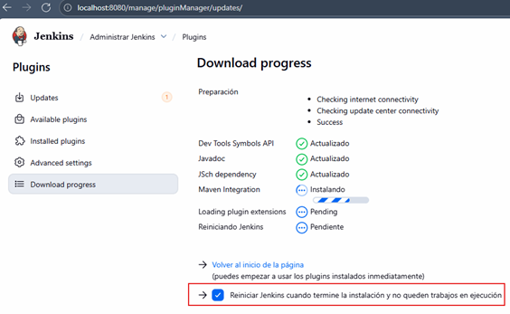

Una vez reiniciado `Jenkins`, verifica que el plugin haya sido instalado correctamente:

- Navega a: `Installed plugins`
- Busca nuevamente `Maven`
- Deberás ver `Maven Integration Plugin` en la lista

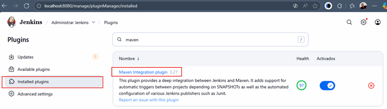

### 🧩 Verificación de `GitHub Branch Source Plugin`

El plugin `GitHub Branch Source Plugin` viene instalado por defecto en la mayoría de distribuciones modernas de
`Jenkins`. No es necesario instalarlo manualmente, solo comprobar que esté disponible.

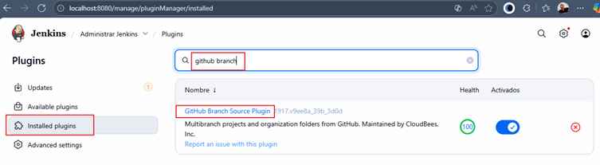

Este plugin hace mucho detrás de cámaras para que la integración `Jenkins–GitHub` sea moderna y automática:

- Detectar ramas y pull requests (PRs) dinámicamente usando la API de GitHub.
- Configura automáticamente Webhooks para que GitHub notifique a Jenkins de nuevos commits.
- Administra credenciales y conexiones a GitHub usando la integración con GitHub App o tokens personales.
- Crea y actualiza jobs de manera automática en un Multibranch Pipeline basados en el Jenkinsfile de cada rama.

> 💡 Esto lo vuelve ideal para equipos que usan GitHub Flow o GitHub PR Flow, ya que Jenkins se adapta a los repos sin
> necesidad de crear jobs manuales.

### 🛠️ Configuración de Maven dentro de Jenkins

Ahora que el plugin está instalado, debemos configurar `Maven` como herramienta global dentro de `Jenkins` para que
pueda usarse en cualquier `Job` o `Pipeline`.

1. Ir a: `Administrar Jenkins` → `Tools`
2. Desplázate hacia el final hasta la sección `Instalaciones de Maven`
3. Haz clic en `+ Añadir Maven`

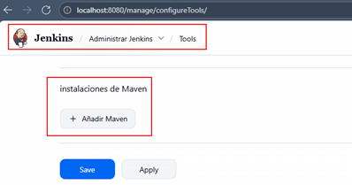

Completa los siguientes campos:

- Name: `Maven en Jenkins`
- Instalar automáticamente: ✔️ `activado`
- Version: dejar la predeterminada (Jenkins descargará la versión estable recomendada)

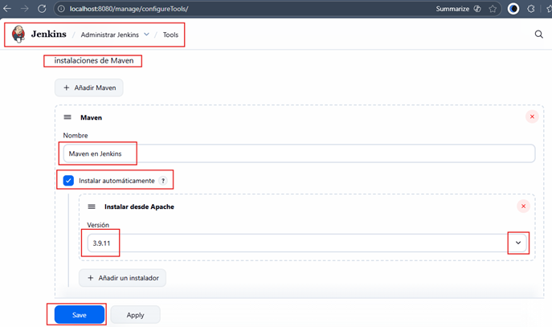

Finalmente, haz clic en `Save`.

### ⚙️ Explicación técnica

- `“Instalar automáticamente”` permite que `Jenkins` descargue y mantenga la versión configurada de `Maven` sin
  necesidad de instalarla manualmente en el servidor.
- En entornos corporativos, es común:
    - Definir versiones específicas de Maven.
    - Instalar Maven en un directorio controlado.
    - Apuntar Jenkins a esa instalación para mantener consistencia entre entornos.

💡 Buena práctica:
> Define versiones fijas de herramientas (como `Maven` y `JDK`) para evitar inconsistencias entre builds generados en
> distintos momentos.

## ⬇️ 2. Pull del repositorio GitHub en Jenkins

En este apartado trabajaremos con el repositorio:

- [macloujulian/simple-java-maven-app](https://github.com/macloujulian/simple-java-maven-app) → fork del repositorio
  oficial:
- [jenkins-docs/simple-java-maven-app](https://github.com/jenkins-docs/simple-java-maven-app)

📌 Este proyecto es perfecto para practicar CI porque contiene un `pom.xml`, código Java y múltiples ejemplos de
`Jenkinsfile`, aunque lo del `Jenkinsfile` lo veremos en secciones más adelante.

### 🔎 ¿Qué significa hacer un fork en GitHub?

Un `fork` es una copia completa de un repositorio que pasa a tu propia cuenta de `GitHub`.
Se utiliza típicamente para:

- Crear tu propia versión de un proyecto.
- Probar cambios sin modificar el repo original.
- Enviar pull requests al repositorio padre.

En el mundo real es común que empresas forkeen repos open-source para agregarlos a su pipeline, parchearlos o
personalizarlos.

### 📝 Repositorio con el que trabajaremos

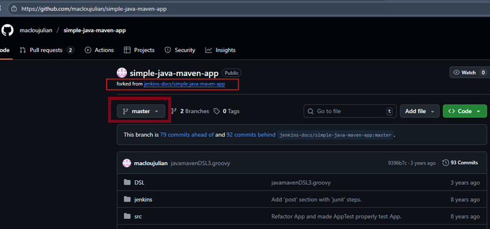

### 🆕 Crear un nuevo Job Freestyle

Creamos un job llamado `java_app_con_maven`:

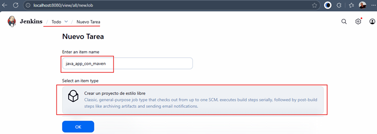

### 🔗 Configuración del Origen del Código Fuente

En la pantalla de configuración:

1. Activamos Git en Source Code Management.
2. Indicamos el repositorio: `https://github.com/macloujulian/simple-java-maven-app.git`.
3. En Branch Specifier colocamos la rama: `master`.

> 📌 `Nota`: En la mayoría de proyectos modernos se usa `main`; el curso utiliza `master` porque así está configurado
> el repo.

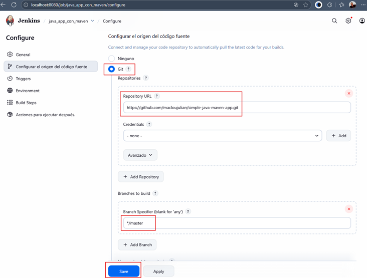

### ▶️ Ejecutando el primer build

Damos clic en `Construir ahora` y obtenemos un build exitoso:

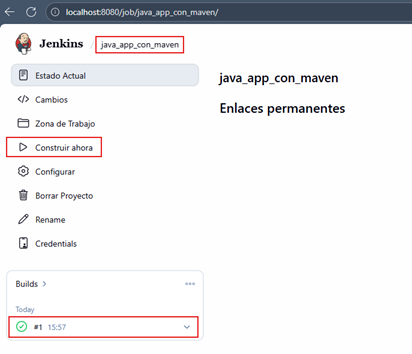

### 🛠️ Explicación del Console Output (paso a paso y profesional)

Si revisamos el `Console Output`, veremos la siguiente salida:

````bash
Started by user System Admin
Running as SYSTEM
Building in workspace /var/jenkins_home/workspace/java_app_con_maven
The recommended git tool is: NONE
No credentials specified
Cloning the remote Git repository
Cloning repository https://github.com/macloujulian/simple-java-maven-app.git
 > git init /var/jenkins_home/workspace/java_app_con_maven # timeout=10
Fetching upstream changes from https://github.com/macloujulian/simple-java-maven-app.git
 > git --version # timeout=10
 > git --version # 'git version 2.47.3'
 > git fetch --tags --force --progress -- https://github.com/macloujulian/simple-java-maven-app.git +refs/heads/*:refs/remotes/origin/* # timeout=10
 > git config remote.origin.url https://github.com/macloujulian/simple-java-maven-app.git # timeout=10
 > git config --add remote.origin.fetch +refs/heads/*:refs/remotes/origin/* # timeout=10
Avoid second fetch
 > git rev-parse refs/remotes/origin/master^{commit} # timeout=10
Checking out Revision 9396b7c42f467673997e3d5f60b9f460a734e178 (refs/remotes/origin/master)
 > git config core.sparsecheckout # timeout=10
 > git checkout -f 9396b7c42f467673997e3d5f60b9f460a734e178 # timeout=10
Commit message: "javamavenDSL3.groovy"
First time build. Skipping changelog.
Finished: SUCCESS 
````

### 🔍 ¿Por qué no aparece git clone?

`Jenkins` no usa directamente `git clone`. En su lugar realiza una secuencia más controlada:

#### ✔️ Paso 1 — Inicializar un repo vacío

````bash
git init /var/jenkins_home/workspace/java_app_con_maven 
````

Crea un repositorio local vacío en el workspace del job.

#### ✔️ Paso 2 — Configurar el origen

````bash
git config remote.origin.url <repo-url>
````

Agrega el remoto `origin` apuntando al repositorio de `GitHub`.

#### ✔️ Paso 3 — Descarga todas las ramas

````bash
git fetch --tags --force --progress -- <repo-url> +refs/heads/*:refs/remotes/origin/* 
````

`fetch` es más eficiente y más controlable que `git clone`, por eso Jenkins lo usa.

#### ✔️ Paso 4 — Resolver el commit a usar

````bash
git rev-parse refs/remotes/origin/master 
````

Identifica el `SHA` exacto que debe construir.

#### ✔️ Paso 5 — Hacer checkout del commit

````bash
git checkout -f <sha> 
````

Se mueve la copia de trabajo al commit correcto.

### 💡 ¿Por qué Jenkins usa init + fetch + checkout?

Porque:

- Controla exactamente qué commit se construye.
- Permite builds reproducibles.
- Evita operaciones innecesarias en cada build.
- Se integra mejor con webhooks, multibranch y PRs.
- Permite comparar cambios entre builds.

En empresas, es la forma estándar: `Jenkins nunca usa “git clone” directo`.

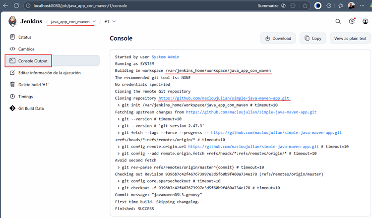

### 📂 Verificando el proyecto dentro del contenedor

Entramos al contenedor de Jenkins:

````bash
$ docker container exec -it c-jenkins /bin/sh
$ cd /var/jenkins_home/workspace/java_app_con_maven
$ ls -l
total 40
drwxr-xr-x 2 jenkins jenkins 4096 Nov 14 15:57 DSL
-rw-r--r-- 1 jenkins jenkins  111 Nov 14 15:57 Dockerfile
-rw-r--r-- 1 jenkins jenkins  180 Nov 14 15:57 Dockerfile2
-rw-r--r-- 1 jenkins jenkins  578 Nov 14 15:57 Jenkinsfile1
-rw-r--r-- 1 jenkins jenkins 1133 Nov 14 15:57 Jenkinsfile3
-rw-r--r-- 1 jenkins jenkins 1854 Nov 14 15:57 Jenkinsfile4
-rw-r--r-- 1 jenkins jenkins  744 Nov 14 15:57 README.md
drwxr-xr-x 3 jenkins jenkins 4096 Nov 14 15:57 jenkins
-rw-r--r-- 1 jenkins jenkins 1383 Nov 14 15:57 pom.xml
drwxr-xr-x 4 jenkins jenkins 4096 Nov 14 15:57 src
$ cd src
$ ls -l
total 8
drwxr-xr-x 3 jenkins jenkins 4096 Nov 14 15:57 main
drwxr-xr-x 3 jenkins jenkins 4096 Nov 14 15:57 test
````

📌 Aquí ya podemos ver el `código Java`, el `pom.xml` y varios `Jenkinsfiles`.

## 🏗️ 3. Construcción del proyecto con Maven

Continuamos con el job creado en el apartado anterior: `java_app_con_maven`.

### ⚙️ Configuración del Build con Maven

Navegamos a: `java_app_con_maven` → `Configurar` → `Build Steps` → `Ejecutar tareas maven de nivel superior`

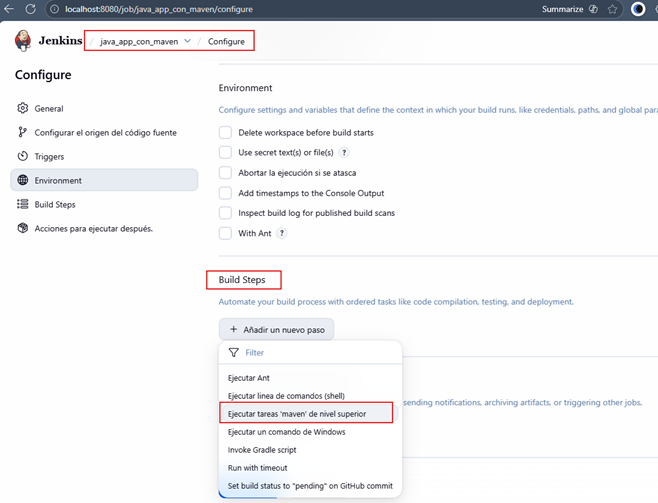

Dentro de este formulario debemos completar los siguientes campos:

- Versión de Maven: `Maven en Jenkins` (el nombre que asignamos en `Administrar Jenkins` → `Tools`)
- Goals: Aunque solemos ejecutar Maven desde consola así:
    ````bash
    mvn -B clean package -DskipTests 
    ````
  En `Jenkins` no debemos anteponer el comando `mvn`, ya que el executor ya sabe que estamos invocando `Maven`. Por lo
  tanto, los goals quedan así:
    ````bash
    -B clean package -DskipTests
    ````

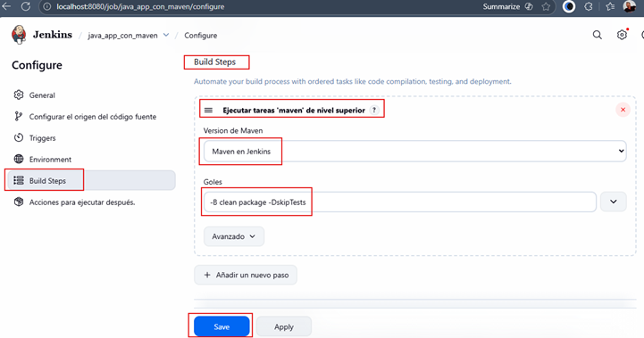

**Donde**

- 📌 `-B `(Batch Mode). Ejecuta Maven en modo no interactivo. Fundamental en CI/CD porque:
    - evita prompts que bloquearían el pipeline,
    - falla inmediatamente si necesita interacción,
    - produce logs más lineales.
- 📌 `clean`
    - Elimina el directorio `target/`.
    - Garantiza una compilación limpia y reproducible.
- 📌 `package`
    - Compila y empaqueta la aplicación en un artefacto `(JAR/WAR)`.
- 📌 `-DskipTests`. Indica a Maven que **omita la ejecución de pruebas**. Esto acelera el build, especialmente útil en:
    - validaciones rápidas
    - pipelines de prueba funcional
    - validaciones previas a PR
- ✔️ Nota real del mundo empresarial
    - En pipelines productivos se suelen usar dos etapas separadas:
    - Build rápido (`package -DskipTests`)
    - Etapa exclusiva de tests (`sin skipTests`)

### ▶️ Ejecutando el build

Damos clic en Construir ahora:

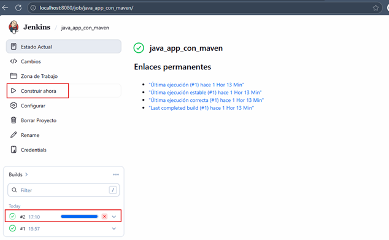

Al finalizar, revisamos el `Console Output` y vemos:

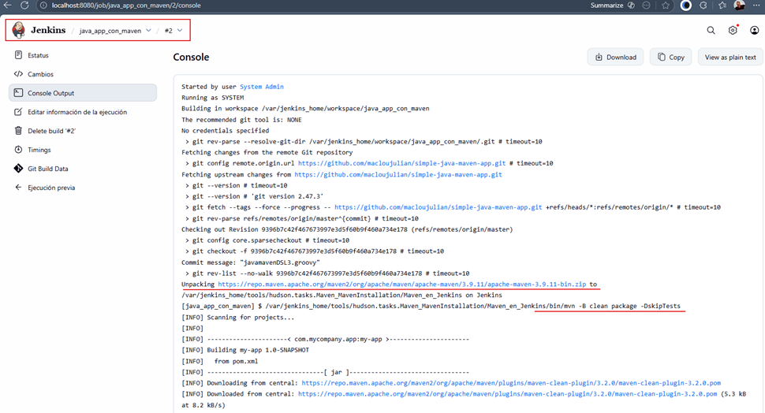

Perfecto, la construcción de nuestra aplicación en un archivo `.jar` se ha realizado con éxito, pues obtenemos el
mensaje `BUILD SUCCESS`.

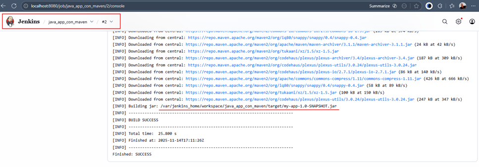

### 📦 Verificando el artefacto .jar

Verificamos que el `my-app-1.0-SNAPSHOT.jar` se encuentre en el directorio que muestra la salida de consola del
job de jenkins: `/var/jenkins_home/workspace/java_app_con_maven/target/`.

````bash
$ docker container exec -it c-jenkins /bin/sh
$ cd /var/jenkins_home/workspace/java_app_con_maven/target/
$ ls -l
total 28
drwxr-xr-x 3 jenkins jenkins 4096 Nov 14 17:11 classes
drwxr-xr-x 3 jenkins jenkins 4096 Nov 14 17:11 generated-sources
drwxr-xr-x 3 jenkins jenkins 4096 Nov 14 17:11 generated-test-sources
drwxr-xr-x 2 jenkins jenkins 4096 Nov 14 17:11 maven-archiver
drwxr-xr-x 3 jenkins jenkins 4096 Nov 14 17:11 maven-status
-rw-r--r-- 1 jenkins jenkins 2676 Nov 14 17:11 my-app-1.0-SNAPSHOT.jar
drwxr-xr-x 3 jenkins jenkins 4096 Nov 14 17:11 test-classes
````

### 📣 Configurando notificaciones por Email y Slack

Es común en CI/CD configurar alertas para:

- builds fallidos (❌)
- builds que regresan a la normalidad (✅)

Esto permite a los equipos reaccionar rápido ante fallas. Configuramos notificaciones dentro del job:

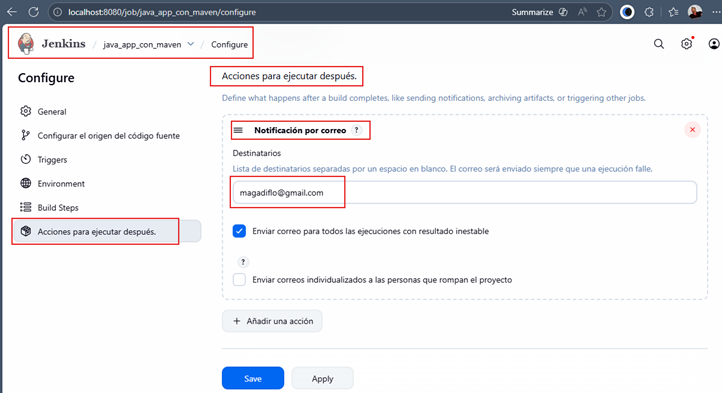

Y agregamos también notificaciones Slack:

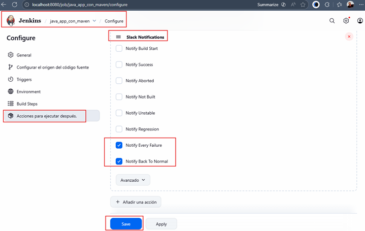

### 🧪 Probando las notificaciones (fallo intencional)

Para verificar que las alertas funcionan, introducimos un error:

Cambiamos el goal:

- ❌ `package`
- ✔️ lo reemplazamos por `packag`

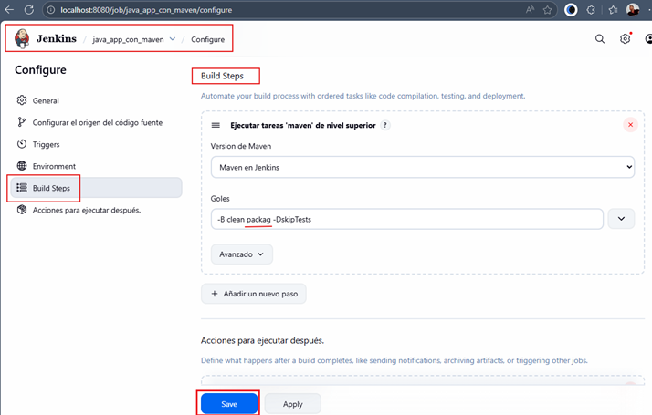

Construimos nuevamente y, como se espera, el build falla:

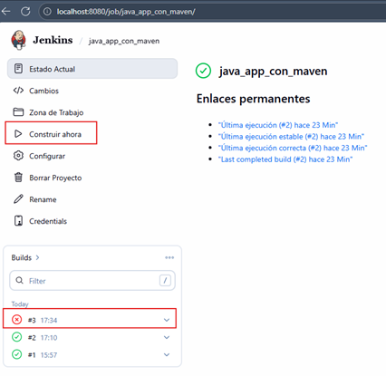

En el `Console Output` vemos que Jenkins envió notificaciones:

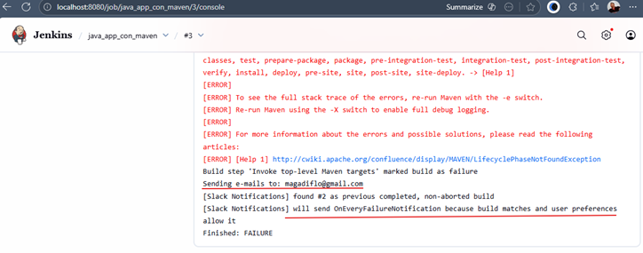

### 📬 Email recibido

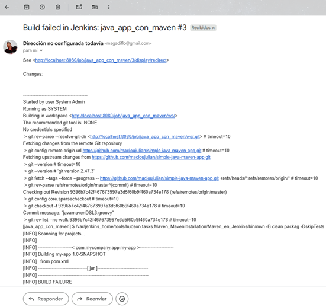

### 💬 Notificación Slack

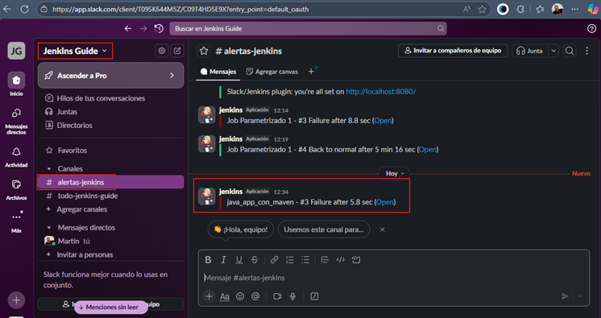
