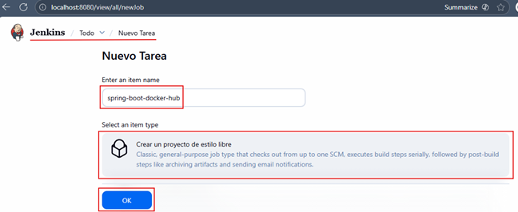
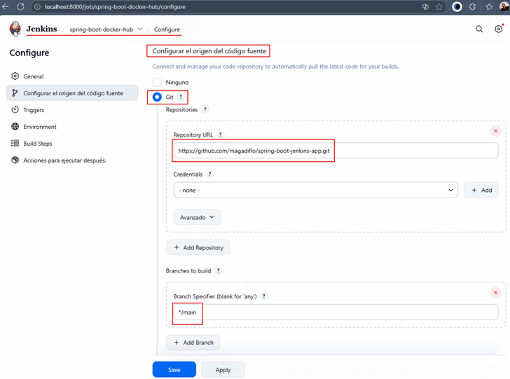
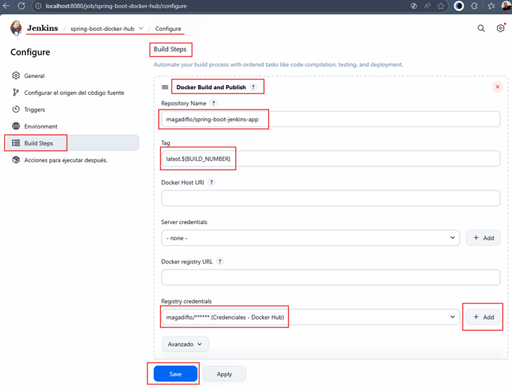
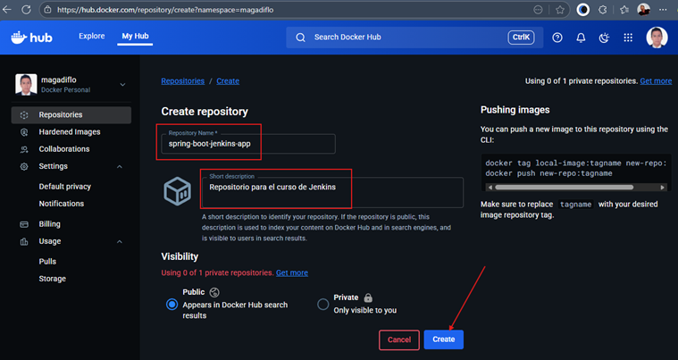
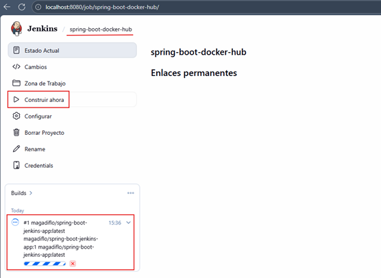
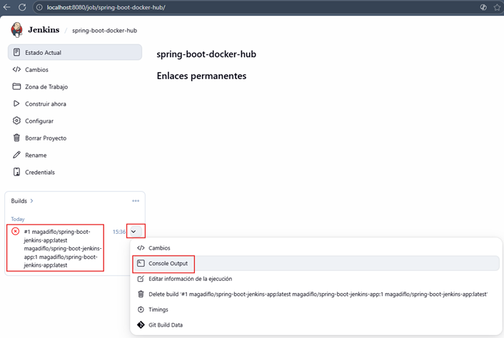
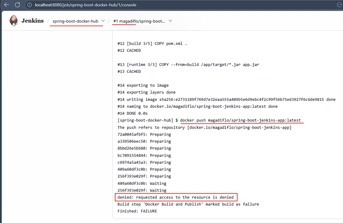
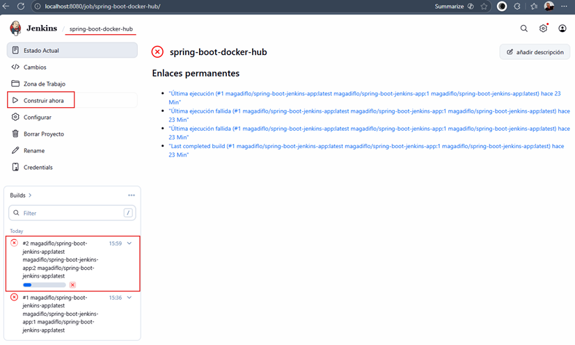
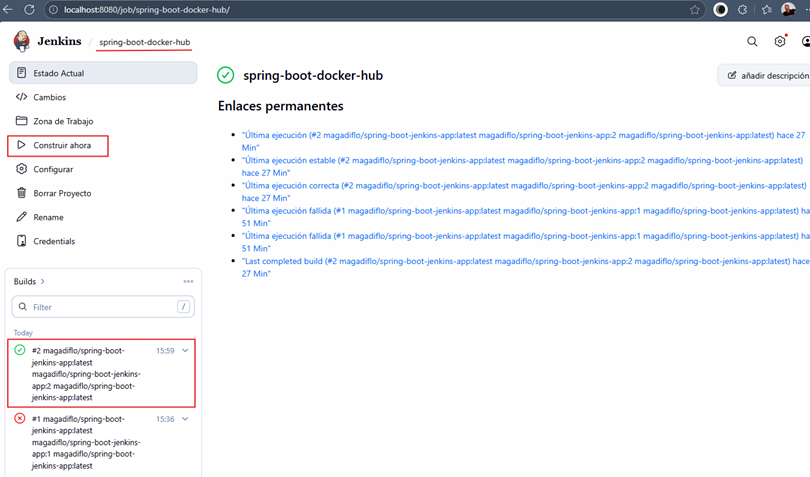
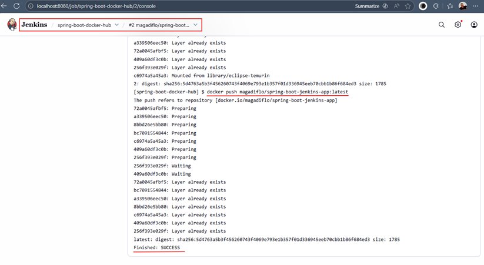

# 🚀 Sección 9: Empaquetar una Aplicación Spring Boot con Docker

En esta sección realizaremos lo que en empresas se conoce como:
**“Construcción y empaquetado de una aplicación Java + Spring Boot en una imagen Docker lista para despliegue”**.

Aunque en el curso el tutor utiliza una app Node.js, aquí trabajaremos directamente con nuestro stack
`Java/Spring Boot`, lo cual es más relevante para nuestra línea profesional en `CI/CD`.

---

## 🗂️ Crear repositorio en GitHub con aplicación Spring Boot

Para esta sección construiremos una aplicación sencilla de Spring Boot que cumpla con:

- 🧩 Un endpoint REST básico.
- 🐳 Un `Dockerfile` funcional siguiendo prácticas de empresas.
- ☁️ Código almacenado en GitHub: https://github.com/magadiflo/spring-boot-jenkins-app

📸 Estructura del repositorio:


A continuación mostramos la construcción del proyecto base.

### 📦 Dependencias del proyecto (Spring Initializr)

El proyecto se creó usando
[Spring initializr](https://start.spring.io/#!type=maven-project&language=java&platformVersion=3.5.7&packaging=jar&configurationFileFormat=yaml&jvmVersion=21&groupId=dev.magadiflo&artifactId=spring-boot-jenkins-app&name=spring-boot-jenkins-app&description=Demo%20project%20for%20Spring%20Boot&packageName=dev.magadiflo.app&dependencies=web,lombok,actuator)
con las siguientes dependencias:

````xml
<!--Spring Boot 3.5.7-->
<!--Java 21-->
<dependencies>
    <dependency>
        <groupId>org.springframework.boot</groupId>
        <artifactId>spring-boot-starter-actuator</artifactId>
    </dependency>
    <dependency>
        <groupId>org.springframework.boot</groupId>
        <artifactId>spring-boot-starter-web</artifactId>
    </dependency>

    <dependency>
        <groupId>org.projectlombok</groupId>
        <artifactId>lombok</artifactId>
        <optional>true</optional>
    </dependency>
    <dependency>
        <groupId>org.springframework.boot</groupId>
        <artifactId>spring-boot-starter-test</artifactId>
        <scope>test</scope>
    </dependency>
</dependencies>
````

### 🛠️ Configuración del application.yml

````yml
server:
  port: 8081
  error:
    include-message: always

spring:
  application:
    name: spring-boot-jenkins-app
````

💡 Nota:
> En el mundo real, los puertos rara vez se fijan en el código; se parametrizan mediante variables de entorno.
> Pero para este ejemplo está bien dejarlo `hardcodeado` en `8081`.

### 🌐 Endpoint REST básico

````java

@RestController
@RequestMapping(path = "/api/v1/greetings")
public class HelloController {
    @GetMapping
    public ResponseEntity<Map<String, Object>> hello() {
        var response = new HashMap<String, Object>();
        response.put("message", "Hola desde Spring Boot + Jenkins!");
        response.put("timestamp", LocalDateTime.now());
        response.put("version", "1.0.0");
        return ResponseEntity.ok(response);
    }
}
````

### 🔎 Verificación del funcionamiento

✔️ Endpoint propio

````bash
$ curl -v http://localhost:8081/api/v1/greetings | jq
>
< HTTP/1.1 200
< Content-Type: application/json
< Transfer-Encoding: chunked
< Date: Wed, 19 Nov 2025 16:21:45 GMT
<
{
  "message": "Hola desde Spring Boot + Jenkins!",
  "version": "1.0.0",
  "timestamp": "2025-11-19T11:21:45.1053065"
}
````

✔️ Endpoint Actuator

````bash
$ curl -v http://localhost:8081/actuator/health | jq
>
< HTTP/1.1 200
< Content-Type: application/vnd.spring-boot.actuator.v3+json
< Transfer-Encoding: chunked
< Date: Wed, 19 Nov 2025 16:22:18 GMT
<
{
  "status": "UP"
}
````

### 🐳 Creando el Dockerfile — Multi-Stage Build (Práctica de Empresa)

Ubicado en raíz del proyecto (junto al `pom.xml`):

````Dockerfile
# Stage 1: Build con Maven 3.9.11 + Java 21
FROM maven:3.9.11-eclipse-temurin-21 AS build
WORKDIR /app
COPY pom.xml .
COPY src ./src
RUN mvn clean package -DskipTests

# Stage 2: Runtime con JRE 21
FROM eclipse-temurin:21-jre-alpine AS runtime
WORKDIR /app
COPY --from=build /app/target/*.jar app.jar
EXPOSE 8081

# Usar ENTRYPOINT para inmutabilidad
ENTRYPOINT ["java", "-jar", "app.jar"] 
````

📌 ¿Por qué este Dockerfile? (Explicación Realista)

| Característica                                | Beneficio                                              |
|-----------------------------------------------|--------------------------------------------------------|
| 🏗️ **Multi-stage build**                     | Reduce tamaño y mejora seguridad.                      |
| ⚙️ **Maven + JDK solo para la fase de build** | No expones herramientas innecesarias en producción.    |
| 🔥 **Imagen final minimalista (JRE Alpine)**  | menos superficie de ataque + menos tiempo de arranque. |
| 📁 **COPY selectivo**                         | Copia solo el JAR final → imagen limpia.               |
| 🛞 **ENTRYPOINT**                             | Define comando inmutable para ejecución estándar.      |
| 📤 **Expose 8081**                            | Documenta el puerto usado por la app (Spring Boot).    |

### 📦 Lista final de entregables de esta sección

- ✔️ Proyecto Spring Boot funcional
- ✔️ Repositorio GitHub correctamente organizado
- ✔️ Endpoint REST y verificación
- ✔️ Dockerfile profesional estilo empresa
- ✔️ Imagen lista para ser construida por Jenkins en la siguiente sección

## 🚀 Instalación del Plugin: CloudBees Docker Build and Publish

Para habilitar que `Jenkins` pueda construir y publicar imágenes Docker directamente desde un job, instalaremos
el plugin `CloudBees Docker Build and Publish`.

### 🛠️ ¿Qué es el Plugin `CloudBees Docker Build and Publish`?

El `CloudBees Docker Build and Publish` Plugin para Jenkins es una extensión que proporciona pasos de pipeline
(o `build steps` para `jobs de estilo libre`) para interactuar directamente con la tecnología `Docker`.

Su propósito fundamental es permitir que un `job` de `Jenkins`:

1. `Construya (Build)` una imagen de `Docker` a partir de un `Dockerfile`.
2. `Etiquete (Tag)` esa imagen con la convención de nombres y versiones deseada.
3. `Publique (Push)` la imagen resultante a un registro de Docker, como `Docker Hub` (en nuestro caso), un registro
   privado o cualquier otro compatible con la API de Docker.

### 📥 Pasos para instalar el plugin

1. ⚙️ Ve a `Manage Jenkins` → `Plugins`
2. 📦 Ingresa a la pestaña `Available plugins`
3. 🔍 Busca: `CloudBees Docker Build and Publish`
4. ☑️ Selecciónalo e instálalo


5. 🔄 Finalmente, marcamos en `Reiniciar Jenkins...`.


## 🚀 Crear una nueva tarea (Job) en Jenkins

En esta lección crearemos un `job freestyle` que nos permitirá integrar el repositorio de `GitHub`, construir nuestra
imagen Docker y posteriormente publicarla en `Docker Hub`.

💡 Nota profesional
> Aunque en empresas se suele preferir `Pipelines Declarativos` (`Jenkinsfile`) por su mantenibilidad, control de
> versiones y auditoría, aprender con un `Freestyle Job` es un excelente primer paso para entender la automatización
> antes de pasar a pipelines como código.

### 🧱 Pasos para crear un nuevo Job en Jenkins

1. En el panel principal de Jenkins, haz clic en `Nueva tarea` (New Item).
2. En el campo de nombre, introduce: `spring-boot-docker-hub`.
    ````
    📌 Se recomienda usar nombres descriptivos, claros y en minúsculas, siguiendo el estándar `kebab-case`. 
    ````
3. Selecciona el tipo de proyecto: `Proyecto de estilo libre` (Freestyle project).
4. Haz clic en `OK` para crear el job.



## 🔗 Configurar el origen del código fuente (GitHub)

En este paso vincularemos nuestro Job de Jenkins con el repositorio donde vive nuestra aplicación Spring Boot. Esto
permitirá que `Jenkins` `obtenga el código fuente directamente desde GitHub` en cada ejecución del Job.

### 🧩 Pasos para configurar Git como origen del código

En la sección `Configurar el origen del código fuente`:

1. Selecciona `Git`.
2. **Repository URL**: `https://github.com/magadiflo/spring-boot-jenkins-app.git`
3. **Branch**: `*/main` o `*/master` (según tu rama principal)
4. Credenciales: Si es repo público, déjalo en `- none -`. Si es privado, agrega credenciales de GitHub.



## 🐳 Configurar Build: Docker Build and Publish

En esta sección crearemos el paso de build que permitirá a Jenkins:

- Construir nuestra `imagen Docker` a partir del `Dockerfile`.
- Etiquetarla correctamente.
- Publicarla en `Docker Hub`.

Todo esto utilizando el plugin `CloudBees Docker Build and Publish`.

### 🧱 Agregar el Build Step

1. Clic en `Añadir un nuevo paso`
2. Selecciona `Docker Build and Publish`

Esto habilita un formulario con la configuración necesaria para generar y publicar la imagen.

### ⚙️ Configuración del paso Docker Build and Publish

| Campo                    | Valor                               | Descripción                                                                 |
|--------------------------|-------------------------------------|-----------------------------------------------------------------------------|
| **Repository Name**      | `magadiflo/spring-boot-jenkins-app` | Nombre completo en Docker Hub (`tu-usuario/nombre-imagen`)                  |
| **Tag**                  | `${BUILD_NUMBER}` o `latest`        | Etiqueta de la imagen. `${BUILD_NUMBER}` usa el número de build de Jenkins. |
| **Docker registry URL**  | (vacío)                             | Dejar vacío usa Docker Hub por defecto                                      |
| **Registry credentials** | (Crear nueva)                       | Credenciales de Docker Hub                                                  |

### 🔐 Crear credenciales para Docker Hub

1. Clic en `+ Add` → `Jenkins`
2. **Kind**: Username with password
3. **Username**: Tu usuario de Docker Hub. Puede ser correo o username real. Se recomienda username (ej: `magadiflo`)
4. **Password**: Tu contraseña de Docker Hub (o Access Token recomendado)
5. **Description**: `Credenciales - Docker Hub`
6. Clic en **Add**
7. Selecciona la credencial recién creada en el `dropdown`

### 🏷️ Configuración de Tags (opcional pero recomendado)

Puedes utilizar uno o varios tags para mejorar el versionado de tus imágenes.

| Tag                   | Resultado                           | Uso                         |
|-----------------------|-------------------------------------|-----------------------------|
| `latest`              | `magadiflo/spring-boot-demo:latest` | Última versión (default)    |
| `${BUILD_NUMBER}`     | `magadiflo/spring-boot-demo:15`     | Versión por número de build |
| `1.0.${BUILD_NUMBER}` | `magadiflo/spring-boot-demo:1.0.15` | Versionado semántico        |
| `v1.0.0`              | `magadiflo/spring-boot-demo:v1.0.0` | Versión fija                |

### ⭐ Recomendación profesional

Usa dos tags simultáneamente:

````bash
Tag: latest,${BUILD_NUMBER} 
````

Esto te da:

- `latest` → siempre apunta a la versión más reciente.
- `${BUILD_NUMBER}` → te permite rastrear qué build generó qué imagen.

Ideal para pipelines reales en empresas.



## 🐳 Crear Repositorio en Docker Hub

En la lección anterior configuramos en `Jenkins` el nombre del repositorio donde se publicará nuestra imagen Docker:
`magadiflo/spring-boot-jenkins-app`.

Sin embargo, ese repositorio aún no existe en `Docker Hub`, así que ahora lo crearemos.

### 🧭 1. Crear repositorio en Docker Hub

1. Ingresa a: https://hub.docker.com/
2. Ve al menú superior y selecciona: `Repositories` → `Create Repository`
3. Completa los siguientes campos:

| Campo               | Valor                     | Descripción                                              |
|---------------------|---------------------------|----------------------------------------------------------|
| **Repository Name** | `spring-boot-jenkins-app` | Solo el nombre, sin el usuario                           |
| **Visibility**      | `Public` o `Private`      | Para CI/CD, público es más simple si no manejas secretos |
| **Description**     | Descripción opcional      | Ayuda a identificar la imagen                            |



📌 El nombre completo final queda así:

````bash
magadiflo/spring-boot-jenkins-app
````

### 📂 2. Repositorio creado (vacío)

Una vez creado, verás tu repositorio en Docker Hub, inicialmente sin imágenes.

⚠️ Esto es completamente normal — la imagen se publicará recién cuando ejecutemos el job de Jenkins.


## 🚧 Primera Construcción del Job (con fallo esperado)

Después de configurar nuestro Build Step (`Docker Build and Publish`) y guardar los cambios, procedemos a ejecutar
nuestro pipeline por primera vez.

1. Ir al job `spring-boot-docker-hub`.
2. Hacer clic en `Construir Ahora` (Build Now).



Tras unos segundos, veremos que el build aparece en rojo ❌ indicando un fallo. Para diagnosticarlo, abrimos el
`Console Output` del build fallido:



### 🧪 Análisis del error en la consola

La mayor parte del proceso se ejecuta correctamente; la construcción de la imagen Docker finaliza sin inconvenientes:

````bash
...
...
#13 [runtime 3/3] COPY --from=build /app/target/*.jar app.jar
#13 CACHED

#14 exporting to image
#14 exporting layers done
#14 writing image sha256:e2731189f769d7e32eaa555a409b5e6d9ebc4f2c99f56b75ed3927f6c6de9815 done
#14 naming to docker.io/magadiflo/spring-boot-jenkins-app:latest done
#14 DONE 0.0s
... 
````

El error se produce durante el `push a Docker Hub`:

````bash
...
...
[spring-boot-docker-hub] $ docker push magadiflo/spring-boot-jenkins-app:latest
The push refers to repository [docker.io/magadiflo/spring-boot-jenkins-app]
72a0045afbf5: Preparing
a339506eec50: Preparing
8bbd26e5bb80: Preparing
bc7091554844: Preparing
c6974a5a45a3: Preparing
409a60df3c0b: Preparing
256f393e029f: Preparing
409a60df3c0b: Waiting
256f393e029f: Waiting
denied: requested access to the resource is denied
Build step 'Docker Build and Publish' marked build as failure
Finished: FAILURE
````

### ❗ ¿Qué significa este error?

El mensaje:

> denied: requested access to the resource is denied

Indica que `Docker no tiene permisos para subir la imagen` a `Docker Hub` porque `Jenkins` no está autenticado en
`Docker Hub` dentro del contenedor donde está ejecutándose.



### 🛠️ Solución al error: Autenticar Jenkins en Docker Hub (dentro del contenedor)

Este problema es frecuente cuando se trabaja con `Jenkins` dentro de `Docker`: el contenedor de `Jenkins` tiene
`Docker CLI` instalado, pero no está logueado en `Docker Hub`.

Para solucionarlo:

1. Ingresar al contenedor de Jenkins.
2. Autenticar Docker Hub desde dentro del contenedor.
    - Al ejecutar el comando `docker login -u magadiflo`, el CLI nos pedirá la contraseña o mejor aún, un Personal
      Access Token (PAT).
    - Ingresamos nuestra contraseña o token.
3. Si la autenticación fue exitosa veremos el mensaje `Login Succeeded`.
4. Para validar que estamos autenticados podemos ejecutar este comando `docker info | grep Usernam` que nos mostrará el
   usuario logueado.

````bash
$ docker container exec -it c-jenkins /bin/sh
$ docker login -u magadiflo

i Info → A Personal Access Token (PAT) can be used instead.
         To create a PAT, visit https://app.docker.com/settings


Password:

WARNING! Your credentials are stored unencrypted in '/var/jenkins_home/.docker/config.json'.
Configure a credential helper to remove this warning. See
https://docs.docker.com/go/credential-store/

Login Succeeded
$ docker info | grep Username
 Username: magadiflo
WARNING: No blkio throttle.read_bps_device support
WARNING: No blkio throttle.write_bps_device support
WARNING: No blkio throttle.read_iops_device support
WARNING: No blkio throttle.write_iops_device support
$ 
````

### 📁 ¿Dónde guarda Docker las credenciales?

Guarda las credenciales en `/var/jenkins_home/.docker/config.json`. Este archivo queda disponible para futuros builds,
por lo que **ya no tendrás que loguearte otra vez**.

### ✅ Resultado

➡️ Con Jenkins ya autenticado dentro del contenedor, la próxima ejecución del job subirá la imagen correctamente a
Docker Hub.

## 🚀 Segunda Construcción del Job (Ejecución Exitosa)

Después de autenticarnos correctamente en Docker Hub dentro del contenedor de Jenkins, ya estamos listos para ejecutar
nuevamente nuestro job `spring-boot-docker-hub`.



### 🎉 Resultado: Build Exitoso

Esta vez el proceso finaliza sin errores, indicando que Jenkins pudo:

- Construir la imagen Docker
- Etiquetarla
- Autenticarse en Docker Hub
- Subirla correctamente



### 🔍 Verificación: Console Output

Si revisamos el `Console Output` de esta segunda ejecución, veremos que todo ha funcionado correctamente. Ahora sí
aparece el bloque final donde se realiza exitosamente el push hacia Docker Hub:



