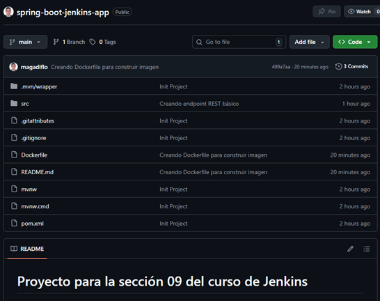
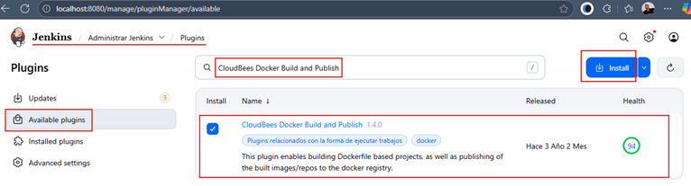
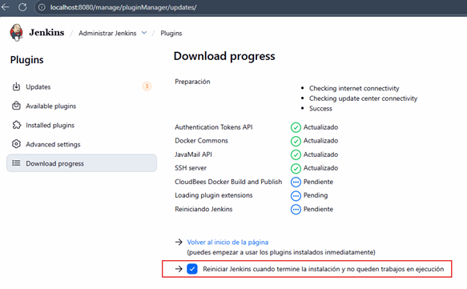

# 🚀 Sección 9: Empaquetar una Aplicación Spring Boot con Docker

En esta sección realizaremos lo que en empresas se conoce como:
**“Construcción y empaquetado de una aplicación Java + Spring Boot en una imagen Docker lista para despliegue”**.

Aunque en el curso el tutor utiliza una app Node.js, aquí trabajaremos directamente con nuestro stack
`Java/Spring Boot`, lo cual es más relevante para nuestra línea profesional en `CI/CD`.

---

## 🗂️ Crear repositorio en GitHub con aplicación Spring Boot

Para esta sección construiremos una aplicación sencilla de Spring Boot que cumpla con:

- 🧩 Un endpoint REST básico.
- 🐳 Un `Dockerfile` funcional siguiendo prácticas de empresas.
- ☁️ Código almacenado en GitHub: https://github.com/magadiflo/spring-boot-jenkins-app

📸 Estructura del repositorio:



A continuación mostramos la construcción del proyecto base.

### 📦 Dependencias del proyecto (Spring Initializr)

El proyecto se creó usando
[Spring initializr](https://start.spring.io/#!type=maven-project&language=java&platformVersion=3.5.7&packaging=jar&configurationFileFormat=yaml&jvmVersion=21&groupId=dev.magadiflo&artifactId=spring-boot-jenkins-app&name=spring-boot-jenkins-app&description=Demo%20project%20for%20Spring%20Boot&packageName=dev.magadiflo.app&dependencies=web,lombok,actuator)
con las siguientes dependencias:

````xml
<!--Spring Boot 3.5.7-->
<!--Java 21-->
<dependencies>
    <dependency>
        <groupId>org.springframework.boot</groupId>
        <artifactId>spring-boot-starter-actuator</artifactId>
    </dependency>
    <dependency>
        <groupId>org.springframework.boot</groupId>
        <artifactId>spring-boot-starter-web</artifactId>
    </dependency>

    <dependency>
        <groupId>org.projectlombok</groupId>
        <artifactId>lombok</artifactId>
        <optional>true</optional>
    </dependency>
    <dependency>
        <groupId>org.springframework.boot</groupId>
        <artifactId>spring-boot-starter-test</artifactId>
        <scope>test</scope>
    </dependency>
</dependencies>
````

### 🛠️ Configuración del application.yml

````yml
server:
  port: 8081
  error:
    include-message: always

spring:
  application:
    name: spring-boot-jenkins-app
````

💡 Nota:
> En el mundo real, los puertos rara vez se fijan en el código; se parametrizan mediante variables de entorno.
> Pero para este ejemplo está bien dejarlo `hardcodeado` en `8081`.

### 🌐 Endpoint REST básico

````java

@RestController
@RequestMapping(path = "/api/v1/greetings")
public class HelloController {
    @GetMapping
    public ResponseEntity<Map<String, Object>> hello() {
        var response = new HashMap<String, Object>();
        response.put("message", "Hola desde Spring Boot + Jenkins!");
        response.put("timestamp", LocalDateTime.now());
        response.put("version", "1.0.0");
        return ResponseEntity.ok(response);
    }
}
````

### 🔎 Verificación del funcionamiento

✔️ Endpoint propio

````bash
$ curl -v http://localhost:8081/api/v1/greetings | jq
>
< HTTP/1.1 200
< Content-Type: application/json
< Transfer-Encoding: chunked
< Date: Wed, 19 Nov 2025 16:21:45 GMT
<
{
  "message": "Hola desde Spring Boot + Jenkins!",
  "version": "1.0.0",
  "timestamp": "2025-11-19T11:21:45.1053065"
}
````

✔️ Endpoint Actuator

````bash
$ curl -v http://localhost:8081/actuator/health | jq
>
< HTTP/1.1 200
< Content-Type: application/vnd.spring-boot.actuator.v3+json
< Transfer-Encoding: chunked
< Date: Wed, 19 Nov 2025 16:22:18 GMT
<
{
  "status": "UP"
}
````

### 🐳 Creando el Dockerfile — Multi-Stage Build (Práctica de Empresa)

Ubicado en raíz del proyecto (junto al `pom.xml`):

````Dockerfile
# Stage 1: Build con Maven 3.9.11 + Java 21
FROM maven:3.9.11-eclipse-temurin-21 AS build
WORKDIR /app
COPY pom.xml .
COPY src ./src
RUN mvn clean package -DskipTests

# Stage 2: Runtime con JRE 21
FROM eclipse-temurin:21-jre-alpine AS runtime
WORKDIR /app
COPY --from=build /app/target/*.jar app.jar
EXPOSE 8081

# Usar ENTRYPOINT para inmutabilidad
ENTRYPOINT ["java", "-jar", "app.jar"] 
````

📌 ¿Por qué este Dockerfile? (Explicación Realista)

| Característica                                | Beneficio                                              |
|-----------------------------------------------|--------------------------------------------------------|
| 🏗️ **Multi-stage build**                     | Reduce tamaño y mejora seguridad.                      |
| ⚙️ **Maven + JDK solo para la fase de build** | No expones herramientas innecesarias en producción.    |
| 🔥 **Imagen final minimalista (JRE Alpine)**  | menos superficie de ataque + menos tiempo de arranque. |
| 📁 **COPY selectivo**                         | Copia solo el JAR final → imagen limpia.               |
| 🛞 **ENTRYPOINT**                             | Define comando inmutable para ejecución estándar.      |
| 📤 **Expose 8081**                            | Documenta el puerto usado por la app (Spring Boot).    |

### 📦 Lista final de entregables de esta sección

- ✔️ Proyecto Spring Boot funcional
- ✔️ Repositorio GitHub correctamente organizado
- ✔️ Endpoint REST y verificación
- ✔️ Dockerfile profesional estilo empresa
- ✔️ Imagen lista para ser construida por Jenkins en la siguiente sección

## 🚀 Instalación del Plugin: CloudBees Docker Build and Publish

Para habilitar que `Jenkins` pueda construir y publicar imágenes Docker directamente desde un job, instalaremos
el plugin `CloudBees Docker Build and Publish`.

### 🛠️ ¿Qué es el Plugin `CloudBees Docker Build and Publish`?

El `CloudBees Docker Build and Publish` Plugin para Jenkins es una extensión que proporciona pasos de pipeline
(o `build steps` para `jobs de estilo libre`) para interactuar directamente con la tecnología `Docker`.

Su propósito fundamental es permitir que un `job` de `Jenkins`:

1. `Construya (Build)` una imagen de `Docker` a partir de un `Dockerfile`.
2. `Etiquete (Tag)` esa imagen con la convención de nombres y versiones deseada.
3. `Publique (Push)` la imagen resultante a un registro de Docker, como `Docker Hub` (en nuestro caso), un registro
   privado o cualquier otro compatible con la API de Docker.

### 📥 Pasos para instalar el plugin

1. ⚙️ Ve a `Manage Jenkins` → `Plugins`
2. 📦 Ingresa a la pestaña `Available plugins`
3. 🔍 Busca: `CloudBees Docker Build and Publish`
4. ☑️ Selecciónalo e instálalo



5. 🔄 Finalmente, marcamos en `Reiniciar Jenkins...`.



