# 🚀 Sección 12: Jenkins Job DSL

---

## 🧩 Introducción al Job DSL

El término `DSL (Domain Specific Language)` hace referencia a un lenguaje diseñado para resolver problemas dentro
de un dominio específico. En el caso de `Jenkins`, el `Job DSL` permite
`definir, crear y actualizar jobs usando código`, en lugar de configurarlos manualmente desde la interfaz web.

Esto es especialmente útil en empresas donde se requiere:

- Estándares de configuración entre cientos de jobs.
- Versionar pipelines y plantillas.
- Automatizar despliegues de la infraestructura de CI/CD.

### 🛠️ ¿Qué es el plugin Jenkins Job DSL?

El plugin `Jenkins Job DSL` permite generar jobs mediante archivos escritos en `Groovy` (*`Groovy` es un lenguaje de
scripting dinámico para la plataforma Java*). Con este plugin podemos
escribir código que describa:

- Freestyle jobs
- Pipeline jobs
- Vistas
- Carpetas
- Configuraciones completas de la interfaz

De esta manera, Jenkins se convierte en un sistema declarativo, donde el código es la fuente de verdad para los jobs.

> 💡 Para poder usar `Job DSL` es indispensable instalar el plugin oficial: `Job DSL Plugin`

### 🧵 ¿Por qué usar Job DSL? (Beneficios Reales)

Los usuarios pueden describir sus jobs mediante scripts basados en `Groovy`, lo que habilita ventajas muy alineadas con
las prácticas modernas de CI/CD:

#### ✔️ Rollbacks seguros

Puedes revertir un cambio en un job simplemente regresando a una versión anterior del script en Git.

#### ✔️ Historial de cambios y auditoría

Cada modificación a un job queda registrada en el control de versiones (Git), no solo en la UI de Jenkins.

#### ✔️ Control de versiones

Los jobs pasan a ser infraestructura como código (IaC), facilitando:

- Revisiones por PR
- Control de calidad en cambios de pipelines
- Despliegue consistente de jobs en distintos entornos (Dev, QA, Prod)

#### ✔️ Automatización completa

Puedes crear cientos de jobs automáticamente a partir de una plantilla.

### 🏢 ¿Cómo se usa en empresas reales?

En el mundo profesional, `Job DSL` se emplea para:

- Definir plantillas estandarizadas para equipos completos.
- Crear jobs automáticamente para nuevos repositorios.
- Evitar configuraciones manuales que producen errores humanos.
- Mantener versiones claras de los pipelines (GitOps + CI/CD).
- Generar múltiples pipelines basados en parámetros (ej: microservicios).
- Reducir inconsistencias entre entornos o equipos.

💡 En entornos empresariales grandes, `Job DSL` convive con `Jenkins Pipeline` (declarativo o scripted).
Suele usarse así:

| Uso                         | Herramienta      |
|-----------------------------|------------------|
| Crear la estructura del job | Job DSL          |
| Ejecutar el pipeline real   | Jenkins Pipeline |

## ⚙️ Instalación del Plugin Job DSL

Para utilizar `Job DSL` en `Jenkins`, primero debemos instalar el plugin oficial. Este plugin nos permitirá definir
jobs mediante código `Groovy` y habilita las herramientas necesarias para generar, actualizar y gestionar
configuraciones desde scripts.

Nos vamos a `Administrar Jenkins` → `Plugins` y buscamos `Job DSL`, lo seleccionamos y procedemos a instalar.

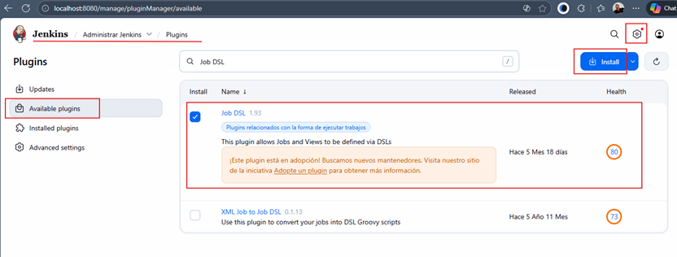

Seleccionamos `Reiniciar Jenkins cuando termina la instalación...` y esperamos mientras se instala.

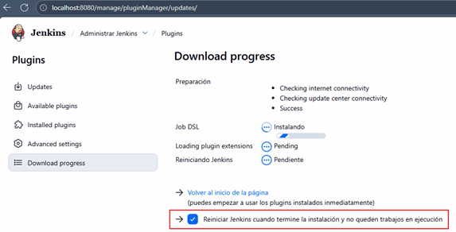

## 🌱 Seed Job & Description (Fundamentos del Job DSL)

Para utilizar correctamente el `Plugin Job DSL`, lo primero que debemos crear es un `Seed Job`.

Un `Seed Job` es un job normal de Jenkins (igual que los jobs de estilo libre que hemos estado creando), pero con
la particularidad de que incluye el paso `Process Job DSLs`. Este paso le permite ejecutar
`scripts DSL escritos en Groovy` para crear o actualizar otros jobs automáticamente. A partir de estos scripts es
posible:

- Crear nuevos jobs.
- Actualizar configuraciones.
- Regenerar plantillas.
- Aplicar cambios en masa.

En otras palabras:

> 🧠 El `Seed Job` es el `“job padre”` que genera otros jobs automáticamente mediante código.

### 🔍 ¿Por qué existe el Seed Job?

Porque `Jenkins`, por defecto, solo ejecuta lo que le asignamos manualmente. El `Seed Job` actúa como
“intérprete” del DSL, permitiendo:

- Automatizar creación de pipelines.
- Mantener jobs versionados.
- Facilitar la estandarización en equipos grandes.
- Evitar configuraciones manuales desde la UI.
- Regenerar jobs cuando cambian las plantillas.

> 💡 En empresas, los `Seed Jobs` suelen correr automáticamente al recibir cambios en su repositorio Git.

### 🛠️ Crear el Seed Job y configurar el DSL

Creamos un job de estilo libre llamado: `dsl-job`. Este será nuestro `Seed Job` inicial.

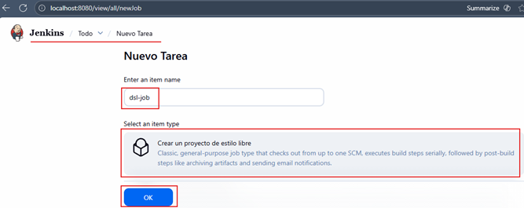

Dentro del job, nos dirigimos al `Build Steps` y en `+ Añadir un nuevo paso` seleccionamos `Process Job DSLs`.

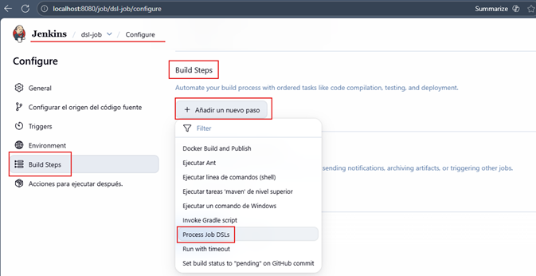

### 📁 Opciones del procesamiento DSL

Al agregar el paso, aparecen dos opciones:

- 🔸 Opción 1: `Use the provided DSL script`.
    - Permite escribir el código directamente en la interfaz del job.
    - Suele usarse solo para pruebas o demos.

- 🔸 Opción 2: `Look on Filesystem`
    - Permite cargar uno o varios archivos `.groovy` desde el workspace del job.
    - Esta es la forma usada en empresas, pues el DSL se versiona en Git.

En este punto usaremos la `opción 1` para una demostración.

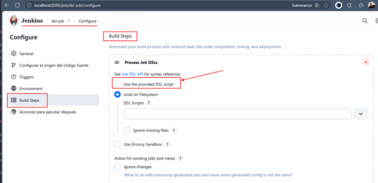

### 📝 Ejemplo básico de DSL Script

Al seleccionar la `opción 1`, aparece un cuadro de texto para escribir el script. Usaremos este ejemplo simple:

````bash
job('ejemplo-job-DSL') {
  
}
````

Este script indica:

> 🔨 Crear un nuevo job llamado `ejemplo-job-DSL` utilizando como base este seed job (`dsl-job`).

Nota:
> En el siguiente enlace https://jenkinsci.github.io/job-dsl-plugin podemos ver información sobre `Jenkins Job DSL API`


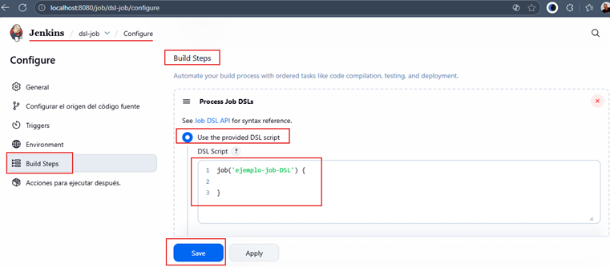

### ▶️ Ejecutando el Job DSL

Guardamos el Seed Job y luego hacemos clic en: `Construir Ahora`. Sin embargo, veremos que aparece un error:

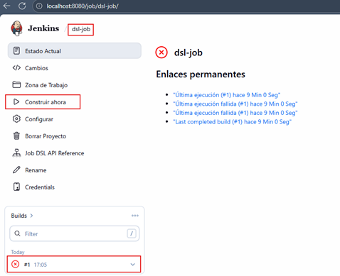

### 🛡️ ¿Por qué aparece el error?

Porque `Jenkins`, por seguridad, `no ejecuta scripts Groovy no aprobados`. `Jenkins` requiere revisar los scripts
para evitar ejecución de código potencialmente peligroso.

Debemos aprobarlos manualmente:

````
Administrar Jenkins → In-process Script Approval 
````

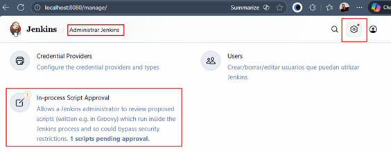

### ✔️ Aprobando el script

Entramos a `In-Process Script Approval` y hacemos clic en: `Approve`.


Después de aprobarlo, volvemos a ejecutar el Seed Job y veremos que ahora el build finaliza correctamente:

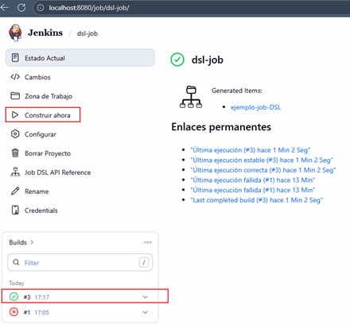

### 🎉 Verificando que el job fue creado

Vamos al panel principal de Jenkins y veremos que se generó un nuevo job: `ejemplo-job-DSL`.

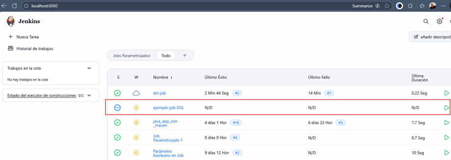

Y si ingresamos al job recién creado, veremos la referencia: `Seed job: dsl-job`. Esto nos confirma que el job fue
creado mediante código usando nuestro Seed Job.

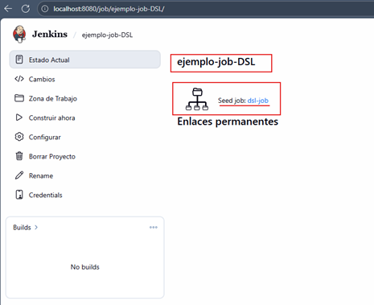

