# 🚀 Sección 12: Jenkins Job DSL

---

## 🧩 Introducción al Job DSL

El término `DSL (Domain Specific Language)` hace referencia a un lenguaje diseñado para resolver problemas dentro
de un dominio específico. En el caso de `Jenkins`, el `Job DSL` permite
`definir, crear y actualizar jobs usando código`, en lugar de configurarlos manualmente desde la interfaz web.

Esto es especialmente útil en empresas donde se requiere:

- Estándares de configuración entre cientos de jobs.
- Versionar pipelines y plantillas.
- Automatizar despliegues de la infraestructura de CI/CD.

### 🛠️ ¿Qué es el plugin Jenkins Job DSL?

El plugin `Jenkins Job DSL` permite generar jobs mediante archivos escritos en `Groovy` (*`Groovy` es un lenguaje de
scripting dinámico para la plataforma Java*). Con este plugin podemos
escribir código que describa:

- Freestyle jobs
- Pipeline jobs
- Vistas
- Carpetas
- Configuraciones completas de la interfaz

De esta manera, Jenkins se convierte en un sistema declarativo, donde el código es la fuente de verdad para los jobs.

> 💡 Para poder usar `Job DSL` es indispensable instalar el plugin oficial: `Job DSL Plugin`

### 🧵 ¿Por qué usar Job DSL? (Beneficios Reales)

Los usuarios pueden describir sus jobs mediante scripts basados en `Groovy`, lo que habilita ventajas muy alineadas con
las prácticas modernas de CI/CD:

#### ✔️ Rollbacks seguros

Puedes revertir un cambio en un job simplemente regresando a una versión anterior del script en Git.

#### ✔️ Historial de cambios y auditoría

Cada modificación a un job queda registrada en el control de versiones (Git), no solo en la UI de Jenkins.

#### ✔️ Control de versiones

Los jobs pasan a ser infraestructura como código (IaC), facilitando:

- Revisiones por PR
- Control de calidad en cambios de pipelines
- Despliegue consistente de jobs en distintos entornos (Dev, QA, Prod)

#### ✔️ Automatización completa

Puedes crear cientos de jobs automáticamente a partir de una plantilla.

### 🏢 ¿Cómo se usa en empresas reales?

En el mundo profesional, `Job DSL` se emplea para:

- Definir plantillas estandarizadas para equipos completos.
- Crear jobs automáticamente para nuevos repositorios.
- Evitar configuraciones manuales que producen errores humanos.
- Mantener versiones claras de los pipelines (GitOps + CI/CD).
- Generar múltiples pipelines basados en parámetros (ej: microservicios).
- Reducir inconsistencias entre entornos o equipos.

💡 En entornos empresariales grandes, `Job DSL` convive con `Jenkins Pipeline` (declarativo o scripted).
Suele usarse así:

| Uso                         | Herramienta      |
|-----------------------------|------------------|
| Crear la estructura del job | Job DSL          |
| Ejecutar el pipeline real   | Jenkins Pipeline |

## ⚙️ Instalación del Plugin Job DSL

Para utilizar `Job DSL` en `Jenkins`, primero debemos instalar el plugin oficial. Este plugin nos permitirá definir
jobs mediante código `Groovy` y habilita las herramientas necesarias para generar, actualizar y gestionar
configuraciones desde scripts.

Nos vamos a `Administrar Jenkins` → `Plugins` y buscamos `Job DSL`, lo seleccionamos y procedemos a instalar.


Seleccionamos `Reiniciar Jenkins cuando termina la instalación...` y esperamos mientras se instala.


## 🌱 Seed Job & Description (Fundamentos del Job DSL)

Para utilizar correctamente el `Plugin Job DSL`, lo primero que debemos crear es un `Seed Job`.

Un `Seed Job` es un job normal de Jenkins (igual que los jobs de estilo libre que hemos estado creando), pero con
la particularidad de que incluye el paso `Process Job DSLs`. Este paso le permite ejecutar
`scripts DSL escritos en Groovy` para crear o actualizar otros jobs automáticamente. A partir de estos scripts es
posible:

- Crear nuevos jobs.
- Actualizar configuraciones.
- Regenerar plantillas.
- Aplicar cambios en masa.

En otras palabras:

> 🧠 El `Seed Job` es el `“job padre”` que genera otros jobs automáticamente mediante código.

### 🔍 ¿Por qué existe el Seed Job?

Porque `Jenkins`, por defecto, solo ejecuta lo que le asignamos manualmente. El `Seed Job` actúa como
“intérprete” del DSL, permitiendo:

- Automatizar creación de pipelines.
- Mantener jobs versionados.
- Facilitar la estandarización en equipos grandes.
- Evitar configuraciones manuales desde la UI.
- Regenerar jobs cuando cambian las plantillas.

> 💡 En empresas, los `Seed Jobs` suelen correr automáticamente al recibir cambios en su repositorio Git.

### 🛠️ Crear el Seed Job y configurar el DSL

Creamos un job de estilo libre llamado: `dsl-job`. Este será nuestro `Seed Job` inicial.


Dentro del job, nos dirigimos al `Build Steps` y en `+ Añadir un nuevo paso` seleccionamos `Process Job DSLs`.


### 📁 Opciones del procesamiento DSL

Al agregar el paso, aparecen dos opciones:

- 🔸 Opción 1: `Use the provided DSL script`.
    - Permite escribir el código directamente en la interfaz del job.
    - Suele usarse solo para pruebas o demos.

- 🔸 Opción 2: `Look on Filesystem`
    - Permite cargar uno o varios archivos `.groovy` desde el workspace del job.
    - Esta es la forma usada en empresas, pues el DSL se versiona en Git.

En este punto usaremos la `opción 1` para una demostración.


### 📝 Ejemplo básico de DSL Script

Al seleccionar la `opción 1`, aparece un cuadro de texto para escribir el script. Usaremos este ejemplo simple:

````bash
job('ejemplo-job-DSL') {
  
}
````

Este script indica:

> 🔨 Crear un nuevo job llamado `ejemplo-job-DSL` utilizando como base este seed job (`dsl-job`).

Nota:
> En el siguiente enlace https://jenkinsci.github.io/job-dsl-plugin podemos ver información sobre `Jenkins Job DSL API`


### ▶️ Ejecutando el Job DSL

Guardamos el Seed Job y luego hacemos clic en: `Construir Ahora`. Sin embargo, veremos que aparece un error:


### 🛡️ ¿Por qué aparece el error?

Porque `Jenkins`, por seguridad, `no ejecuta scripts Groovy no aprobados`. `Jenkins` requiere revisar los scripts
para evitar ejecución de código potencialmente peligroso.

Debemos aprobarlos manualmente:

````
Administrar Jenkins → In-process Script Approval 
````


### ✔️ Aprobando el script

Entramos a `In-Process Script Approval` y hacemos clic en: `Approve`.


Después de aprobarlo, volvemos a ejecutar el Seed Job y veremos que ahora el build finaliza correctamente:


### 🎉 Verificando que el job fue creado

Vamos al panel principal de Jenkins y veremos que se generó un nuevo job: `ejemplo-job-DSL`.


Y si ingresamos al job recién creado, veremos la referencia: `Seed job: dsl-job`. Esto nos confirma que el job fue
creado mediante código usando nuestro Seed Job.


## 📁 Source Control Management (SCM)

En esta lección aprenderemos a integrar `GitHub` dentro de un `Job` creado mediante `Jenkins Job DSL`, indicándole
desde qué repositorio debe clonar el código fuente para ejecutar el pipeline o los scripts asociados.

Integrar correctamente `SCM` es fundamental en entornos empresariales, ya que:

- Permite ejecutar pipelines reproducibles.
- Garantiza que el código provenga siempre de una fuente controlada.
- Hace posible trabajar con branching models modernos (`GitFlow`, `trunk-based development`).
- Facilita auditorías y trazabilidad.

### 🔍 Conociendo el Git SCM Source en Job DSL

Para definir el origen del código dentro del script DSL, utilizamos el bloque `scm { ... }`.

En la documentación oficial del plugin:

➡️ [Jenkins Job DSL Plugin](https://jenkinsci.github.io/job-dsl-plugin/#method/javaposse.jobdsl.dsl.helpers.ScmContext.git)
encontraremos ejemplos como este:

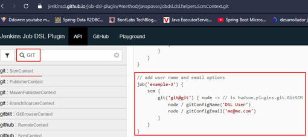

En la imagen vemos el `example-3`, mismo que se representa a continuación.

````bash
// add user name and email options
job('example-3') {
    scm {
        git('git@git') { node -> // is hudson.plugins.git.GitSCM
            node / gitConfigName('DSL User')
            node / gitConfigEmail('me@me.com')
        }
    }
} 
````

#### 📝 ¿Qué son `gitConfigName` y `gitConfigEmail`?

- Estos parámetros dentro del bloque `scm` están configurando la identidad que `Git` utilizará para firmar cualquier
  nuevo commit que Jenkins haga en el repositorio.
- Esto es el equivalente a ejecutar los siguientes comandos de Git dentro del espacio de trabajo del job de Jenkins (si
  el job hiciera un commit):
    ````bash
    git config user.name "DSL User"
    git config user.email "me@me.com" 
    ````
- `¿Son importantes?` Sí, porque si tu job realiza una acción que resulta en un commit (por ejemplo, actualizando un
  número de versión o un archivo de configuración), esta es la información del autor que aparecerá en el historial de
  Git.

### 🧪 Ejemplo previo usado en el curso

Anteriormente, probamos este script desde un job parametrizable de tipo Freestyle llamado `Parámetro booleano en Job`:

````bash
#!/bin/bash
echo "Bienvenido al planeta ${PLANET}"
if [ "${AGENT}" = "true" ] 
then
	echo "Prepárese para la misión agente X, que la fuerza te acompañe."
else
	echo "Disfruta el planeta humano ${NAME}, trata de no morir"
fi
echo "..."
sleep 10
echo "¡Suerte! La necesitarás." 
````

Este mismo script estará subido en el repositorio de GitHub del tutor en un archivo llamado `jobscript.sh`, tal como
se muestra a continuación.

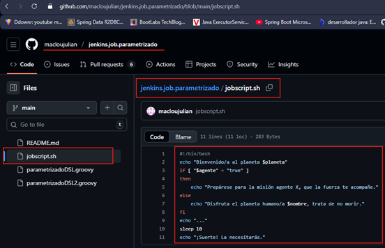

### 🛠️ Realizando el Ejemplo con Job DSL

Nos dirigimos al `Seed Job` `dsl-job` → `Configure` → `Build Steps` → `Process Job DSLs`, e insertamos lo siguiente:

````bash
job('ejemplo-job-DSL') {
  description('Job DSL de ejemplo para el curso de Jenkins')
  scm {
        git('https://github.com/macloujulian/jenkins.job.parametrizado.git', 'main') { node ->
            node / gitConfigName('Martín Díaz')
            node / gitConfigEmail('magadiflo@gmail.com')
        }
    }
}
````

#### 💡 ¿Qué hace este script?

- Crea un nuevo job llamado `ejemplo-job-DSL`.
- Configura `Git SCM` apuntando al repositorio `GitHub`.
- Selecciona la rama `main`.
- Define el nombre y correo del autor si Jenkins ejecuta operaciones Git.

En la siguiente imagen se observa la modificación anterior.

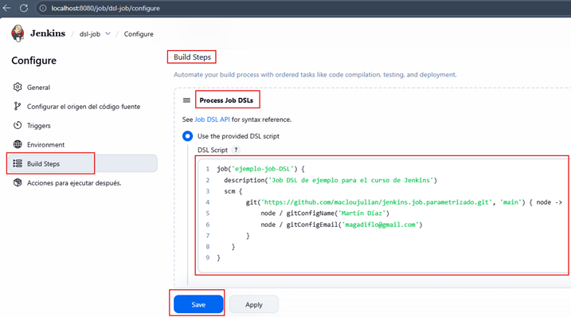

Luego de dar en `Save`, vamos a `Construir ahora`. Probablemente, el job no se ejecute y nos muestre un mensaje
de error `ERROR: script not yet approved for use`.

### 🔐 Mensaje de error: `script not yet approved for use`

El error `ERROR: script not yet approved for use` significa que el Groovy Sandbox de Jenkins está bloqueando la
ejecución del script porque contiene métodos o clases que Jenkins considera potencialmente inseguros.

Cuando ejecutas un Seed Job que usa Job DSL, en realidad estás ejecutando un script Groovy. Jenkins tiene un mecanismo
de seguridad (el `In-process Script Approval`) para evitar que scripts maliciosos puedan dañar el sistema de archivos o
acceder a información sensible.

Para resolver esto, debemos aprobar manualmente el script del Job DSL.

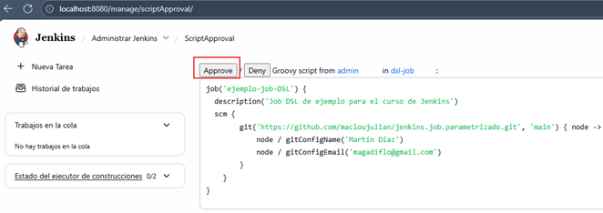

### ✔️ Ejecución Exitosa

Cuando el Seed Job corre nuevamente:

- El script queda aprobado.
- El job `ejemplo-job-DSL` se crea correctamente.
- La configuración SCM aparece con el repositorio y la rama definida.

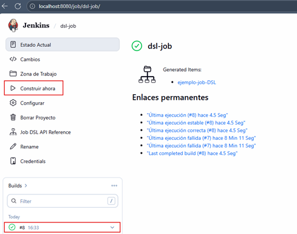

Dentro de este `Seed Job` llamado `dls-job` vemos un job `ejemplo-job-DSL`, ingresamos en él y vemos que `Git`
se ha configurado indicando el `repositorio de GitHub` y la rama `main`.

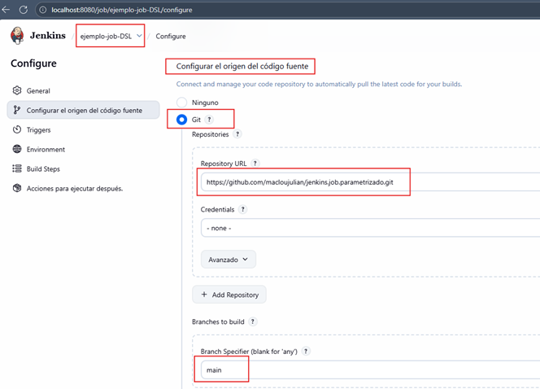

Recordemos que el `Process Job DSLs` inicia con `job('ejemplo-job-DSL'){...}`, por eso es que la configuración de git
y el repositorio de GitHub se aplicaron a ese job.

### 📌 Conclusión

- El bloque `scm` en Job DSL permite integrar repositorios GitHub directamente en la definición de jobs.
- Es fundamental configurar nombre y email para que los commits generados por Jenkins tengan identidad clara.
- En Jenkins, los scripts DSL son Groovy y requieren aprobación de seguridad antes de ejecutarse.
- Una vez aprobado, el job queda listo para usar el código fuente del repositorio remoto.

## 🎛️ Parámetros en Jenkins DSL (Job DSL)

En esta lección aprenderemos cómo definir parámetros en un Job utilizando `Jenkins Job DSL`.
Los parámetros permiten que un job sea dinámico, configurable y reutilizable; son ampliamente usados en entornos
reales para:

- Deploys a distintos entornos (`DEV`, `QA`, `PROD`).
- Activar o desactivar funcionalidades.
- Pasar variables a scripts (como nuestro `jobscript.sh`).
- Seleccionar versiones, ramas o artefactos.
- Cambiar comportamientos del pipeline según valores de entrada.

### 📚 Consultando documentación oficial

En la documentación del plugin:
➡️ [Jenkins Job DSL Plugin](https://jenkinsci.github.io/job-dsl-plugin/#method/javaposse.jobdsl.dsl.jobs.FreeStyleJob.parameters)

Encontramos el siguiente ejemplo básico:

````bash
job('example') {
    parameters {
        booleanParam('FLAG', true)
        choiceParam('OPTION', ['option 1 (default)', 'option 2', 'option 3'])
    }
}
````

💡 ¿Qué hace este ejemplo?

- `booleanParam` → crea un checkbox
- `choiceParam` → crea una lista desplegable con opciones

Este patrón es el que usaremos para definir nuestros parámetros personalizados.

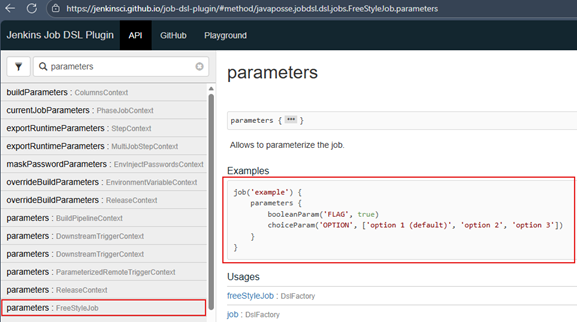

### 🛠️ Configurando parámetros para el ejemplo real del curso

Nuestro script `jobscript.sh` descargado desde GitHub requiere los parámetros:

- NAME
- PLANET
- AGENT

Por lo tanto, debemos agregar esos parámetros mediante el `DSL`. Volvemos a nuestro
`Seed Job` → `Configure` → `Process Job DSLs` y agregamos los parámetros dentro del job `ejemplo-job-DSL`.

````bash
job('ejemplo-job-DSL') {
  description('Job DSL de ejemplo para el curso de Jenkins')
  scm {
        git('https://github.com/macloujulian/jenkins.job.parametrizado.git', 'main') { node ->
            node / gitConfigName('Martín Díaz')
            node / gitConfigEmail('magadiflo@gmail.com')
        }
    }
  parameters {
    stringParam('NAME', 'Milagritos', 'Parámetro de cadena para el Job Booleano')
    choiceParam('PLANET', ['Mercurio', 'Venus', 'Tierra', 'Marte', 'Júpiter', 'Saturno', 'Urano', 'Neptuno', 'Plutón'], 'Lista de parámetros')
    booleanParam('AGENT', false)
  }
} 
````

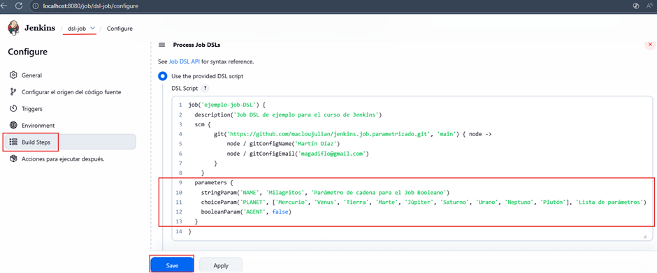

Damos en `Save` y vamos a `Construir ahora`. Si nos aparece el error `ERROR: script not yet approved for use`
ya sabemos que debemos aprobar la ejecución de ese job en:
`Administrar Jenkins` > `In-process Script Approval`.

### 🖼️ Configuración visual en la UI

Al ejecutar el `Seed Job` y después ir al `ejemplo-job-DSL`, veremos los parámetros listos para ser usados.

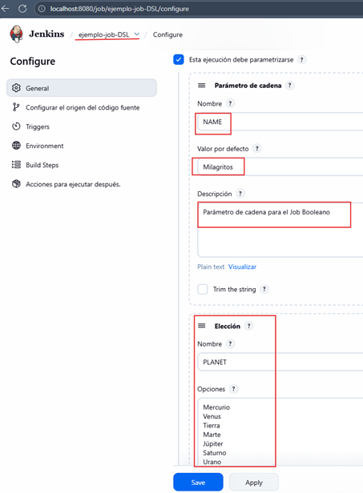

Esto confirma que el DSL del `Seed Job` está creando correctamente los parámetros en el job destino.

### ⚙️ ¿Por qué los parámetros aparecen en `ejemplo-job-DSL`?

Porque el Seed Job ejecuta:

````bash
job('ejemplo-job-DSL') { ... } 
````

Todo lo que esté dentro de ese bloque se aplica `al job que estamos declarando` y no al `Seed Job`.
El Seed Job solo sirve para `crear o actualizar` otros jobs. Este patrón es estándar en grandes empresas:

#### 🧩 Patrón típico en entornos reales

- `Seed Job`: crea/actualiza cientos de jobs automáticamente.
- `Jobs generados por DSL`: contienen toda la configuración (SCM, parámetros, triggers, etc.).
- La configuración vive en código, no en clics manuales.

### Verifica parámetros en job `ejemplo-job-DSL`

Si damos clic en `Build with Parameters` en el job `ejemplo-job-DSL`, vemos que nos aparece los parámetros configurados.

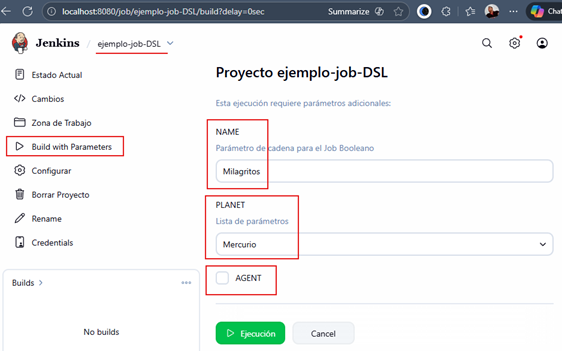

## ⏱️ Triggers & Wrappers en Jenkins Job DSL

En esta lección aprenderemos a utilizar dos conceptos fundamentales cuando definimos jobs mediante `Jenkins Job DSL`:

- `Wrappers` → Acciones adicionales antes/después del job.
- `Triggers` → Programar la ejecución de un job automáticamente.

Ambos son utilizados en entornos empresariales para controlar el comportamiento de los jobs y automatizar procesos de
CI/CD.

### 🎁 Wrappers

Un `wrapper` es un bloque que permite agregar comportamientos adicionales al job, ya sea antes o después de la
ejecución.

Ejemplos típicos en empresas:

- ✔️ Configurar timeout.
- ✔️ Ejecutar el job en un entorno controlado.
- ✔️ Agregar timestamps a la consola.
- ✔️ Activar ansiColor.
- ✔️ Enmascarar logs con credenciales.

Aunque lo estudiaremos más adelante con profundidad, podemos describirlo así:

> 💡 `Wrapper` = comportamiento extra antes o después de la ejecución del job.

Ejemplo real:

````groovy
wrappers {
    timeout {
        absolute(10) // falla el job si dura más de 10 minutos
    }
    timestamps() // agrega tiempo a cada línea del log
} 
````

### ⏱️ Triggers en Jenkins

Los `triggers` permiten ejecutar un job de manera automática sin intervención humana.

En el mundo real esto se usa para:

- Ejecutar builds diarios o nocturnos (nightly builds).
- Validar ramas periódicamente.
- Sincronizar repositorios.
- Generar reportes automáticos.
- Automatizar tareas repetitivas.

En `Job DSL`, un trigger común es el `cron`.

#### 🧩 ¿Qué es un cron?

Un `cron` es una expresión que indica cuándo debe ejecutarse algo. Tiene 5 campos:

````scss
┌────────── Minutos (0 - 59)
│ ┌──────── Hora (0 - 23)
│ │ ┌────── Día del mes (1 - 31)
│ │ │ ┌──── Mes (1 - 12)
│ │ │ │ ┌── Día de la semana (0 - 7)
│ │ │ │ │
│ │ │ │ │
* * * * * 
````

Ejemplos:

| Expresión   | Significa                                |
|-------------|------------------------------------------|
| `* * * * *` | Cada minuto                              |
| `0 * * * *` | Cada hora exacta                         |
| `0 0 * * *` | Todos los días a medianoche              |
| `H * * * *` | Una vez por hora, usando hashing estable |

#### 💡 `H` en Jenkins

`Jenkins` incluye la letra `H (hash)` para distribuir automáticamente las ejecuciones y evitar que todos los
jobs corran a la vez. Es una mejor práctica recomendada en empresas.

Ejemplo:

````bash
H/7 * * * *
````

➡️ `Ejecuta el job cada 7 minutos`, pero no siempre en el mismo minuto exacto. Esto balancea la carga del servidor.

### 🧩 Nota rápida sobre el formato `cron` en otros sistemas

En `Apache Camel` los `cron` usan `6 campos` porque se basan en `Quartz Cron`, que incluye el campo de segundos:

````bash
Segundos  Minutos  Horas  DíaMes  Mes  DíaSemana 
````

En `Jenkins`, en cambio, el `cron` usa el formato `Unix clásico` de `5 campos`, sin segundos:

````bash
Minutos  Horas  DíaMes  Mes  DíaSemana
````

💡 Por eso en `Camel` verás `expresiones con 6 asteriscos`, mientras que en `Jenkins solo 5`.

### 🛠️ Trigger en Job DSL

Así se define un trigger con cron:

````groovy
triggers {
    cron('H/7 * * * *')
} 
````

### 🧱 DSL Completo con SCM, Parámetros y Trigger

Aquí está el script completo utilizado en esta lección:

````groovy
job('ejemplo-job-DSL') {
    description('Job DSL de ejemplo para el curso de Jenkins')
    scm {
        git('https://github.com/macloujulian/jenkins.job.parametrizado.git', 'main') { node ->
            node / gitConfigName('Martín Díaz')
            node / gitConfigEmail('magadiflo@gmail.com')
        }
    }
    parameters {
        stringParam('NAME', 'Milagritos', 'Parámetro de cadena para el Job Booleano')
        choiceParam('PLANET', ['Mercurio', 'Venus', 'Tierra', 'Marte', 'Júpiter', 'Saturno', 'Urano', 'Neptuno', 'Plutón'], 'Lista de parámetros')
        booleanParam('AGENT', false)
    }
    triggers {
        cron('H/7 * * * *') // Se ejecuta cada 7 minutos
    }
}
````

La imagen muestra lo mismo que el código anterior.

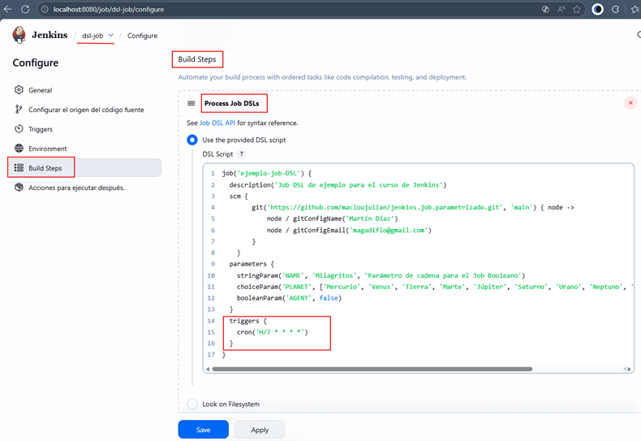

### 🖼️ Visualización en Jenkins

Luego de ejecutar el `Seed Job` (recordemos aprobar el script en `Manage Jenkins` → `In-process Script Approval`).

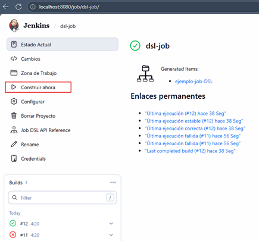

El job generado `ejemplo-job-DSL` mostrará el trigger configurado:


Como podemos observar, en la opción `Triggers` se muestra el crón definido anteriormente. Este trigger se ejecutará
cada 7 minutos.
