# 🚀 Sección 13: Java Maven DSL

---

## 🔓 Deshabilitando la seguridad de scripts para los Job DSL

Cuando trabajamos con `Job DSL` (Domain Specific Language) en Jenkins, es común que después de modificar algún script
—especialmente en el `Seed Job`— `Jenkins bloquee la ejecución hasta que el administrador apruebe manualmente` el
contenido del DSL. Esto ocurre porque, por defecto, `Jenkins` aplica un mecanismo de `Script Security` para evitar
que scripts potencialmente maliciosos afecten la configuración del servidor.

Sin embargo, mientras desarrollamos y hacemos iteraciones rápidas, este proceso puede ser molesto e innecesario. Para
entornos de prueba o aprendizaje, podemos `deshabilitar temporalmente esta validación`.

### ⚠️ Advertencia importante (mundo real)

En entornos corporativos o servidores Jenkins compartidos, nunca desactives la seguridad de scripts.
Las empresas mantienen esta opción activada para evitar que alguien ejecute un DSL que modifique trabajos, agentes o
ejecuciones sin control.

La opción solo conviene desactivarla cuando:

- "estás en un Jenkins local",
- "estás en un ambiente sandbox",
- "o eres administrador y sabes exactamente qué scripts se ejecutarán".

### 🛠️ Pasos para deshabilitar la Script Security en DSL

Para permitir que Jenkins ejecute los scripts sin solicitar aprobación manual:

1. Ir a Manage Jenkins (Administrar Jenkins).
2. Seleccionar Security.
3. Desmarcar la opción: `Enable script security for Job DSL scripts`
4. Guardar los cambios.


## 🧩 Contexto previo antes de la creación de los Jobs

En la `Sección 7: Integración de Jenkins con una App Java + Maven`, creamos manualmente el job `java_app_con_maven`
y ahí configuramos:

- 📦 Origen del código fuente (repositorio Git)
- 🏗️ Build Steps (comandos Maven para compilar, ejecutar tests y empaquetar el .jar)
- 📬 Notificaciones por correo
- 💬 Notificaciones por Slack
- 📝 Publicación de reportes de pruebas JUnit

En resumen, construimos un `job clásico configurado manualmente desde la UI de Jenkins`.

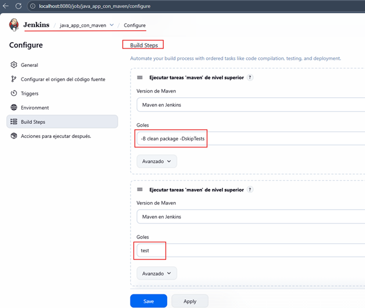

### 🔁 ¿Qué cambia en esta Sección 13?

En esta sección daremos un paso importante hacia la automatización real: vamos a reemplazar la configuración manual
por una configuración declarativa usando `Job DSL scripts`.

#### 🎯 ¿Qué significa esto?

Toda la configuración que antes hacíamos clic por clic en la interfaz ahora la definiremos mediante código `.groovy`,
dentro de un `Seed Job` (job padre).

Luego, solo debemos `ejecutar ese Seed Job`, y Jenkins:

- Generará automáticamente el job hijo.
- Aplicará toda la configuración especificada en el DSL.
- Mantendrá una configuración reproducible y versionable.

#### 💼 ¿Por qué esto es importante en el mundo real?

En entornos profesionales, la configuración manual en Jenkins se considera una mala práctica, porque:

- ❌ No se versiona.
- ❌ Es difícil replicar en nuevos entornos (QA, Stage, Prod).
- ❌ No es auditable.
- ❌ Depende de la memoria del operador ("¿qué checkbox activé la vez pasada?").

Con `Job DSL` o `Pipeline-as-Code` (Jenkinsfile):

- ✔️ La configuración está en Git.
- ✔️ La creación de jobs es idéntica entre entornos.
- ✔️ Puedes hacer PRs para revisar cambios.
- ✔️ Evitas configuraciones inconsistentes.
- ✔️ Puedes reconstruir toda la estructura de jobs desde cero.

💡 Nota:

Aunque `DSL Job` ha sido muy usado, muchas empresas están migrando a `Multibranch Pipelines` y `Pipeline-as-Code`.
Sin embargo, `Job DSL` sigue siendo útil para:

- Generar estructuras de carpetas.
- Crear plantillas de jobs.
- Crear cientos de jobs parametrizados.
- Automatizar la gestión del propio Jenkins.

## 📝 Creación de Jobs con Job DSL – Script Integrado (In-line)

En esta lección aprenderemos la primera forma de generar jobs con `Job DSL`, colocando el código
`directamente dentro del Seed Job`. Esta técnica se conoce como `Inline DSL (o Script Integrado)`, porque el código
`.groovy` vive en la misma configuración del Job y no en un archivo externo.

⚠️ Nota profesional (mundo real):
> Las empresas suelen evitar el `DSL inline`, porque no se versiona en Git. Se usa solo para prototipos,
> sandbox y pruebas. Más adelante veremos la forma correcta y profesional: `DSL desde archivos externos versionados`.

### 🌱 Creando el Seed Job (Job Padre)

Creamos un nuevo job de tipo Freestyle Job con el nombre: `seed-job-dsl-integrated`.

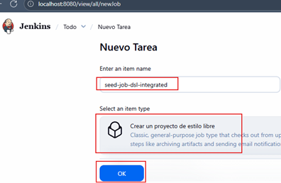

### ⚙️ Configurando el Seed Job para procesar DSL

Una vez creado el job:

1. Entramos a `Configurar`
2. Bajamos a `Build Steps`
3. Seleccionamos `Add build step` → `Process Job DSLs`
4. Y elegimos la opción: `Use the provided DSL script`

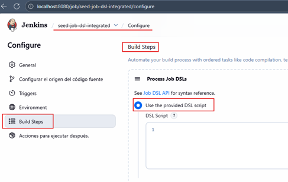

En este modo escribiremos el código DSL directamente en el cuadro de texto del Seed Job.

### 📚 Archivo de referencia del repositorio

La siguiente imagen muestra el archivo `javamavenDSL.groovy`. Este archivo se encuentra en el subdirectorio `DSL/`
de nuestro repositorio forkeado
(referencia: https://github.com/magadiflo/simple-java-maven-app/blob/master/DSL/javamavenDSL.groovy).
Contiene el código `Groovy DSL` que utilizaremos como plantilla para definir nuestros Jobs en Jenkins.

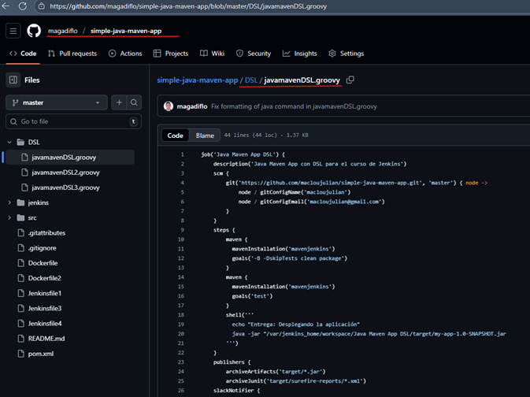

Tomamos ese archivo como referencia para escribir nuestro propio DSL, aplicando pequeñas mejoras.

### 🧱 Código DSL (Groovy) Modificado

Aquí está la versión del script que usaremos dentro del `Seed Job`:

````groovy
job('java-app-con-maven-dsl') {
    description('Java Maven App con DSL para el curso de Jenkins')
    scm {
        git('https://github.com/magadiflo/simple-java-maven-app.git', 'master') { node ->
            node / gitConfigName('Martín Díaz')
            node / gitConfigEmail('magadiflo@gmail.com')
        }
    }
    steps {
        maven {
            mavenInstallation('Maven en Jenkins')
            goals('-B -DskipTests clean package')
        }
        maven {
            mavenInstallation('Maven en Jenkins')
            goals('test')
        }
        shell('''
          echo "Entrega: Desplegando la aplicación" 
          java -jar /var/jenkins_home/workspace/java-app-con-maven-dsl/target/my-app-1.0-SNAPSHOT.jar
        ''')
    }
    publishers {
        archiveArtifacts('target/*.jar')
        archiveJunit('target/surefire-reports/*.xml')
        slackNotifier {
            notifyAborted(true)
            notifyEveryFailure(true)
            notifyNotBuilt(false)
            notifyUnstable(false)
            notifyBackToNormal(true)
            notifySuccess(true)
            notifyRepeatedFailure(false)
            startNotification(false)
            includeTestSummary(false)
            includeCustomMessage(false)
            customMessage(null)
            sendAs(null)
            commitInfoChoice('NONE')
            teamDomain(null)
            authToken(null)
        }
    }
}
````

### 🧩 ¿Qué hace este código DSL Groovy?

Este script define un job de Jenkins completamente desde código. Lo más importante que realiza es:

#### 🔧 1. Creación del Job

- Crea un job llamado `java-app-con-maven-dsl`.
- Le asigna una descripción visible en la UI.

#### 📥 2. Configuración del SCM (Git)

- Clona el repositorio: https://github.com/magadiflo/simple-java-maven-app.git
- Usa la rama `master`.
- Registra nombre y correo para identificar los commits en Jenkins (metadatos).

#### 🏗️ 3. Ejecución de Builds con Maven

El core del job para Java:

- Usa la instalación de Maven llamada `Maven en Jenkins`.
- El nombre `Maven en Jenkins` debe coincidir exactamente con la instalación de Maven definida en:
  `Administrar Jenkins` → `Tools` → `Instalaciones de Maven`.
- Ejecuta dos pasos Maven:
    1. `-B -DskipTests clean package` → compila y empaqueta el JAR sin correr tests.
    2. `test` → ejecuta las pruebas unitarias.

> Esto reproduce el pipeline clásico de proyectos Java: `compilar` → `empaquetar` → `probar`.

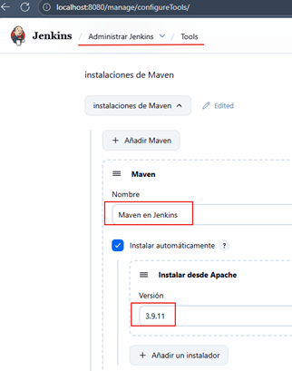

#### 🚀 4. Ejecución de la aplicación Java

- Usa un paso `shell` para lanzar el `.jar` generado.
- Ejecuta: `java -jar /var/jenkins_home/workspace/java-app-con-maven-dsl/target/my-app-1.0-SNAPSHOT.jar`.
- Esto demuestra que el build generó un artefacto válido.

#### 📦 5. Publicación de artefactos

- Guarda el `.jar` como artefacto descargable.
- Publica resultados de pruebas `JUnit` desde `surefire-reports`.

#### 💬 6. Notificaciones por Slack

Configura el plugin de `Slack` para enviar notificaciones según el resultado del job (`fallo`, `éxito`, `inestable`,
`abortado`, etc.).

#### 🎯 Resumen breve

El script crea un job completo que:

- Clona un proyecto Java/Maven desde Git
- Compila y empaqueta la aplicación
- Ejecuta tests
- Corre la aplicación Java
- Publica el `.jar` y reportes de pruebas
- Notifica a Slack los resultados

> Todo esto `sin tocar la interfaz gráfica`, demostrando cómo Job DSL convierte una configuración manual en un proceso
> totalmente automatizado.

### 🧩 Colocando el código DSL en el Seed Job

En el Seed Job entramos a: `Build Steps` → `Process Job DSLs` → `Use the provided DSL script` y
pegamos el código `.groovy`.

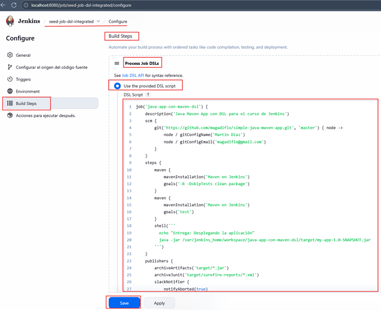

Guardamos los cambios.

### ▶️ Ejecutando el Seed Job

Damos clic en `Construir ahora` en el job `seed-job-dsl-integrated`. Una vez completado el build, veremos que
Jenkins generó automáticamente un nuevo job: `java-app-con-maven-dsl`

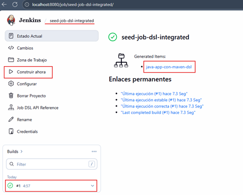

También aparece correctamente en la pantalla principal:

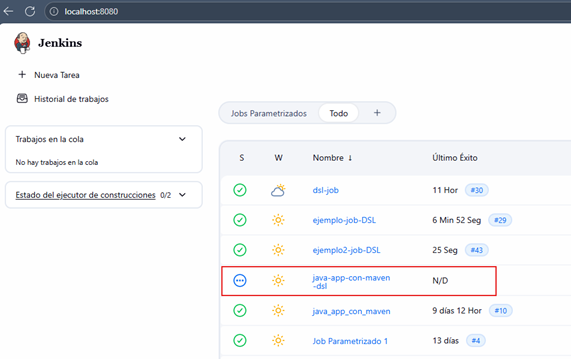

### 🔧 Verificando la configuración generada

Ingresamos a `Configurar` dentro del job recién creado (`java-app-con-maven-dsl`) y confirmamos que todas las opciones
(`SCM`, `Maven`, `Slack`, `JUnit`, `shell`, etc.) fueron aplicadas exactamente como estaban en el `código DSL`.

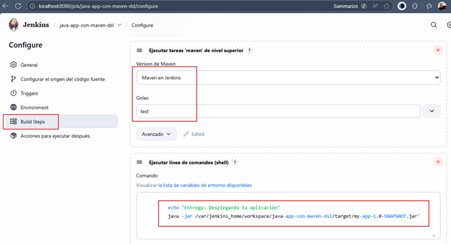

### ▶️ Ejecutando el job generado

Ahora ejecutamos el job `java-app-con-maven-dsl` con `Construir ahora` y vemos que se ejecuta correctamente:

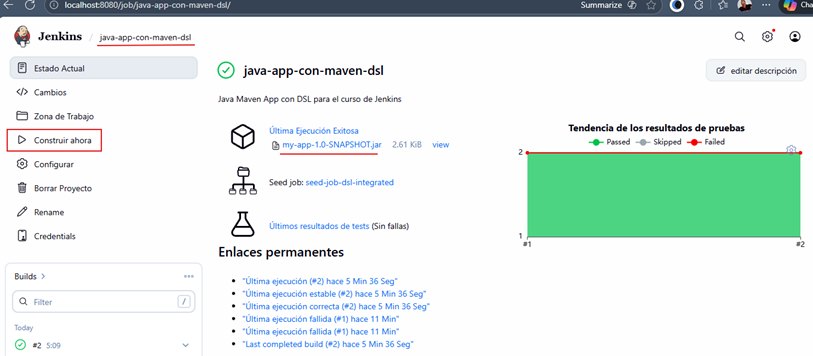

Y en los logs aparece:

- La ejecución de `Maven`
- El despliegue del `.jar`
- El mensaje final `SUCCESS`

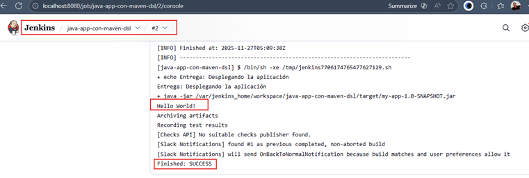

### ✅ Resumen

En esta primera aproximación:

- Creamos un Seed Job básico.
- Pegamos el `DSL Groovy` directamente dentro del job.
- Generamos un job completo sin tocar la UI de Jenkins.
- Confirmamos que todo funciona: build, artefactos, test, notificaciones, ejecución del .jar

> 🌟 `Este es el primer paso hacia CI/CD completamente automatizado`. En los siguientes apartados veremos formas más
> profesionales y mantenibles de trabajar con DSL.
