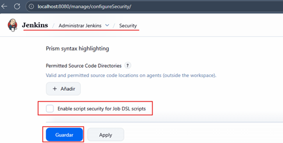

# 🚀 Sección 13: Java Maven DSL

---

## 🔓 Deshabilitando la seguridad de scripts para los Job DSL

Cuando trabajamos con `Job DSL` (Domain Specific Language) en Jenkins, es común que después de modificar algún script
—especialmente en el `Seed Job`— `Jenkins bloquee la ejecución hasta que el administrador apruebe manualmente` el
contenido del DSL. Esto ocurre porque, por defecto, `Jenkins` aplica un mecanismo de `Script Security` para evitar
que scripts potencialmente maliciosos afecten la configuración del servidor.

Sin embargo, mientras desarrollamos y hacemos iteraciones rápidas, este proceso puede ser molesto e innecesario. Para
entornos de prueba o aprendizaje, podemos `deshabilitar temporalmente esta validación`.

### ⚠️ Advertencia importante (mundo real)

En entornos corporativos o servidores Jenkins compartidos, nunca desactives la seguridad de scripts.
Las empresas mantienen esta opción activada para evitar que alguien ejecute un DSL que modifique trabajos, agentes o
ejecuciones sin control.

La opción solo conviene desactivarla cuando:

- "estás en un Jenkins local",
- "estás en un ambiente sandbox",
- "o eres administrador y sabes exactamente qué scripts se ejecutarán".

### 🛠️ Pasos para deshabilitar la Script Security en DSL

Para permitir que Jenkins ejecute los scripts sin solicitar aprobación manual:

1. Ir a Manage Jenkins (Administrar Jenkins).
2. Seleccionar Security.
3. Desmarcar la opción: `Enable script security for Job DSL scripts`
4. Guardar los cambios.

