# 🚀 Sección 15: Jenkins Pipeline

---

## 📘 Introducción a Pipeline

`Jenkins Pipeline` nos da la capacidad de escribir los `Build Steps` en forma de código. Esto significa que podemos
definir las etapas del ciclo de `CI/CD` de manera explícita:

- `Build` → Compilar la aplicación.
- `Test` → Ejecutar pruebas automáticas.
- `Deploy` → Desplegar la aplicación en un entorno.

⚠️ `Nota pedagógica`: Estas tres etapas son las más comunes en cualquier proceso de integración y entrega continua,
y casi siempre se repiten en proyectos reales.

### 🎯 ¿Por qué escribir Pipeline como código?

Las organizaciones modernas trabajan con el concepto de `Pipeline-as-Code`, el cual proporciona beneficios clave:

#### ⭐ Ventajas principales

- 📦 `Versionamiento (SCM)`: El pipeline se guarda en un archivo (`Jenkinsfile`) dentro del repositorio, lo que permite
  rastrear cambios, hacer code review y mantener historial.
- 🛠️ `Reproducibilidad`: Todo el proceso de compilación, pruebas y despliegue queda definido como código.
  Nada queda “en la memoria” del administrador.
- ♻️ `Automatización real`: `Jenkins` puede ejecutar el Pipeline automáticamente en cada push, PR o evento.
- 🚀 `Portabilidad entre Jobs`: Puedes copiar, clonar o refactorizar pipelines fácilmente.
- 🧪 `Estabilidad`: Menos dependencias de la interfaz gráfica → menos errores humanos.

💡 Nota:
> En empresas, tener el `Jenkinsfile` dentro del repo es considerado la mejor práctica estándar. Queda prohibido
> depender solo de configuraciones por UI.

### 🔍 Diferencia entre Jenkins Pipeline vs Jenkins Job DSL

Ambos permiten definir el proceso de CI/CD como código, pero su enfoque es distinto:

#### 🧬 Jenkins Pipeline

- Es un `tipo de Job` en Jenkins.
- Se encarga directamente del flujo de CI/CD: `Build` → `Test` → `Deploy`.
- La definición del `Pipeline` vive en un `Jenkinsfile`.

#### 🏭 Jenkins Job DSL

- Es un mecanismo para generar Jobs desde código.
- Usado para crear y configurar otros Jobs (incluidos pipelines).
- Utiliza Groovy, pero NO para el flujo CI/CD, sino para crear Jobs, vistas, carpetas, etc.

#### 🤝 Cómo conviven

En empresas es muy común:

- Usar `Job DSL` para crear automáticamente:
    - carpetas
    - multibranch pipelines
    - jobs de librerías compartidas
- Usar `Pipeline` como el contenido del `Jenkinsfile` dentro del proyecto.

#### 📌 Ejemplo típico real:

Un repositorio `infra-jenkins` contiene los scripts DSL para generar Jobs. El repositorio de la app contiene
el `Jenkinsfile` con el pipeline real.

### 🛠️ Formas de crear Jenkins Pipelines

Jenkins ofrece dos maneras de crear un Pipeline:

#### 1. Desde la Interfaz de Usuario (UI)

- Se crea un Job tipo `Pipeline` o `Multibranch Pipeline`.
- Código del pipeline se escribe directamente en Jenkins o se le indica dónde está el `Jenkinsfile`.

#### 2. Usando DSL / Jenkinsfile (recomendado)

- Se crea un archivo `Jenkinsfile` en el repositorio.
- Jenkins detecta cambios automáticamente.
- Es la forma usada en empresas modernas.

### 🧑‍💻 Lenguajes para escribir un Jenkins Pipeline

Jenkins tiene dos estilos principales:

#### 🟧 1. Scripted Pipeline (Groovy puro)

- Basado en Groovy “clásico”.
- Muy flexible y expresivo.
- Más difícil de mantener.
- Hoy se usa solo en casos muy específicos.

#### 🟩 2. Declarative Pipeline (DSL moderno)

- Sigue una estructura clara: `pipeline { ... }`
- Más legible, más seguro y con validaciones.
- Recomendado en empresas.
- Permite features avanzadas como:
    - environment
    - options
    - post
    - stages paralelos, etc.

> 📌 `Mejor práctica actual`: Usar `Declarative Pipeline` junto con librerías compartidas para lógica compleja.

### 🧱 Etapas típicas de un Jenkins Pipeline

En un proyecto estándar, las etapas más comunes son:

#### 🏗️ Build

- Compilar la aplicación.
- Instalar dependencias (Maven, Gradle, NPM, etc.)
- Generar artefactos (ej. .jar, .war, contenedores Docker).

#### 🧪 Test

- Ejecutar pruebas unitarias, integración o estáticas.
- Generar reportes (JUnit, Jacoco, SonarQube).
- Validar calidad del código antes de desplegar.

#### 🚀 Deploy

- Publicar artefactos (Artifactory, Nexus).
- Puede incluir pasos de infraestructura (Docker, Kubernetes, servidores).
- Desplegar en dev/QA/prod (Kubernetes, EC2, etc.)

### 📌 Conclusión

- Jenkins Pipeline convierte el ciclo de CI/CD en código versionable.
- Se diferencia de Job DSL en que Pipeline ejecuta directamente las etapas, mientras que DSL crea jobs.
- Puede escribirse en Groovy (Scripted) o en Declarative DSL, siendo este último más sencillo y recomendado.
- Las etapas típicas son `Build` → `Test` → `Deploy`, reflejando el flujo estándar de cualquier proyecto moderno.

## 📄 Código Pipeline (Jenkinsfile)

El archivo `Jenkinsfile` define el flujo completo de un pipeline en Jenkins usando `Pipeline as Code`, lo que permite:

- ✔️ Versionarlo en el repositorio (Git).
- ✔️ Revisiones de código y PRs para cambios en el pipeline.
- ✔️ Reproducibilidad entre entornos.
- ✔️ Trazabilidad del proceso de CI/CD.

Este archivo puede escribirse con la sintaxis `Declarative Pipeline` (más común en empresas) o
`Scripted Pipeline` (más flexible pero menos legible). `Aquí trabajaremos con el estilo Declarativo`.

### 📘 Ejemplo completo de Jenkinsfile (Declarative Pipeline)

Este ejemplo muestra un pipeline típico con las fases estándar de CI/CD:

> `Build` → `Test` → `Build Docker` → `Deploy`.

````groovy
pipeline {
    agent any

    stages {
        stage('Build') {
            steps {
                echo 'Compilando la aplicación...'
                sh 'mvn clean package -DskipTests'
            }
        }

        stage('Test') {
            steps {
                echo 'Ejecutando pruebas...'
                sh 'mvn test'
            }
        }

        stage('Docker Build') {
            steps {
                echo 'Construyendo imagen Docker...'
                sh 'docker build -t mi-app:latest .'
            }
        }

        stage('Deploy') {
            steps {
                echo 'Desplegando la aplicación...'
                sh 'docker run -d --name mi-app-container -p 8080:8080 mi-app:latest'
            }
        }
    }
}
````

#### 🔎 Explicación línea por línea

- 🧩 `pipeline`. Define que el archivo contiene un `Declarative Pipeline` y agrupa toda la configuración del proceso.
- ⚙️ `agent any`
    - Asigna un ejecutor (worker/agent) donde se ejecutará el pipeline.
    - `any` indica: *“usa cualquier agente disponible en el cluster Jenkins”*.
    - ⚠️ En empresas se utilizan agentes especializados:
        - `docker` (con contenedores efímeros)
        - `linux` / `windows` / `arm64`
        - agentes con JDK, Maven, Node, etc.
- 🧱 `stages`
    - Agrupa todas las etapas del pipeline.
    - Un pipeline empresarial puede incluir 8–20 stages:
        - Linting
        - SonarQube
        - Build
        - Unit Tests
        - Integration Tests
        - Package
        - Docker Build
        - Push to Registry
        - Deploy a Dev
        - Deploy a QA
        - Deploy a Prod (manual approval)
- 🔨 `steps`
    - Son los pasos individuales que se ejecutan dentro de cada stage.
    - Todos los comandos `sh` o acciones declarativas se colocan aquí.

#### 🏗️ Etapa Build

````groovy
stage('Build') {
    steps {
        echo 'Compilando la aplicación...'
        sh 'mvn clean package -DskipTests'
    }
}
````

- Se compila y empaqueta la aplicación.
- Se omiten las pruebas para hacer más rápido el build (estrategia común en pipelines modernos).

💡 Mejores prácticas reales

- No compilar dos veces.
    - Compilar aquí → generar artefacto → reutilizar ese mismo artefacto en etapas posteriores.
- Generar artefactos reproducibles:
    - `.jar`, `.war`, `.zip`, `imágenes Docker`.
- Subir artefactos a un repositorio central:
    - `Nexus`, `Artifactory`, `JFrog`, `GitHub Packages`.

#### 🧪 Etapa Test

````groovy
stage('Test') {
    steps {
        echo 'Ejecutando pruebas...'
        sh 'mvn test'
    }
}
````

Ejecuta pruebas unitarias y/o de integración.

💡 Mejores prácticas en empresas

- Integrar `SonarQube` aquí (o antes): `sh 'mvn sonar:sonar'`.
- Publicar reportes:
    - JUnit
    - Jacoco (coverage)
- Bloquear despliegue si no pasa la calidad mínima.

#### 🐳 Etapa Docker Build

````groovy
stage('Docker Build') {
    steps {
        echo 'Construyendo imagen Docker...'
        sh 'docker build -t mi-app:latest .'
    }
}
````

Crea una imagen Docker basada en el código recién construido.

💡 Mejores prácticas modernas

- Usar versionado semántico en tags: `mi-app:${BUILD_NUMBER}`
- Usar `Docker Buildx` o `kaniko` para builds más rápidos.
- Subir la imagen a un registry:
    - Docker Hub
    - GitHub Container Registry
    - Amazon ECR
    - Google GCR
    - Azure ACR

#### 🚀 Etapa Deploy

````groovy
stage('Deploy') {
    steps {
        echo 'Desplegando la aplicación...'
        sh 'docker run -d --name mi-app-container -p 8080:8080 mi-app:latest'
    }
}
````

Despliega la imagen recién creada.

💡 Buenas prácticas reales

- No hacer `docker run` directo en PROD.
- Las empresas usan:
    - Kubernetes (EKS, AKS, GKE)
    - ECS
    - Nomad
    - Docker Swarm (menos común hoy)
- Jenkins `solo orquesta`, pero no debe encargarse directamente del hosting.

### ⚠️ Nota técnica (Muy importante en empresas)

Cuando usas Jenkins dentro de Docker con acceso al host: `Jenkins` usa `Docker-outside-of-Docker` (DooD)

Significa:

- `Jenkins` no tiene su propio `Docker Engine`.
- Usa el `CLI Docker` instalado dentro del contenedor.
- Se conecta al `Docker` del host mediante el socket: `/var/run/docker.sock`.

Esto permite:

- Construir imágenes
- Ejecutar contenedores
- Parar/limpiar contenedores
- Usar Docker Compose

️⚠️ Riesgos reales a considerar

- Cualquier proceso dentro del contenedor Jenkins tiene permisos de root en el host.
- Las empresas suelen aislar los agentes con:
    - Agentes Kubernetes
    - Jenkins agents con privilegios mínimos
    - Containers sin acceso al socket Docker

### 📌 Conclusión

Este `Jenkinsfile`:

- Define un pipeline declarativo completo.
- Contiene las 4 etapas más comunes en empresas: `Build` → `Test` → `Build Docker` → `Deploy`.
- Está preparado para integrarse con herramientas reales como `SonarQube`, `Nexus`, `Docker Registry`, etc.
- Está escrito siguiendo mejores prácticas modernas de CI/CD.

## 🚀 Primer Pipeline en Jenkins

En esta sección crearemos nuestro primer `Pipeline Declarativo` en Jenkins y analizaremos cómo ejecutar múltiples pasos,
visualizar resultados e instalar herramientas adicionales para entender mejor la ejecución del pipeline.

### 🔌 Verificando la instalación del plugin Pipeline

El contenedor oficial de Jenkins incluye por defecto el `Pipeline Plugin`, también conocido como:

- Workflow API
- Declarative Pipeline
- Scripted Pipeline Runtime

Para verificar que está presente, ingresamos a: `Manage Jenkins → Plugins → Installed plugins`. Como se observa en la
imagen, el plugin Pipeline ya está instalado.


En empresas, Jenkins casi siempre se despliega con los plugins esenciales ya preinstalados mediante:

- Jenkins Configuration as Code (JCasC)
- Imágenes Docker personalizadas
- Scripts Groovy de inicialización

Esto garantiza consistencia entre entornos.

### 🆕 Creando nuestro primer Pipeline

Creamos una `nueva tarea (job)` llamado `primer-pripeline` y, en lugar de seleccionar “Freestyle Project”, elegimos
`Pipeline`, que permite definir automatizaciones completas usando código.

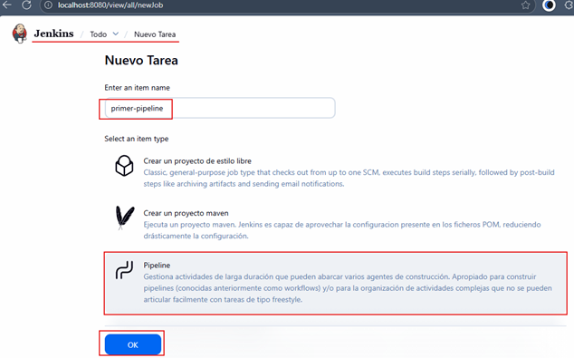

- Los pipelines deben escribirse siempre como código para ser versionados.
- Los Freestyle Jobs están prácticamente obsoletos para CI/CD moderno.

### ✍️ Definiendo el Pipeline Script

Al ingresar al nuevo job `primer-pripeline`, veremos opciones similares a las de un job clásico, salvo que:

- Ya no existen `Build Steps`.
- En su lugar aparece la sección `Pipeline`.

Esta sección permite dos modos principales:

- 1️⃣ `Pipeline Script`. Escribir el pipeline directamente en el editor de Jenkins (modo recomendado solo para pruebas
  o demos).
- 2️⃣ `Pipeline Script from SCM`. Usar un repositorio Git para cargar un `Jenkinsfile` real. Este es el método estándar
  en empresas.

Por ahora usaremos el modo manual (`Pipeline Script`).

### 🧱 Primer Pipeline simple (solo imprime mensajes)

````groovy
pipeline {
    agent any
    stages {
        stage('Build') {
            steps {
                echo 'Compilando la aplicación...'
            }
        }
        stage('Test') {
            steps {
                echo 'Ejecutando pruebas...'
            }
        }
        stage('Deploy') {
            steps {
                echo 'Desplegando la aplicación...'
            }
        }
    }
}
````

En la interfaz se verá así:


### ▶️ Ejecutando el Pipeline

Al pulsar `Construir ahora`, Jenkins procesará las etapas secuencialmente.

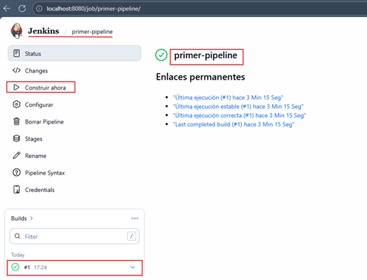

### 📜 Revisando el Console Output

En el log de la ejecución podemos ver:

- El pipeline fue asignado a un ejecutor.
- Cada stage se ejecutó correctamente.
- Todos los mensajes `echo` se imprimieron.

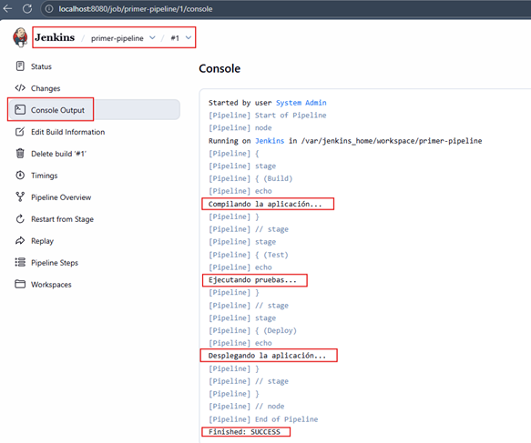

💡 `Importante`. El `Console Output` es la herramienta principal para depurar errores en `Jenkins`.

## 🔄 Ejecutando múltiples pasos en una etapa

`Jenkins Pipeline` permite ejecutar múltiples comandos dentro del bloque `steps`. Cada `step` representa una acción
individual.

Documentación oficial: https://www.jenkins.io/doc/pipeline/tour/running-multiple-steps/

### 📌 Conceptos clave

- Un `step` = Un comando o acción individual.
- Si un step falla → ❌ el pipeline se detiene.
- Si todos los steps completan → ✔️ la etapa es exitosa.

### 🐧 Uso del paso `sh` en Linux / BSD / macOS

En sistemas tipo Unix, usamos `sh` para ejecutar comandos de shell:

````groovy
pipeline {
    agent any
    stages {
        stage('Build') {
            steps {
                sh 'echo "Compilando la aplicación..."'
                sh '''
                    echo "Los pasos de shell multilínea también funcionan"
                    ls -lah
                    pwd
                '''
            }
        }
        stage('Test') {
            steps {
                echo 'Ejecutando pruebas...'
            }
        }
        stage('Deploy') {
            steps {
                echo 'Desplegando la aplicación...'
            }
        }
    }
}
````

En la siguiente imagen se muestra cómo quedaría el código anterior.

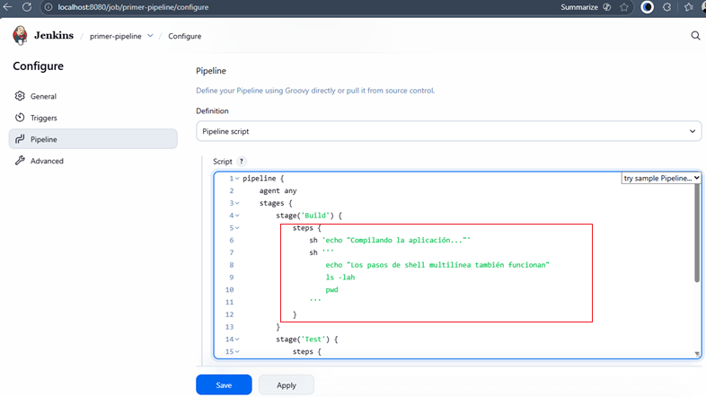

Guardamos el nuevo pipeline con los múltiples pasos agregados y procedemos a construir la aplicación. Vemos que
la construcción se realizó exitosamente.

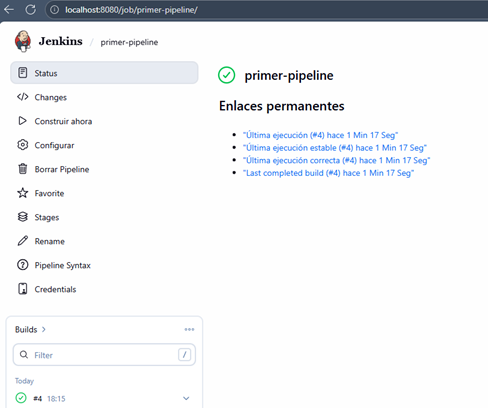

Ahora, si revisamos el log generado por la ejecución `#4` vemos que los múltiples pasos se han ejecutado sin problemas.
Eso permitió que las siguientes etapas continúen su ejecución.

````bash
Started by user System Admin
[Pipeline] Start of Pipeline
[Pipeline] node
Running on Jenkins in /var/jenkins_home/workspace/primer-pipeline
[Pipeline] {
[Pipeline] stage
[Pipeline] { (Build)
[Pipeline] sh
+ echo Compilando la aplicación...
Compilando la aplicación...
[Pipeline] sh
+ echo Los pasos de shell multilínea también funcionan
Los pasos de shell multilínea también funcionan
+ ls -lah
total 8.0K
drwxr-xr-x  2 jenkins jenkins 4.0K Nov 28 18:15 .
drwxr-xr-x 17 jenkins jenkins 4.0K Nov 28 18:15 ..
+ pwd
/var/jenkins_home/workspace/primer-pipeline
[Pipeline] }
[Pipeline] // stage
[Pipeline] stage
[Pipeline] { (Test)
[Pipeline] echo
Ejecutando pruebas...
[Pipeline] }
[Pipeline] // stage
[Pipeline] stage
[Pipeline] { (Deploy)
[Pipeline] echo
Desplegando la aplicación...
[Pipeline] }
[Pipeline] // stage
[Pipeline] }
[Pipeline] // node
[Pipeline] End of Pipeline
Finished: SUCCESS 
````

## 📊 Instalación del plugin Pipeline Stage View

Este plugin agrega una interfaz visual muy útil para ver:

- Etapas del pipeline
- Duración por etapa
- Estado de cada ejecución
- Paralelismo (si aplica)

Pasos para instalar:

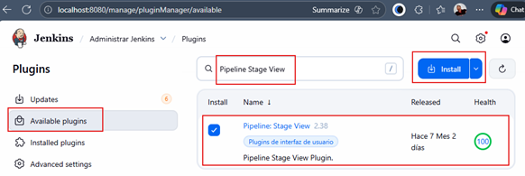

Habiendo instalado el plugin y reiniciado Jenkins (si se requiere reinicio manual ir a la siguiente dirección
`http://localhost:8080/safeRestart`), nos vamos a nuestro job `primer-pipeline` y vemos que ahora las ejecuciones
se muestran gráficamente, incluso se muestran las etapas: Build | Test | Deploy y en cada fila el número de ejecución
realizada al job. Debajo de cada etapa se muestra el fondo en color verde indicando que esa etapa se realizó con éxito.

- 🟩 Verde = éxito
- 🟥 Rojo = fallo
- 🟨 Amarillo = inestable (usualmente por pruebas fallidas)

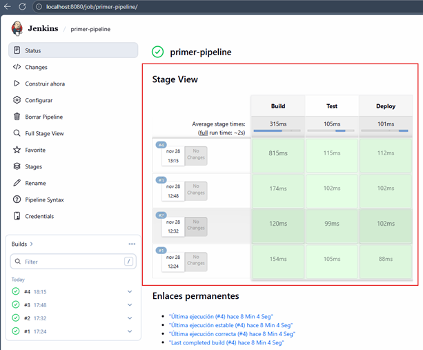

### 🧠 Diferencias entre versiones de Jenkins

El instructor no necesitó instalarlo porque:

- Algunas versiones antiguas (LTS previas) venían con este plugin preinstalado.
- En tu caso, la versión moderna del contenedor no incluye plugins adicionales para mantener la imagen más ligera.

## Etapas paralelas y secuenciales

En el siguiente enlace encontraremos todo lo relacionado con la sintaxis de `Pipelines en Jenkins`:
`Pipeline Syntax`: https://www.jenkins.io/doc/book/pipeline/syntax/

En esta lección vamos a modificar el `Pipeline script` del job `primer-pipeline` para ilustrar el comportamiento de las
etapas secuenciales y paralelas dentro de un mismo flujo.

### 🧩 Script del Pipeline (Secuencial + Paralelo)

````groovy
pipeline {
    agent any
    stages {
        stage('Secuencial') {
            stages {
                stage('Secuencial 1') {
                    steps {
                        echo "Secuencial: Parte 1"
                    }
                }
                stage('Secuencial 2') {
                    steps {
                        echo "Secuencial: Parte 2"
                    }
                }
                stage('Paralelo dentro de secuencial') {
                    parallel {
                        stage('Paralelo 1') {
                            steps {
                                echo "Paralelo en secuencial: Parte 1"
                            }
                        }
                        stage('Paralelo 2') {
                            steps {
                                echo "Paralelo en secuencial: Parte 2"
                            }
                        }
                    }
                }
            }
        }
    }
}
````

> 💡 `Nota`: Aquí observamos cómo `Jenkins` permite anidar bloques `stages` para ejecutar tareas secuenciales,
> y dentro de ellos incluir un bloque `parallel` que ejecuta etapas simultáneamente.

### 🖼️ Modificación del Pipeline en Jenkins

En la siguiente imagen se puede ver la actualización del script dentro del job:

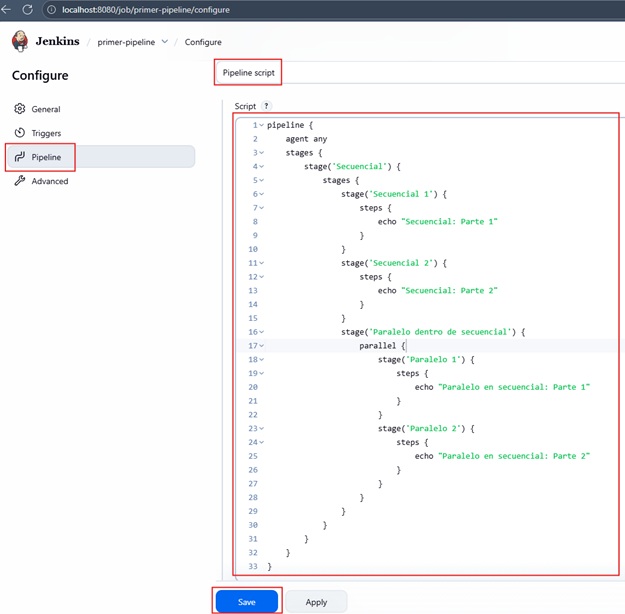

### ▶️ Ejecución del Pipeline

Después de guardar los cambios, construimos nuevamente el job `primer-pipeline`. A continuación se muestra el
log generado durante la ejecución:

````bash
Started by user System Admin

[Pipeline] Start of Pipeline
[Pipeline] node
Running on Jenkins
 in /var/jenkins_home/workspace/primer-pipeline
[Pipeline] {
[Pipeline] stage
[Pipeline] { (Secuencial)
[Pipeline] stage
[Pipeline] { (Secuencial 1)
[Pipeline] echo
Secuencial: Parte 1
[Pipeline] }
[Pipeline] // stage
[Pipeline] stage
[Pipeline] { (Secuencial 2)
[Pipeline] echo
Secuencial: Parte 2
[Pipeline] }
[Pipeline] // stage
[Pipeline] stage
[Pipeline] { (Paralelo dentro de secuencial)
[Pipeline] parallel
[Pipeline] { (Branch: Paralelo 1)
[Pipeline] { (Branch: Paralelo 2)
[Pipeline] stage
[Pipeline] { (Paralelo 1)
[Pipeline] stage
[Pipeline] { (Paralelo 2)
[Pipeline] echo
Paralelo en secuencial: Parte 1
[Pipeline] }
[Pipeline] echo
Paralelo en secuencial: Parte 2
[Pipeline] }
[Pipeline] // stage
[Pipeline] // stage
[Pipeline] }
[Pipeline] }
[Pipeline] // parallel
[Pipeline] }
[Pipeline] // stage
[Pipeline] }
[Pipeline] // stage
[Pipeline] }
[Pipeline] // node
[Pipeline] End of Pipeline
Finished: SUCCESS 
````

### 📊 Visualización en el Pipeline Stage View

También podemos observar la ejecución en la interfaz principal del job gracias al plugin `Pipeline Stage View`,
que muestra gráficamente:

- las etapas secuenciales como columnas en orden lineal,
- y las etapas paralelas compartiendo una misma línea horizontal.


### ⚙️ Control de fallas en bloques paralelos

Podemos forzar que si una de las etapas dentro del bloque `parallel` falla, todas las demás se aborten automáticamente,
evitando procesos colgados o inconsistencias. Para eso necesitamos añadir `failFast` como valor `true` a la etapa
que contiene la etapa paralela.

💡 Ejemplo:

````bash 
...
stage('Paralelo dentro de secuencial') {
    failFast true
    parallel {
        stage('Paralelo 1') {
            steps {
                echo "Paralelo en secuencial: Parte 1"
            }
        }
        stage('Paralelo 2') {
            steps {
                echo "Paralelo en secuencial: Parte 2"
            }
        }
    }
}
...
````

💬 Explicación técnica:
> Usar `failFast` ayuda a evitar consumir recursos innecesarios cuando el resultado final del pipeline ya está
> comprometido por la falla de uno de los subprocesos.

## ⭐ Options, Timeout & Retry en Jenkins Pipeline

Cómo controlar tiempos, reintentos y configuraciones globales en Pipelines Declarativos (con buenas prácticas reales)

🎯 Objetivo:
> Aprender a usar correctamente `retry`, `timeout` y `options` —tres mecanismos críticos para crear pipelines seguros,
> resilientes y predecibles.

📚 Fuente oficial:
[Timeouts, retries and more](https://www.jenkins.io/doc/pipeline/tour/running-multiple-steps/#timeouts-retries-and-more)

### 🧩 ¿Qué son Retry y Timeout?

- 🔁 `retry(n)`: Reintenta ejecutar uno o varios `steps` hasta que se completen correctamente.
- Muy útil para:
    - Steps que fallan de forma intermitente (red, API, despliegues frágiles)
    - Deploys que dependen de servicios externos
    - Scripts inestables o con flakiness


- ⏳ `timeout`: Cancelará la ejecución de un bloque si tarda más de lo configurado.
- Muy útil para:
    - Evitar hangs inesperados
    - Proteger agentes (que no queden “colgados”)
    - Detener scripts que pueden entrar en loops infinitos
    - Asegurar SLAs en pipelines largos

#### 🔍 Ejemplo explicado

````groovy
pipeline {
    agent any
    stages {
        stage('Deploy') {
            steps {
                retry(3) {
                    sh './flakey-deploy.sh'
                }

                timeout(time: 3, unit: 'MINUTES') {
                    sh './health-check.sh'
                }
            }
        }
    }
}
````

🧠 ¿Qué está pasando?

1. 🔁 `retry(3)`
    - Ejecuta `./flakey-deploy.sh` hasta 3 veces.
    - Si una ejecución tiene éxito → no continúa reintentando.
    - Si todas fallan → la etapa falla.


2. ⏳ `timeout(3 MINUTES)`
    - Intenta ejecutar `./health-check.sh`.
    - Si demora más de 3 minutos:
        - Jenkins aborta el step
        - La etapa "Deploy" falla
        - El pipeline se detiene

🧱 Importante
> Los steps como `retry` y `timeout` son wrappers, es decir, envoltorios que contienen otros steps dentro.

### 🧪 Ejemplo 1: Timeout

📍 Modificamos el pipeline del job `primer-pipeline`:

````groovy
pipeline {
    agent any
    stages {
        stage('Deploy') {
            steps {
                retry(3) {
                    sh 'echo "Iniciando el deploy"'
                }

                timeout(time: 10, unit: 'SECONDS') {
                    sh 'sleep 15'
                }
            }
        }
    }
}
````

En la siguiente imagen vemos el código anterior definido en el `Pipeline script`.

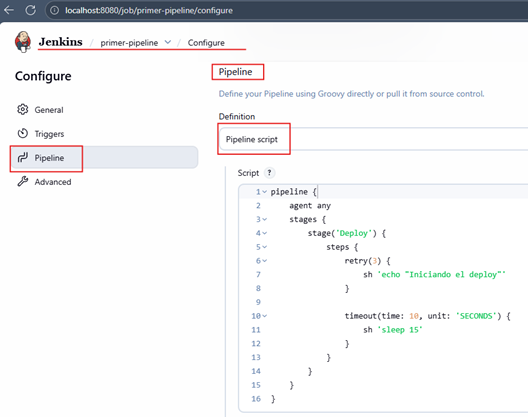

Luego damos en `Save` y procedemos a construir el Job `primer-pipeline`.

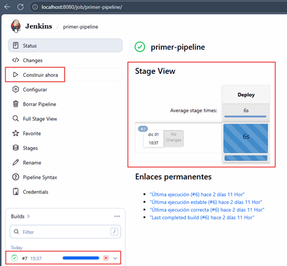

En este ejemplo:

- El timeout es de `10 segundos`
- El comando `sleep 15` tarda más
    - Resultado esperado: El pipeline será `abortado` porque el tiempo excede el límite.

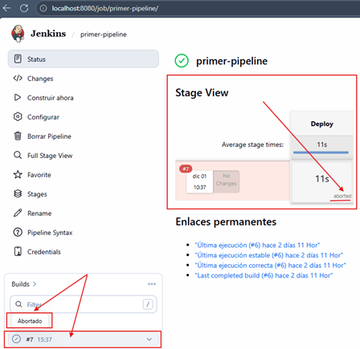

Si revisamos el `Console Output` de la construcción que falló podemos ver lo siguiente:

````bash
Started by user System Admin
[Pipeline] Start of Pipeline
[Pipeline] node
Running on Jenkins in /var/jenkins_home/workspace/primer-pipeline
[Pipeline] {
[Pipeline] stage
[Pipeline] { (Deploy)
[Pipeline] retry
[Pipeline] {
[Pipeline] sh
+ echo Iniciando el deploy
Iniciando el deploy
[Pipeline] }
[Pipeline] // retry
[Pipeline] timeout
Timeout set to expire in 10 sec
[Pipeline] {
[Pipeline] sh
+ sleep 15
Cancelling nested steps due to timeout
Sending interrupt signal to process
Terminated
script returned exit code 143
[Pipeline] }
[Pipeline] // timeout
[Pipeline] }
[Pipeline] // stage
[Pipeline] }
[Pipeline] // node
[Pipeline] End of Pipeline
Timeout has been exceeded
org.jenkinsci.plugins.workflow.actions.ErrorAction$ErrorId: 9e123e4b-a55f-47e1-b6a0-d6c291b65ced
Finished: ABORTED 
````

Se observa:

- `Timeout set to expire in 10 sec`
- Se interrumpe con `Cancelling nested steps due to timeout`
- El pipeline termina en: `ABORTED`

> 💡 Esto imita escenarios reales: scripts colgados, conexiones lentas, recursos saturados, etc.

### 🧪 Ejemplo 2: Retry

````groovy
pipeline {
    agent any
    stages {
        stage('Deploy') {
            steps {
                timeout(time: 5, unit: 'SECONDS') {
                    retry(3) {
                        sh 'hola'
                    }
                }
            }
        }
    }
}
````

#### 🔎 ¿Por qué fallará?

Porque `hola` **no es un comando válido**, nos “olvidamos” de `echo`. Cada ejecución fallará, y `retry(3)` repetirá
el intento 3 veces.

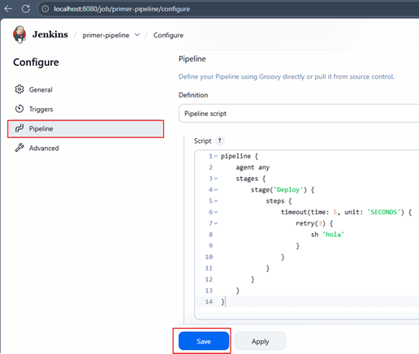

Damos en `Save` y procedemos a realizar la construcción del job `primer-pipeline`.

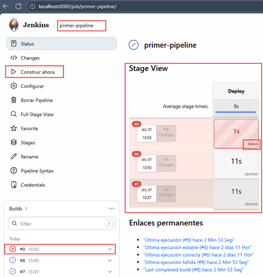

Como vemos en la imagen anterior, el resultado de la construcción falla. Salida notable del log:

````bash
Started by user System Admin
[Pipeline] Start of Pipeline
[Pipeline] node
Running on Jenkins in /var/jenkins_home/workspace/primer-pipeline
[Pipeline] {
[Pipeline] stage
[Pipeline] { (Deploy)
[Pipeline] timeout
Timeout set to expire in 5 sec
[Pipeline] {
[Pipeline] retry
[Pipeline] {
[Pipeline] sh
+ hola
/var/jenkins_home/workspace/primer-pipeline@tmp/durable-b1f6b6c7/script.sh.copy: 1: hola: not found
[Pipeline] }
ERROR: script returned exit code 127
Retrying
[Pipeline] {
[Pipeline] sh
+ hola
/var/jenkins_home/workspace/primer-pipeline@tmp/durable-b5ff0fd6/script.sh.copy: 1: hola: not found
[Pipeline] }
ERROR: script returned exit code 127
Retrying
[Pipeline] {
[Pipeline] sh
+ hola
/var/jenkins_home/workspace/primer-pipeline@tmp/durable-230d8437/script.sh.copy: 1: hola: not found
[Pipeline] }
[Pipeline] // retry
[Pipeline] }
[Pipeline] // timeout
[Pipeline] }
[Pipeline] // stage
[Pipeline] }
[Pipeline] // node
[Pipeline] End of Pipeline
ERROR: script returned exit code 127
Finished: FAILURE 
````

- ✔️ Finalmente → El pipeline falla (`status: FAILURE`).
- ✔️ Se ve claramente cómo trabaja `retry`.

### ⚙️ Options — Configuración a nivel Pipeline

La directiva `options` permite configurar parámetros del pipeline entero.

🔧 Algunos ejemplos reales:

| Opción                      | Propósito                                     |
|-----------------------------|-----------------------------------------------|
| `timeout(...)`              | Limitar el tiempo total del pipeline          |
| `buildDiscarder(...)`       | Rotar builds antiguos (muy usado en empresas) |
| `timestamps()`              | Añadir timestamps al console output           |
| `disableConcurrentBuilds()` | Evitar builds simultáneas                     |
| `skipDefaultCheckout()`     | No hacer checkout automático del repositorio  |

#### 🧩 Ejemplo simple

````groovy
pipeline {
    agent any
    options {
        timeout(time: 1, unit: 'HOURS')
    }
    stages {
        stage('Example') {
            steps {
                echo 'Hello World'
            }
        }
    }
}
````

➡️ Si el pipeline completa tarda más de 1 hora → será abortada.

### 🧪 Ejemplo real usando options dentro de un stage

````groovy
pipeline {
    agent any
    stages {
        stage('Secuencial') {
            options {
                timeout(time: 15, unit: 'SECONDS')
            }
            stages {
                stage('Secuencial 1') {
                    steps {
                        echo "Secuencial: Parte 1"
                    }
                }
                stage('Secuencial 2') {
                    steps {
                        sh 'sleep 16'
                    }
                }
            }
        }
    }
}
````

- ✔ El timeout aplicado al stage es de 15 segundos
- ✔ El comando tarda 16 segundos
- ❌ Resultado: ABORTED

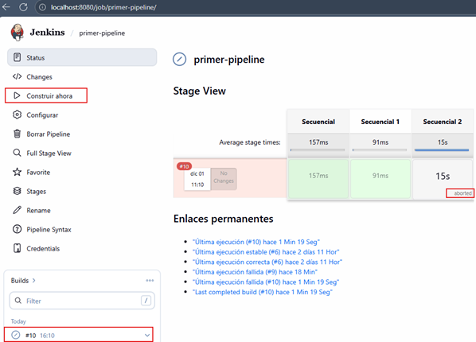

### 🎯 Conclusión

Con `retry`, `timeout` y `options` elevas la calidad de tus pipelines, volviéndolos:

- Más resilientes
- Más seguros
- Más predecibles
- Más profesionales

Y sobre todo, alineados con cómo trabajan equipos DevOps en empresas reales.

## 🔐 Env Variables & Credentials (Variables de Entorno y Credenciales en Jenkins)

El manejo de `credenciales` y `variables de entorno` es uno de los pilares fundamentales en la construcción de
Pipelines seguros, mantenibles y reutilizables. En Jenkins, estos elementos permiten:

- Centralizar información sensible (usuarios, contraseñas, tokens, claves).
- Controlar variable según el ambiente (dev, qa, prod).
- Evitar exponer secretos en los logs del pipeline.
- Integrar herramientas externas (GitHub, DockerHub, SonarQube, Kubernetes, etc.).

### 🔑 Creando credenciales en Jenkins

Para crear credenciales en Jenkins:

`Administrar Jenkins` → `Credentials` → `seleccionar almacén (global en este ejemplo)` → `Add credentials`

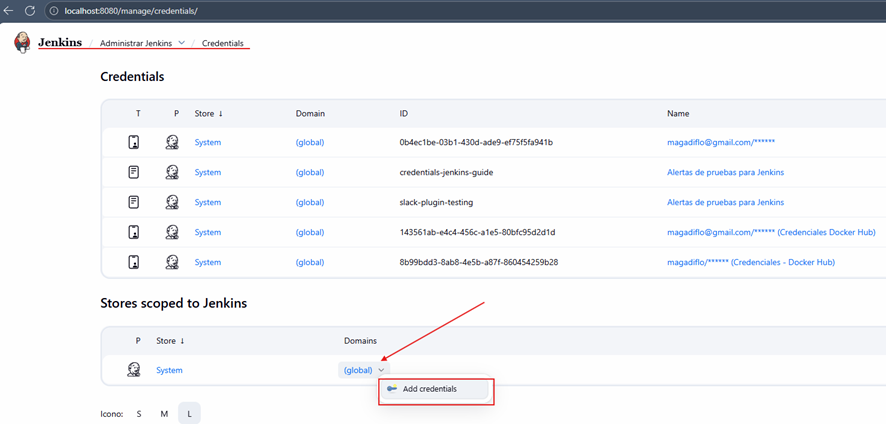

En el formulario de `New credentials` definimos los siguientes valores:

- `King`: Username with password
- `Username`: qwerty
- `Password`: 1234
- `ID`: usuario1

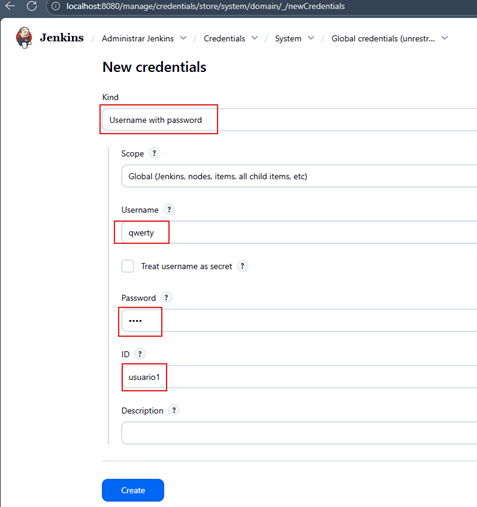

Creamos nuevas credenciales con los siguientes valores:

- `King`: Secret text
- `Secret`: 123456789
- `ID`: usuario2

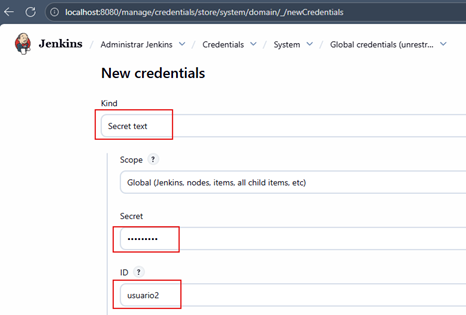

Finalmente, las dos credenciales definidas las vemos creadas en el `Global credentials (unrestricted)`.

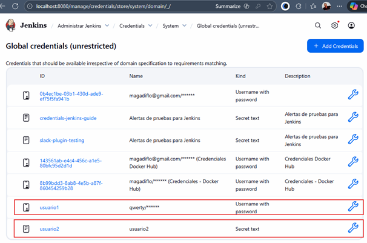

### 🌍 Environment

La directiva `environment` permite definir variables de entorno visibles en:

- Todo el pipeline (si está a nivel raíz).
- Un stage específico (si se define dentro de `stage`).
- Un bloque interno, como `script`.

También permite utilizar el método especial: `credentials('ID')`. El cual expone los valores de credenciales como
variables de entorno automatizadas.

### 🧪 Ejemplo 1 — Username/Password dentro de un Stage

Veamos el siguiente ejemplo:

````groovy
pipeline {
    agent any
    stages {
        stage('Ejemplo Username/Password') {
            environment {
                CRED_USUARIO = credentials('usuario1')
            }
            steps {
                sh 'echo "El usuario es $CRED_USUARIO_USR"'
                sh 'echo "La contraseña es $CRED_USUARIO_PSW"'
            }
        }
    }
}
````

Cuando se usa: `CRED_USUARIO = credentials('usuario1')`, Jenkins crea internamente:

- `$CRED_USUARIO_USR` → username
- `$CRED_USUARIO_PSW` → password

Y además activa automáticamente un bloque `withCredentials` para ocultarlos en los logs.

💡 Nota de seguridad:
> Los valores sensibles jamás aparecerán en texto plano. Jenkins automáticamente enmascara cualquier coincidencia.

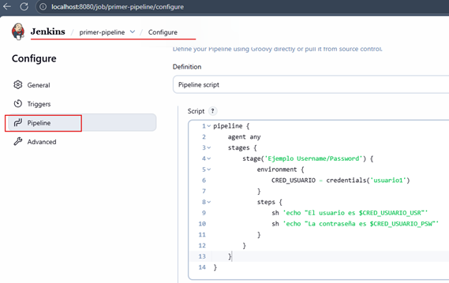

Si construimos el job `primer-pipeline` vemos que la construcción es exitosa.

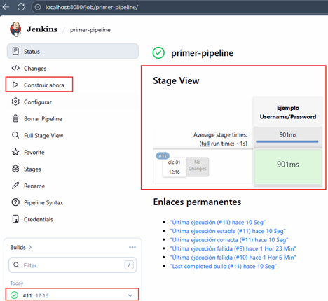

Ahora, si revisamos el `Console Output`, vemos que nos está mostrando correctamente los mensajes definidos junto a
los valores de la variable de entorno. Obviamente, las contraseñas no los va a mostrar por eso los muestra en
asteriscos.

````bash
Started by user System Admin
[Pipeline] Start of Pipeline
[Pipeline] node
Running on Jenkins in /var/jenkins_home/workspace/primer-pipeline
[Pipeline] {
[Pipeline] stage
[Pipeline] { (Ejemplo Username/Password)
[Pipeline] withCredentials
Masking supported pattern matches of $CRED_USUARIO or $CRED_USUARIO_PSW
[Pipeline] {
[Pipeline] sh
+ echo El usuario es qwerty
El usuario es qwerty
[Pipeline] sh
+ echo La contraseña es ****
La contraseña es ****
[Pipeline] }
[Pipeline] // withCredentials
[Pipeline] }
[Pipeline] // stage
[Pipeline] }
[Pipeline] // node
[Pipeline] End of Pipeline
Finished: SUCCESS
````

### 🧪 Ejemplo 2 — Secret Text como variable global

Aquí definimos la variable `a nivel del pipelin`e, no solo a nivel de un stage.

````groovy
pipeline {
    agent any
    environment {
        SECRET_TEXT = credentials('usuario2')
    }
    stages {
        stage('Ejemplo para Secret Text') {
            steps {
                sh 'echo $SECRET_TEXT'
            }
        }
    }
}
````

Puntos claves:

- ✔ `credentials('usuario2')` expone una única variable:
    - `$SECRET_TEXT` → contendrá el secret directamente
- ✔ Jenkins enmascara el valor en los logs. Siempre verás `****`.

⚙️ Explicación técnica:
> El plugin `Credentials Binding` detecta patrones sensibles y reemplaza cualquier coincidencia con asteriscos para
> evitar
> filtrado accidental.

````bash
Started by user System Admin
[Pipeline] Start of Pipeline
[Pipeline] node
Running on Jenkins in /var/jenkins_home/workspace/primer-pipeline
[Pipeline] {
[Pipeline] withCredentials
Masking supported pattern matches of $SECRET_TEXT
[Pipeline] {
[Pipeline] stage
[Pipeline] { (Ejemplo para Secret Text)
[Pipeline] sh
+ echo ****
****
[Pipeline] }
[Pipeline] // stage
[Pipeline] }
[Pipeline] // withCredentials
[Pipeline] }
[Pipeline] // node
[Pipeline] End of Pipeline
Finished: SUCCESS 
````

En producción, preferir integración con Vault, AWS Secrets Manager o Azure Key Vault. Jenkins solo debería pedir los
secretos, no almacenarlos.
