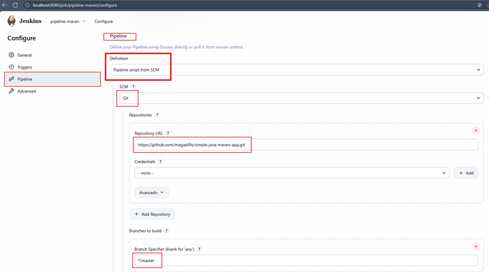
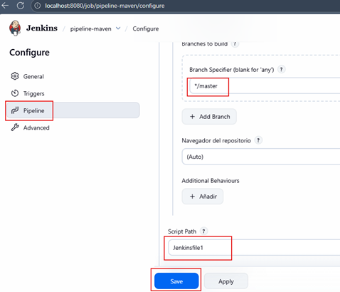
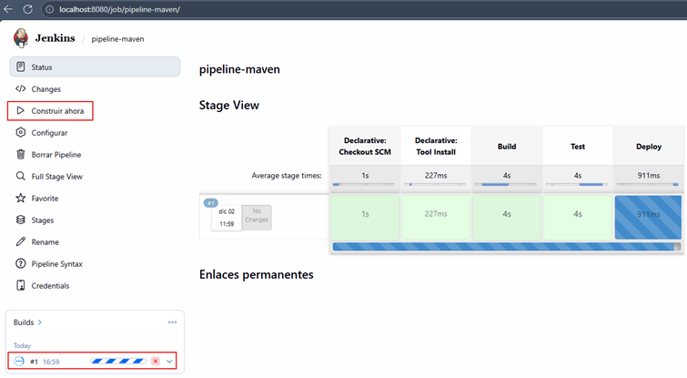
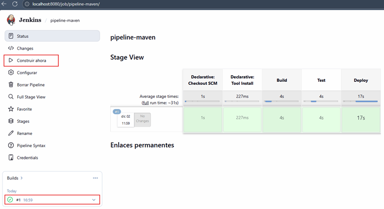
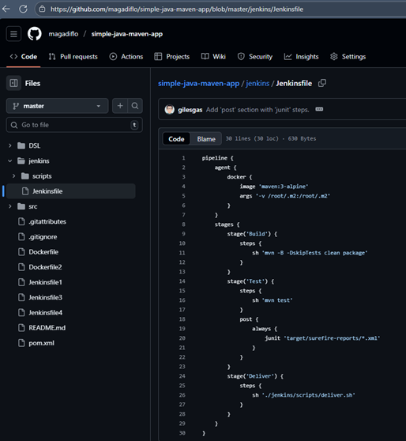
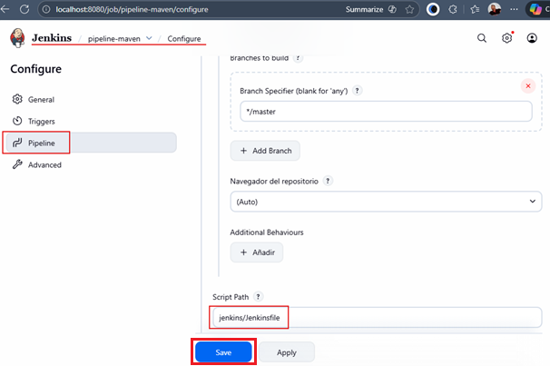
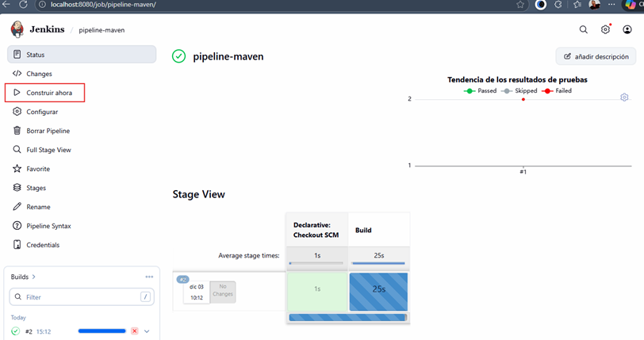
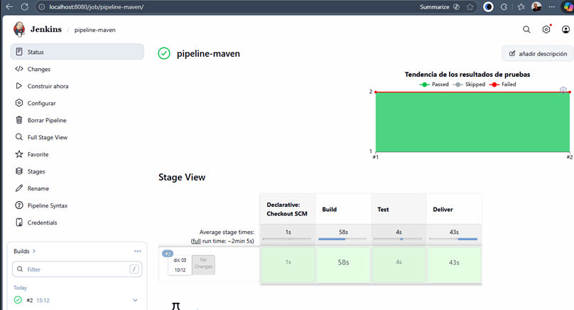

# 🚀 Sección 17: Pipeline App Java Maven Docker

---

## Introducción

En esta sección utilizaremos el plugin `Maven Integration Plugin` que instalamos en secciones anteriores.


Ahora, si nos vamos a `Administrar Jenkins` -> `Tools` en la sección instalaciones de Maven podemos observar que le
dimos el nombre `Maven en Jenkins` a nuestro Maven, además tenemos seleccionado la versión `3.9.11` que es la última
versión.


Finalmente, el repositorio que usaremos será este https://github.com/magadiflo/simple-java-maven-app, recordemos que
es un repositorio que está forkeado del tutor y a su vez, el tutor lo ha forkeado de jenkins-docs.


## Etapas y ejecución del Pipeline 1

Creamos un nuevo job llamado `pipeline-maven` del tipo `Pipeline`.


Con el job creado, nos vamos a la sección `Pipeline` y completamos los camos con los siguientes valores:

- Definition: Pipeline script from SCM
- SCM: Git
- Repository URL: https://github.com/magadiflo/simple-java-maven-app.git
- Branch Specifier: */master
- Script Path: Jenkinsfile1 <--- Indica que ese archivo está en la raíz del repositorio



Una vez configurado los valores, damos en `Save`.



## Explorando el archivo Jenkinsfile1

Recordemos que el archivo `Jenkinsfile1` está en la raíz de nuestro repositorio `simple-java-maven-app.git` en GitHub.
Este archivo contiene lo siguiente.

````groovy
pipeline {
    agent any

    tools {
        maven 'Maven en Jenkins'
    }

    stages {
        stage('Build') {
            steps {
                sh 'mvn -B -DskipTests clean package'
            }
        }
        stage('Test') {
            steps {
                sh 'mvn test'
            }
            post {
                always {
                    junit 'target/surefire-reports/*.xml'
                }
            }
        }
        stage('Deploy') {
            steps {
                sh './jenkins/scripts/deliver.sh'
            }
        }
    }
}
````

- `agent any`. Indica que este pipeline puede ejecutarse en cualquier agente disponible.
- `tools { maven 'Maven en Jenkins' }`. La directiva `tools` hace que Jenkins:
    1. Instale la herramienta Maven configurada previamente en `Manage Jenkins` → `Tools` → `Maven installations`
    2. La agregue automáticamente al `PATH` durante la ejecución del pipeline.
    3. `Maven en Jenkins` es el nombre de la instalación configurada en Jenkins. Si ese nombre no coincide → el pipeline
       fallará.
- `stage('Build')`
    - Ejecuta el comando Maven para:
        - Limpiar el proyecto (`clean`)
        - Empaquetar el artefacto (`package`)
    - `-DskipTests` evita ejecutar pruebas en esta etapa
    - `-B` (batch mode) evita prompts interactivos, recomendado en pipelines
    - Resultado: Se genera un archivo `.jar` dentro de `target/`
- `stage('Test')`
    - `sh 'mvn test'`. Ejecuta todas las pruebas unitarias del proyecto
    - `post { always { junit ... } }`. El bloque `post` se ejecuta SIEMPRE, incluso si los tests fallan.
        - Recolecta los reportes generados por surefire
        - Los publica en Jenkins
        - Permite ver:
            - Tests pasados
            - Tests fallados
            - Tendencias históricas
        - Siempre debes publicar reportes JUnit para que Jenkins registre el historial de pruebas.
- `stage('Deploy')`. Esta etapa ejecuta un script bash externo. ¿Por qué se usa un script externo?
    - Es más fácil de mantener versiones
    - Permite reutilizarlo fuera de Jenkins
    - Evita pipeline demasiado largos
    - Mejora la separación de responsabilidades

En el código anterior se hace referencia al archivo `./jenkins/scripts/deliver.sh` cuyo contenido es el siguiente.

````bash
#!/usr/bin/env bash

echo 'The following Maven command installs your Maven-built Java application'
echo 'into the local Maven repository, which will ultimately be stored in'
echo 'Jenkins''s local Maven repository (and the "maven-repository" Docker data'
echo 'volume).'
set -x
mvn jar:jar install:install help:evaluate -Dexpression=project.name
set +x

echo 'The following complex command extracts the value of the <name/> element'
echo 'within <project/> of your Java/Maven project''s "pom.xml" file.'
set -x
NAME=`mvn help:evaluate -Dexpression=project.name | grep "^[^\[]"`
set +x

echo 'The following complex command behaves similarly to the previous one but'
echo 'extracts the value of the <version/> element within <project/> instead.'
set -x
VERSION=`mvn help:evaluate -Dexpression=project.version | grep "^[^\[]"`
set +x

echo 'The following command runs and outputs the execution of your Java'
echo 'application (which Jenkins built using Maven) to the Jenkins UI.'
set -x
java -jar target/${NAME}-${VERSION}.jar 
````

### 🧩 Explicación completa del archivo deliver.sh

#### 🧱 Comando Maven para instalar artefacto

```bash
set -x
mvn jar:jar install:install help:evaluate -Dexpression=project.name
set +x
```

##### ¿Qué hace esto?

1. `set -x` → activa el "debug mode", imprime cada comando antes de ejecutarlo.
2. El comando Maven ejecuta:
    - `jar:jar` → empaqueta una versión JAR
    - `install:install` → instala el artefacto en el repositorio local `~/.m2`
    - `help:evaluate -Dexpression=project.name`  
      → evalúa el `<name>` del `pom.xml`

💡 **Esto garantiza que Jenkins tenga el artefacto instalado en su repositorio local**  
Muy útil si una etapa posterior o proyecto dependiera de este JAR.

#### 🏷️ Extrayendo el nombre del proyecto

```bash
NAME=`mvn help:evaluate -Dexpression=project.name | grep "^[^\[]"`
```

##### ¿Qué hace?

1. Ejecuta Maven para obtener `project.name`
2. Filtra la salida con grep para obtener solo la línea limpia (sin logs)
3. Asigna el valor a la variable `NAME`

Ejemplo:  
Si en tu `pom.xml` tienes:

```xml

<name>simple-app</name>
```

Entonces:

```
NAME="simple-app"
```

#### 🔢 Extrayendo la versión del proyecto

```bash
VERSION=`mvn help:evaluate -Dexpression=project.version | grep "^[^\[]"`
```

- Igual que lo anterior, pero para `<version>`.

Ejemplo:

```
VERSION="1.0-SNAPSHOT"
```

#### ▶️ Ejecutar la aplicación Java

```bash
java -jar target/${NAME}-${VERSION}.jar
```

Supongamos que:

- NAME = `simple-app`
- VERSION = `1.0-SNAPSHOT`

Entonces ejecuta:

```
java -jar target/simple-app-1.0-SNAPSHOT.jar
```

💡 **Objetivo verdadero del Deploy en este ejemplo**

Esto NO es un deploy real, sino:

- Ejecutar el JAR generado
- Ver su salida en Jenkins

En pipelines productivos, esta etapa se reemplaza por:

- Push a repositorio Docker
- Deploy a servidores
- Deploy a Kubernetes
- Copy artifacts a Nexus/Artifactory

### 🧾 Resumen final

#### ✔ Jenkinsfile1

Implementa un pipeline clásico CI:

| Stage  | Acción                                                | Tecnología       |
|--------|-------------------------------------------------------|------------------|
| Build  | Compila y empaqueta con Maven                         | Maven            |
| Test   | Ejecuta pruebas + publica resultados                  | JUnit + Surefire |
| Deploy | Ejecuta un script que instala el artefacto y lo corre | Shell script     |

#### ✔ deliver.sh

Realiza:

1. Instalación del artefacto en repositorio local
2. Obtención dinámica del nombre y versión del proyecto
3. Ejecución del `.jar` generado

### 🚀 Construyendo el Proyecto (Ejecución del Pipeline 1)

En este punto ya tenemos configurado el job `pipeline-maven` y el `Jenkinsfile1` dentro del repositorio.
Procedemos ahora a construir el pipeline y analizar lo que ocurre en cada etapa.

#### 🟦 Ejecución visual del pipeline

Al pulsar `Build Now`, Jenkins inicia la ejecución y podemos observar cómo se van procesando las etapas declaradas en
el `Jenkinsfile1`:

- Build
- Test
- Deploy



Cada etapa se marca en azul (o verde) conforme avanza correctamente.

Una vez finalizado, Jenkins muestra que la ejecución ha sido exitosa:



### 📄 Análisis del Console Output (Paso a paso)

El Console Output permite ver exactamente qué hizo Jenkins, qué comandos ejecutó y qué resultados se generaron.
A continuación explicamos los puntos más relevantes de este registro.

````bash
Started by user System Admin
Obtained Jenkinsfile1 from git https://github.com/magadiflo/simple-java-maven-app.git
[Pipeline] Start of Pipeline
[Pipeline] node
Running on Jenkins in /var/jenkins_home/workspace/pipeline-maven
[Pipeline] {
[Pipeline] stage
[Pipeline] { (Declarative: Checkout SCM)
[Pipeline] checkout
Selected Git installation does not exist. Using Default
The recommended git tool is: NONE
No credentials specified
Cloning the remote Git repository
Cloning repository https://github.com/magadiflo/simple-java-maven-app.git
 > git init /var/jenkins_home/workspace/pipeline-maven # timeout=10
Fetching upstream changes from https://github.com/magadiflo/simple-java-maven-app.git
 > git --version # timeout=10
 > git --version # 'git version 2.47.3'
 > git fetch --tags --force --progress -- https://github.com/magadiflo/simple-java-maven-app.git +refs/heads/*:refs/remotes/origin/* # timeout=10
 > git config remote.origin.url https://github.com/magadiflo/simple-java-maven-app.git # timeout=10
 > git config --add remote.origin.fetch +refs/heads/*:refs/remotes/origin/* # timeout=10
Avoid second fetch
 > git rev-parse refs/remotes/origin/master^{commit} # timeout=10
Checking out Revision 4cb06a0a3ab510ba7615bf949fb223321c01cbff (refs/remotes/origin/master)
 > git config core.sparsecheckout # timeout=10
 > git checkout -f 4cb06a0a3ab510ba7615bf949fb223321c01cbff # timeout=10
Commit message: "Update Maven tool name in Jenkinsfile"
First time build. Skipping changelog.
[Pipeline] }
[Pipeline] // stage
[Pipeline] withEnv
[Pipeline] {
[Pipeline] stage
[Pipeline] { (Declarative: Tool Install)
[Pipeline] tool
[Pipeline] envVarsForTool
[Pipeline] }
[Pipeline] // stage
[Pipeline] withEnv
[Pipeline] {
[Pipeline] stage
[Pipeline] { (Build)
[Pipeline] tool
[Pipeline] envVarsForTool
[Pipeline] withEnv
[Pipeline] {
[Pipeline] sh
+ mvn -B -DskipTests clean package
[INFO] Scanning for projects...
[INFO] 
[INFO] ----------------------< com.mycompany.app:my-app >----------------------
[INFO] Building my-app 1.0-SNAPSHOT
[INFO]   from pom.xml
[INFO] --------------------------------[ jar ]---------------------------------
[INFO] 
[INFO] --- clean:3.2.0:clean (default-clean) @ my-app ---
[INFO] 
[INFO] --- resources:3.3.1:resources (default-resources) @ my-app ---
[WARNING] Using platform encoding (UTF-8 actually) to copy filtered resources, i.e. build is platform dependent!
[INFO] skip non existing resourceDirectory /var/jenkins_home/workspace/pipeline-maven/src/main/resources
[INFO] 
[INFO] --- compiler:3.13.0:compile (default-compile) @ my-app ---
[INFO] Recompiling the module because of changed source code.
[WARNING] File encoding has not been set, using platform encoding UTF-8, i.e. build is platform dependent!
[INFO] Compiling 1 source file with javac [debug target 1.8] to target/classes
[WARNING] bootstrap class path not set in conjunction with -source 8
[WARNING] source value 8 is obsolete and will be removed in a future release
[WARNING] target value 8 is obsolete and will be removed in a future release
[WARNING] To suppress warnings about obsolete options, use -Xlint:-options.
[INFO] 
[INFO] --- resources:3.3.1:testResources (default-testResources) @ my-app ---
[WARNING] Using platform encoding (UTF-8 actually) to copy filtered resources, i.e. build is platform dependent!
[INFO] skip non existing resourceDirectory /var/jenkins_home/workspace/pipeline-maven/src/test/resources
[INFO] 
[INFO] --- compiler:3.13.0:testCompile (default-testCompile) @ my-app ---
[INFO] Recompiling the module because of changed dependency.
[WARNING] File encoding has not been set, using platform encoding UTF-8, i.e. build is platform dependent!
[INFO] Compiling 1 source file with javac [debug target 1.8] to target/test-classes
[WARNING] bootstrap class path not set in conjunction with -source 8
[WARNING] source value 8 is obsolete and will be removed in a future release
[WARNING] target value 8 is obsolete and will be removed in a future release
[WARNING] To suppress warnings about obsolete options, use -Xlint:-options.
[INFO] 
[INFO] --- surefire:3.2.5:test (default-test) @ my-app ---
[INFO] Tests are skipped.
[INFO] 
[INFO] --- jar:3.0.2:jar (default-jar) @ my-app ---
[INFO] Building jar: /var/jenkins_home/workspace/pipeline-maven/target/my-app-1.0-SNAPSHOT.jar
[INFO] ------------------------------------------------------------------------
[INFO] BUILD SUCCESS
[INFO] ------------------------------------------------------------------------
[INFO] Total time:  2.257 s
[INFO] Finished at: 2025-12-02T17:00:05Z
[INFO] ------------------------------------------------------------------------
[Pipeline] }
[Pipeline] // withEnv
[Pipeline] }
[Pipeline] // stage
[Pipeline] stage
[Pipeline] { (Test)
[Pipeline] tool
[Pipeline] envVarsForTool
[Pipeline] withEnv
[Pipeline] {
[Pipeline] sh
+ mvn test
[INFO] Scanning for projects...
[INFO] 
[INFO] ----------------------< com.mycompany.app:my-app >----------------------
[INFO] Building my-app 1.0-SNAPSHOT
[INFO]   from pom.xml
[INFO] --------------------------------[ jar ]---------------------------------
[INFO] 
[INFO] --- resources:3.3.1:resources (default-resources) @ my-app ---
[WARNING] Using platform encoding (UTF-8 actually) to copy filtered resources, i.e. build is platform dependent!
[INFO] skip non existing resourceDirectory /var/jenkins_home/workspace/pipeline-maven/src/main/resources
[INFO] 
[INFO] --- compiler:3.13.0:compile (default-compile) @ my-app ---
[INFO] Nothing to compile - all classes are up to date.
[INFO] 
[INFO] --- resources:3.3.1:testResources (default-testResources) @ my-app ---
[WARNING] Using platform encoding (UTF-8 actually) to copy filtered resources, i.e. build is platform dependent!
[INFO] skip non existing resourceDirectory /var/jenkins_home/workspace/pipeline-maven/src/test/resources
[INFO] 
[INFO] --- compiler:3.13.0:testCompile (default-testCompile) @ my-app ---
[INFO] Nothing to compile - all classes are up to date.
[INFO] 
[INFO] --- surefire:3.2.5:test (default-test) @ my-app ---
[INFO] Using auto detected provider org.apache.maven.surefire.junit4.JUnit4Provider
[INFO] 
[INFO] -------------------------------------------------------
[INFO]  T E S T S
[INFO] -------------------------------------------------------
[INFO] Running com.mycompany.app.AppTest
[INFO] Tests run: 2, Failures: 0, Errors: 0, Skipped: 0, Time elapsed: 0.046 s -- in com.mycompany.app.AppTest
[INFO] 
[INFO] Results:
[INFO] 
[INFO] Tests run: 2, Failures: 0, Errors: 0, Skipped: 0
[INFO] 
[INFO] ------------------------------------------------------------------------
[INFO] BUILD SUCCESS
[INFO] ------------------------------------------------------------------------
[INFO] Total time:  1.660 s
[INFO] Finished at: 2025-12-02T17:00:09Z
[INFO] ------------------------------------------------------------------------
Post stage
[Pipeline] junit
Recording test results
[Checks API] No suitable checks publisher found.
[Pipeline] }
[Pipeline] // withEnv
[Pipeline] }
[Pipeline] // stage
[Pipeline] stage
[Pipeline] { (Deploy)
[Pipeline] tool
[Pipeline] envVarsForTool
[Pipeline] withEnv
[Pipeline] {
[Pipeline] sh
+ ./jenkins/scripts/deliver.sh
The following Maven command installs your Maven-built Java application
into the local Maven repository, which will ultimately be stored in
Jenkinss local Maven repository (and the "maven-repository" Docker data
volume).
+ mvn jar:jar install:install help:evaluate -Dexpression=project.name
[INFO] Scanning for projects...
Downloading from central: https://repo.maven.apache.org/maven2/org/apache/maven/plugins/maven-install-plugin/3.1.2/maven-install-plugin-3.1.2.pom
...
[INFO] 
[INFO] ----------------------< com.mycompany.app:my-app >----------------------
[INFO] Building my-app 1.0-SNAPSHOT
[INFO]   from pom.xml
[INFO] --------------------------------[ jar ]---------------------------------
[INFO] 
[INFO] --- jar:3.0.2:jar (default-cli) @ my-app ---
[INFO] 
[INFO] --- install:3.1.2:install (default-cli) @ my-app ---
Downloading from central: https://repo.maven.apache.org/maven2/org/apache/maven/resolver/maven-resolver-util/1.9.18/maven-resolver-util-1.9.18.pom
...
[INFO] No artifact parameter specified, using 'com.mycompany.app:my-app:jar:1.0-SNAPSHOT' as project.
[INFO] 
my-app
[INFO] ------------------------------------------------------------------------
[INFO] BUILD SUCCESS
[INFO] ------------------------------------------------------------------------
[INFO] Total time:  12.071 s
[INFO] Finished at: 2025-12-02T17:00:23Z
[INFO] ------------------------------------------------------------------------
+ set +x
The following complex command extracts the value of the <name/> element
within <project/> of your Java/Maven projects "pom.xml" file.
++ mvn help:evaluate -Dexpression=project.name
++ grep '^[^\[]'
+ NAME=my-app
+ set +x
The following complex command behaves similarly to the previous one but
extracts the value of the <version/> element within <project/> instead.
++ mvn help:evaluate -Dexpression=project.version
++ grep '^[^\[]'
+ VERSION=1.0-SNAPSHOT
+ set +x
The following command runs and outputs the execution of your Java
application (which Jenkins built using Maven) to the Jenkins UI.
+ java -jar target/my-app-1.0-SNAPSHOT.jar
Hello World!
[Pipeline] }
[Pipeline] // withEnv
[Pipeline] }
[Pipeline] // stage
[Pipeline] }
[Pipeline] // withEnv
[Pipeline] }
[Pipeline] // withEnv
[Pipeline] }
[Pipeline] // node
[Pipeline] End of Pipeline
Finished: SUCCESS 
````

#### 🔍 1. Checkout del repositorio

````bash
Obtained Jenkinsfile1 from git https://github.com/magadiflo/simple-java-maven-app.git
Cloning repository https://github.com/magadiflo/simple-java-maven-app.git
...
Checking out Revision 4cb06a0... 
````

✔️ ¿Qué ocurre aquí?

- Jenkins clona el repositorio definido en el job.
- Obtiene el archivo `Jenkinsfile1` desde la rama master.
- Coloca el código dentro del workspace: `/var/jenkins_home/workspace/pipeline-maven`

💡 Nota:
> Aunque aparece el mensaje “Selected Git installation does not exist”, Jenkins usa el Git interno integrado en la
> imagen de Jenkins. Es normal en instalaciones básicas.

#### 🔧 2. Instalación automática de Maven (“Tool Install”)

````bash
[Pipeline] tool
[Pipeline] envVarsForTool 
````

✔️ ¿Qué hace Jenkins aquí?

El bloque:

````bash
tools {
    maven 'Maven en Jenkins'
} 
````

Hace que Jenkins:

- Descargue (si no existe) la versión de Maven configurada como `Maven en Jenkins`.
- Inserte rutas de Maven en `PATH` para que los comandos `mvn` funcionen.

#### 🏗️ 3. Etapa Build

````bash
mvn -B -DskipTests clean package 
````

✔️ ¿Qué ocurre?

1. clean → limpia la carpeta target/.
2. package → compila el proyecto y genera el .jar.
3. -DskipTests → omite la ejecución de pruebas en esta fase.
4. -B → modo batch, evita prompts interactivos (buena práctica en CI/CD).

✔️ Resultados destacados

````bash
[INFO] Building my-app 1.0-SNAPSHOT
[INFO] Building jar: .../target/my-app-1.0-SNAPSHOT.jar
BUILD SUCCESS
````

💡 Punto importante: A pesar de saltarse las pruebas aquí, en la siguiente etapa SI se ejecutarán.

#### 🧪 4. Etapa Test

````bash
mvn test 
````

¿Qué hace esta etapa?

- Ejecuta los tests definidos.
- Usa Surefire para correr pruebas JUnit.
- Genera reportes XML que serán publicados en Jenkins.

Salida relevante:

````bash
Tests run: 2, Failures: 0, Errors: 0, Skipped: 0
BUILD SUCCESS 
````

Luego Jenkins publica los reportes:

````bash
[Pipeline] junit
Recording test results
````

#### 🚚 5. Etapa Deploy

Esta etapa ejecuta el script:

````bash
./jenkins/scripts/deliver.sh
````

✔️ ¿Qué hace este script?

a) Instala el JAR en el repositorio local de Maven

````bash
mvn jar:jar install:install help:evaluate -Dexpression=project.name 
````

Esto:

- Genera el JAR (si fuera necesario).
- Lo instala en ~/.m2/repository.
- Evalúa parámetros del POM (name, version).

b) Extrae project.name y project.version

````bash
NAME=`mvn help:evaluate -Dexpression=project.name | grep "^[^\["]`
VERSION=`mvn help:evaluate -Dexpression=project.version | grep "^[^\["]` 
````

✔️ Permite obtener dinámicamente my-app y 1.0-SNAPSHOT.

c) Ejecuta el JAR final

````bash
java -jar target/${NAME}-${VERSION}.jar
````

Salida:

````bash
Hello World! 
````

#### 🟢 Resultado final

El pipeline termina correctamente:

````bash
Finished: SUCCESS 
````

Y lo más importante: ¡el artefacto resultante funciona!

````bash
Hello World! 
````

Esto confirma que:

- El código compila.
- Las pruebas pasan.
- El deploy ejecuta correctamente la aplicación Java.

## 🚀 Java Maven App en un Contenedor Docker Separado

En esta sección continuamos trabajando con el repositorio:

🔗 https://github.com/magadiflo/simple-java-maven-app

Dentro de este proyecto se encuentra el archivo `jenkins/Jenkinsfile`, donde definimos el `Pipeline Declarativo`
y los distintos stages del proceso CI/CD.

En lugar de ejecutar el pipeline directamente sobre el agente de Jenkins, esta vez lo ejecutaremos dentro de un
`contenedor Docker que contiene Maven`, lo que representa una práctica moderna muy usada en empresas.

### 🧩 Jenkinsfile – Pipeline con Maven en Docker

````groovy
pipeline {
    agent {
        docker {
            image 'maven:3-alpine'
            args '-v /root/.m2:/root/.m2'
        }
    }
    stages {
        stage('Build') {
            steps {
                sh 'mvn -B -DskipTests clean package'
            }
        }
        stage('Test') {
            steps {
                sh 'mvn test'
            }
            post {
                always {
                    junit 'target/surefire-reports/*.xml'
                }
            }
        }
        stage('Deliver') {
            steps {
                sh './jenkins/scripts/deliver.sh'
            }
        }
    }
}
````

### 🧱 Explicando el Bloque `agent`

(*y por qué ahora no usamos* `agent any`)

En lecciones anteriores utilizábamos: `agent any`. Esto le decía a Jenkins que ejecutara el pipeline en
`cualquier nodo disponible`, usando el entorno del agente directamente.

Sin embargo, esto tiene un inconveniente:

> 👉 **El agente debe tener instalado todo lo necesario (Maven, JDK, dependencias, binarios, etc.).**

Las empresas modernas `no instalan herramientas directamente en el agente de Jenkins`, porque eso genera inconsistencias
y problemas de mantenimiento.

### 🔥 Mejora profesional: usar contenedores como agentes

En su lugar, definimos:

````groovy
agent {
    docker {
        image 'maven:3-alpine'
        args '-v /root/.m2:/root/.m2'
    }
}
````

¿Qué significa esto?

| Elemento                    | Explicación                                                                      |
|-----------------------------|----------------------------------------------------------------------------------|
| 🐳 `docker { ... }`         | El pipeline usará un contenedor Docker como agente.                              |
| 📦 `image 'maven:3-alpine'` | Jenkins descargará (si es necesario) y usará esta imagen de Maven.               |
| 🔄 `-v /root/.m2:/root/.m2` | Monta el repositorio local de Maven para cachear dependencias y acelerar builds. |

💡 Ventajas (usadas en el mundo real)

- El agente no necesita tener Maven instalado.
- El entorno es `reproducible` y `portátil` (misma imagen = mismo build).
- Se evita la llamada "contaminación del agente".
- Facilita migrar pipelines entre ambientes.
- Las dependencias quedan cacheadas (gracias al volumen).

Este enfoque es tan común que incluso pipelines corporativos modernos usan `Docker-in-Docker (DinD)` o `DooD`
para builds complejos, especialmente con Node, Maven o Gradle.

### 🧪 Stage: Build

````groovy
sh 'mvn -B -DskipTests clean package'
````

- `-B` activa el modo batch (sin prompts interactivos).
- `-DskipTests` salta los tests en esta fase, porque existe un stage dedicado solo para testing.
- `clean package` empaqueta la aplicación generando el `.jar`.

> 💼 **Mejor práctica:** separar build y test permite reusar artefactos en pipelines más grandes y usar herramientas
> como `Jenkins` + `Nexus/Artifactory`.

### 🧪 Stage: Test

````groovy
sh 'mvn test'
````

Este stage ejecuta únicamente los tests, lo que da mayor claridad y separación de responsabilidades.

Luego, se publica el reporte:

````bash
junit 'target/surefire-reports/*.xml' 
````

✔️ Esto permite ver test cases, fallos y tendencias dentro del panel de Jenkins.

### 📦 Stage: Deliver

````groovy
sh './jenkins/scripts/deliver.sh'
````

Aquí se ejecuta un script externo. Este es un patrón real de empresas:

> 🏭 "Nunca embebas lógica compleja directamente en el `Jenkinsfile`; colócala en scripts versionados."

De esta manera:

- El `Jenkinsfile` es más limpio.
- La lógica está versionada junto al código.
- Puedes probar scripts localmente antes del pipeline.

La siguiente imagen muestra el archivo y el pipeline explicados:



## ⚙️ Configuración del Job y Ejecución del Pipeline con Docker

Ahora, modificamos nuestro job `pipeline-maven` indicándole a Jenkins dónde se encuentra el `Jenkinsfile`
dentro del repositorio. Como en nuestro proyecto el pipeline está bajo el directorio `jenkins/`, configuramos:

📄 Script Path: `jenkins/Jenkinsfile`



Tras guardar la configuración con `Save`, procedemos a ejecutar el job.



Si todo sale bien, veremos en la vista `Stage View` todos los pasos ejecutados correctamente en color verde:



## 📜 Análisis del Console Output del Pipeline

Ahora ejecutamos nuevamente el pipeline, esta vez con el objetivo de analizar en detalle el log del `Console Output`,
ya que la primera ejecución incluye muchos mensajes de descarga de dependencias.

A continuación explicamos cada parte del log según lo definido en nuestro `jenkins/Jenkinsfile`.

````bash
Started by user System Admin
Obtained jenkins/Jenkinsfile from git https://github.com/magadiflo/simple-java-maven-app.git
[Pipeline] Start of Pipeline
[Pipeline] node
Running on Jenkins in /var/jenkins_home/workspace/pipeline-maven
[Pipeline] {
[Pipeline] stage
[Pipeline] { (Declarative: Checkout SCM)
[Pipeline] checkout
Selected Git installation does not exist. Using Default
The recommended git tool is: NONE
No credentials specified
 > git rev-parse --resolve-git-dir /var/jenkins_home/workspace/pipeline-maven/.git # timeout=10
Fetching changes from the remote Git repository
 > git config remote.origin.url https://github.com/magadiflo/simple-java-maven-app.git # timeout=10
Fetching upstream changes from https://github.com/magadiflo/simple-java-maven-app.git
 > git --version # timeout=10
 > git --version # 'git version 2.47.3'
 > git fetch --tags --force --progress -- https://github.com/magadiflo/simple-java-maven-app.git +refs/heads/*:refs/remotes/origin/* # timeout=10
 > git rev-parse refs/remotes/origin/master^{commit} # timeout=10
Checking out Revision 4cb06a0a3ab510ba7615bf949fb223321c01cbff (refs/remotes/origin/master)
 > git config core.sparsecheckout # timeout=10
 > git checkout -f 4cb06a0a3ab510ba7615bf949fb223321c01cbff # timeout=10
Commit message: "Update Maven tool name in Jenkinsfile"
 > git rev-list --no-walk 4cb06a0a3ab510ba7615bf949fb223321c01cbff # timeout=10
[Pipeline] }
[Pipeline] // stage
[Pipeline] withEnv
[Pipeline] {
[Pipeline] isUnix
[Pipeline] withEnv
[Pipeline] {
[Pipeline] sh
+ docker inspect -f . maven:3-alpine
.
[Pipeline] }
[Pipeline] // withEnv
[Pipeline] withDockerContainer
Jenkins seems to be running inside container 4f3d6c1a282c9f8606fa9665c1ce5f0e5037d0a544a098e1531e01dc5bf72b3a
$ docker run -t -d -u 1000:1000 -v /root/.m2:/root/.m2 -w /var/jenkins_home/workspace/pipeline-maven --volumes-from 4f3d6c1a282c9f8606fa9665c1ce5f0e5037d0a544a098e1531e01dc5bf72b3a -e ******** -e ******** -e ******** -e ******** -e ******** -e ******** -e ******** -e ******** -e ******** -e ******** -e ******** -e ******** -e ******** -e ******** -e ******** -e ******** -e ******** -e ******** -e ******** -e ******** -e ******** -e ******** -e ******** -e ******** -e ******** -e ******** -e ******** -e ******** -e ******** -e ******** -e ******** maven:3-alpine cat
$ docker top a3143acd17bf5aa85a351e940758d802e4ea7e642756fb006a90c288e0cd14b4 -eo pid,comm
[Pipeline] {
[Pipeline] stage
[Pipeline] { (Build)
[Pipeline] sh
+ mvn -B -DskipTests clean package
[INFO] Scanning for projects...
[INFO] 
[INFO] ------------------------------------------------------------------------
[INFO] Building my-app 1.0-SNAPSHOT
[INFO] ------------------------------------------------------------------------
[INFO] 
[INFO] --- maven-clean-plugin:2.5:clean (default-clean) @ my-app ---
[INFO] Deleting /var/jenkins_home/workspace/pipeline-maven/target
[INFO] 
[INFO] --- maven-resources-plugin:2.6:resources (default-resources) @ my-app ---
[WARNING] Using platform encoding (UTF-8 actually) to copy filtered resources, i.e. build is platform dependent!
[INFO] skip non existing resourceDirectory /var/jenkins_home/workspace/pipeline-maven/src/main/resources
[INFO] 
[INFO] --- maven-compiler-plugin:3.1:compile (default-compile) @ my-app ---
[INFO] Changes detected - recompiling the module!
[WARNING] File encoding has not been set, using platform encoding UTF-8, i.e. build is platform dependent!
[INFO] Compiling 1 source file to /var/jenkins_home/workspace/pipeline-maven/target/classes
[INFO] 
[INFO] --- maven-resources-plugin:2.6:testResources (default-testResources) @ my-app ---
[WARNING] Using platform encoding (UTF-8 actually) to copy filtered resources, i.e. build is platform dependent!
[INFO] skip non existing resourceDirectory /var/jenkins_home/workspace/pipeline-maven/src/test/resources
[INFO] 
[INFO] --- maven-compiler-plugin:3.1:testCompile (default-testCompile) @ my-app ---
[INFO] Changes detected - recompiling the module!
[WARNING] File encoding has not been set, using platform encoding UTF-8, i.e. build is platform dependent!
[INFO] Compiling 1 source file to /var/jenkins_home/workspace/pipeline-maven/target/test-classes
[INFO] 
[INFO] --- maven-surefire-plugin:2.12.4:test (default-test) @ my-app ---
[INFO] Tests are skipped.
[INFO] 
[INFO] --- maven-jar-plugin:3.0.2:jar (default-jar) @ my-app ---
[INFO] Building jar: /var/jenkins_home/workspace/pipeline-maven/target/my-app-1.0-SNAPSHOT.jar
[INFO] ------------------------------------------------------------------------
[INFO] BUILD SUCCESS
[INFO] ------------------------------------------------------------------------
[INFO] Total time: 1.496 s
[INFO] Finished at: 2025-12-03T15:19:12Z
[INFO] Final Memory: 19M/312M
[INFO] ------------------------------------------------------------------------
[Pipeline] }
[Pipeline] // stage
[Pipeline] stage
[Pipeline] { (Test)
[Pipeline] sh
+ mvn test
[INFO] Scanning for projects...
[INFO] 
[INFO] ------------------------------------------------------------------------
[INFO] Building my-app 1.0-SNAPSHOT
[INFO] ------------------------------------------------------------------------
[INFO] 
[INFO] --- maven-resources-plugin:2.6:resources (default-resources) @ my-app ---
[WARNING] Using platform encoding (UTF-8 actually) to copy filtered resources, i.e. build is platform dependent!
[INFO] skip non existing resourceDirectory /var/jenkins_home/workspace/pipeline-maven/src/main/resources
[INFO] 
[INFO] --- maven-compiler-plugin:3.1:compile (default-compile) @ my-app ---
[INFO] Nothing to compile - all classes are up to date
[INFO] 
[INFO] --- maven-resources-plugin:2.6:testResources (default-testResources) @ my-app ---
[WARNING] Using platform encoding (UTF-8 actually) to copy filtered resources, i.e. build is platform dependent!
[INFO] skip non existing resourceDirectory /var/jenkins_home/workspace/pipeline-maven/src/test/resources
[INFO] 
[INFO] --- maven-compiler-plugin:3.1:testCompile (default-testCompile) @ my-app ---
[INFO] Nothing to compile - all classes are up to date
[INFO] 
[INFO] --- maven-surefire-plugin:2.12.4:test (default-test) @ my-app ---
[INFO] Surefire report directory: /var/jenkins_home/workspace/pipeline-maven/target/surefire-reports

-------------------------------------------------------
 T E S T S
-------------------------------------------------------
Running com.mycompany.app.AppTest
Tests run: 2, Failures: 0, Errors: 0, Skipped: 0, Time elapsed: 0.035 sec

Results :

Tests run: 2, Failures: 0, Errors: 0, Skipped: 0

[INFO] ------------------------------------------------------------------------
[INFO] BUILD SUCCESS
[INFO] ------------------------------------------------------------------------
[INFO] Total time: 1.165 s
[INFO] Finished at: 2025-12-03T15:19:15Z
[INFO] Final Memory: 11M/303M
[INFO] ------------------------------------------------------------------------
Post stage
[Pipeline] junit
Recording test results
[Checks API] No suitable checks publisher found.
[Pipeline] }
[Pipeline] // stage
[Pipeline] stage
[Pipeline] { (Deliver)
[Pipeline] sh
+ ./jenkins/scripts/deliver.sh
The following Maven command installs your Maven-built Java application
into the local Maven repository, which will ultimately be stored in
Jenkinss local Maven repository (and the "maven-repository" Docker data
volume).
+ mvn jar:jar install:install help:evaluate -Dexpression=project.name
[INFO] Scanning for projects...
[INFO] 
[INFO] ------------------------------------------------------------------------
[INFO] Building my-app 1.0-SNAPSHOT
[INFO] ------------------------------------------------------------------------
[INFO] 
[INFO] --- maven-jar-plugin:3.0.2:jar (default-cli) @ my-app ---
[INFO] 
[INFO] --- maven-install-plugin:2.4:install (default-cli) @ my-app ---
[INFO] Installing /var/jenkins_home/workspace/pipeline-maven/target/my-app-1.0-SNAPSHOT.jar to /var/jenkins_home/workspace/pipeline-maven/?/.m2/repository/com/mycompany/app/my-app/1.0-SNAPSHOT/my-app-1.0-SNAPSHOT.jar
[INFO] Installing /var/jenkins_home/workspace/pipeline-maven/pom.xml to /var/jenkins_home/workspace/pipeline-maven/?/.m2/repository/com/mycompany/app/my-app/1.0-SNAPSHOT/my-app-1.0-SNAPSHOT.pom
[INFO] 
[INFO] ------------------------------------------------------------------------
[INFO] Building my-app 1.0-SNAPSHOT
[INFO] ------------------------------------------------------------------------
[INFO] 
[INFO] --- maven-help-plugin:3.3.0:evaluate (default-cli) @ my-app ---
[INFO] No artifact parameter specified, using 'com.mycompany.app:my-app:jar:1.0-SNAPSHOT' as project.
[INFO] 
my-app
[INFO] ------------------------------------------------------------------------
[INFO] BUILD SUCCESS
[INFO] ------------------------------------------------------------------------
[INFO] Total time: 0.894 s
[INFO] Finished at: 2025-12-03T15:19:17Z
[INFO] Final Memory: 16M/303M
[INFO] ------------------------------------------------------------------------
+ set +x
The following complex command extracts the value of the <name/> element
within <project/> of your Java/Maven projects "pom.xml" file.
++ mvn help:evaluate -Dexpression=project.name
++ grep '^[^\[]'
+ NAME=my-app
+ set +x
The following complex command behaves similarly to the previous one but
extracts the value of the <version/> element within <project/> instead.
++ mvn help:evaluate -Dexpression=project.version
++ grep '^[^\[]'
+ VERSION=1.0-SNAPSHOT
+ set +x
The following command runs and outputs the execution of your Java
application (which Jenkins built using Maven) to the Jenkins UI.
+ java -jar target/my-app-1.0-SNAPSHOT.jar
Hello World!
[Pipeline] }
[Pipeline] // stage
[Pipeline] }
$ docker stop --time=1 a3143acd17bf5aa85a351e940758d802e4ea7e642756fb006a90c288e0cd14b4
$ docker rm -f --volumes a3143acd17bf5aa85a351e940758d802e4ea7e642756fb006a90c288e0cd14b4
[Pipeline] // withDockerContainer
[Pipeline] }
[Pipeline] // withEnv
[Pipeline] }
[Pipeline] // node
[Pipeline] End of Pipeline
Finished: SUCCESS
````

### 🧩 1. Inicio del Pipeline y Checkout del Repositorio

````bash
Started by user System Admin
Obtained jenkins/Jenkinsfile from git https://github.com/magadiflo/simple-java-maven-app.git 
````

📌 `Jenkins detecta el Script Path` y descarga únicamente el `Jenkinsfile` desde esa ruta.

Luego empieza la etapa implícita:

#### 🏁 Declarative: Checkout SCM

Esto lo agrega Jenkins automáticamente antes del primer stage para obtener el código fuente.

````bash
Fetching changes from the remote Git repository
Checking out Revision ...
Commit message: "Update Maven tool name in Jenkinsfile" 
````

✔️ Jenkins obtiene la última versión del repositorio y deja el workspace listo para los stages.

💡 Nota profesional
> En pipelines corporativos es común desactivar este stage automático si deseas un control total del checkout usando
> checkout scm dentro de un stage personalizado.

### 🐳 2. Preparación del Agente Docker

El Jenkinsfile define:

````groovy
agent {
    docker {
        image 'maven:3-alpine'
        args '-v /root/.m2:/root/.m2'
    }
}
````

Jenkins prepara el contenedor:

````bash
docker inspect -f . maven:3-alpine 
````

✔️ Verifica si la imagen existe, y si no, la descarga.

Luego crea el contenedor:

````bash
docker run -t -d -u 1000:1000 \
  -v /root/.m2:/root/.m2 \
  --volumes-from <container-id> \
  maven:3-alpine cat
````

🔍 ¿Qué significa esto?

| Acción                   | Explicación                                                                                          |
|--------------------------|------------------------------------------------------------------------------------------------------|
| `-u 1000:1000`           | Ejecuta el contenedor con el mismo UID/GID que el usuario Jenkins para evitar problemas de permisos. |
| `-v /root/.m2:/root/.m2` | Monta el repositorio Maven para cachear dependencias entre builds.                                   |
| `--volumes-from <id>`    | Hereda volúmenes del contenedor principal de Jenkins.                                                |
| `cat`                    | El contenedor se mantiene en ejecución en modo “dummy” mientras Jenkins ejecuta comandos dentro.     |

💡 Práctica real:
> Este patrón es estándar en pipelines modernos: usar imágenes livianas y reproducibles en vez de depender del agente
> Jenkins.

### 🛠️ 3. Stage: Build

Jenkins ejecuta:

````groovy
sh 'mvn -B -DskipTests clean package'
````

En el log vemos:

````bash
[INFO] Scanning for projects...
[INFO] Building my-app 1.0-SNAPSHOT
````

Luego:

- Limpia el directorio `target`.
- Compila las clases del proyecto.
- Empaqueta el `.jar`.

✔️ El build termina con `BUILD SUCCESS`.

💡 Nota:
> Los warnings sobre el encoding son comunes cuando no defines `<project.build.sourceEncoding>` en el `pom.xml`.

👉 En empresas SIEMPRE se define para evitar builds dependientes del sistema operativo.

### 🧪 4. Stage: Test

Ejecuta:

````groovy
sh 'mvn test'
````

El contenedor reutiliza el workspace y compila solo si hay cambios. Luego:

````bash
Running com.mycompany.app.AppTest
Tests run: 2, Failures: 0 
````

✔️ Los tests se ejecutan correctamente.

Finalmente, `Jenkins` publica el reporte:

````bash
Recording test results 
````

Esto viene del bloque:

````groovy
post {
    always {
        junit 'target/surefire-reports/*.xml'
    }
}
````

### 📦 5. Stage: Deliver

Este stage ejecuta el script real del proyecto:

````groovy
sh './jenkins/scripts/deliver.sh'
````

Dentro del log vemos tres grandes acciones:

#### 🔹 5.1 Instalar el artefacto en el repositorio local Maven del contenedor

````bash
mvn jar:jar install:install … 
````

Esto instala:

````bash
my-app-1.0-SNAPSHOT.jar
my-app-1.0-SNAPSHOT.pom 
````

⚙️ En pipelines reales, este proceso se haría hacia un repositorio corporativo (Nexus/Artifactory), pero para el curso
basta con usar el repositorio local.

#### 🔹 5.2 Extraer valores del `pom.xml`

El script ejecuta:

````bash
mvn help:evaluate -Dexpression=project.name 
````

…para obtener:

````bash
my-app 
````

Luego obtiene la versión:

````bash
1.0-SNAPSHOT
````

Estas operaciones se usan como ejemplo para mostrar cómo leer valores del POM desde el pipeline.

#### 🔹 5.3 Ejecutar la aplicación ya construida

Finalmente se ejecuta:

````bash
java -jar target/my-app-1.0-SNAPSHOT.jar
Hello World! 
````

✔️ Esto demuestra que el pipeline no solo *compila*, sino que el artefacto
**funciona correctamente dentro del contenedor Maven.**

### 🧹 6. Limpieza del contenedor

Al finalizar, Jenkins elimina el contenedor temporal usado como agente:

````bash
docker stop ...
docker rm -f --volumes ... 
````

💡 Motivo profesional:
> Los agentes Docker no deben quedar vivos, para evitar consumo innecesario de recursos.

### 🎉 Resultado final

````bash
Finished: SUCCESS
````

Todos los stages se ejecutaron correctamente:

- Checkout
- Build
- Test
- Deliver

✔️ El uso de Docker como agente permitió un entorno limpio, reproducible y aislado.
