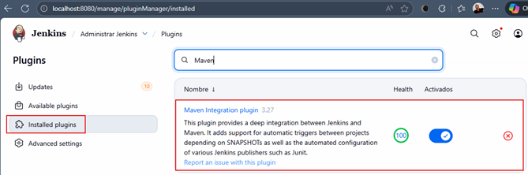
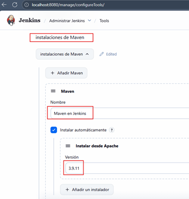
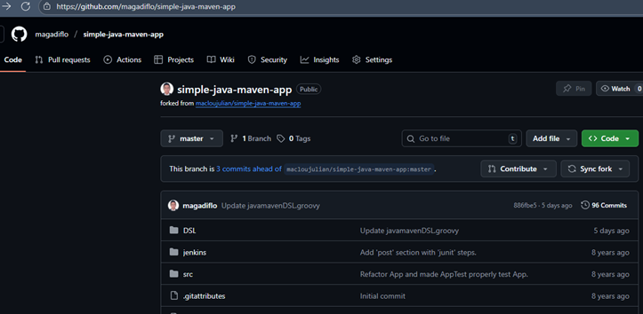

# 🚀 Sección 17: Pipeline App Java Maven Docker

---

## Introducción

En esta sección utilizaremos el plugin `Maven Integration Plugin` que instalamos en secciones anteriores.

Ahora, si nos vamos a `Administrar Jenkins` -> `Tools` en la sección instalaciones de Maven podemos observar que le
dimos el nombre `Maven en Jenkins` a nuestro Maven, además tenemos seleccionado la versión `3.9.11` que es la última
versión.

Finalmente, el repositorio que usaremos será este https://github.com/magadiflo/simple-java-maven-app, recordemos que
es un repositorio que está forkeado del tutor y a su vez, el tutor lo ha forkeado de jenkins-docs.

