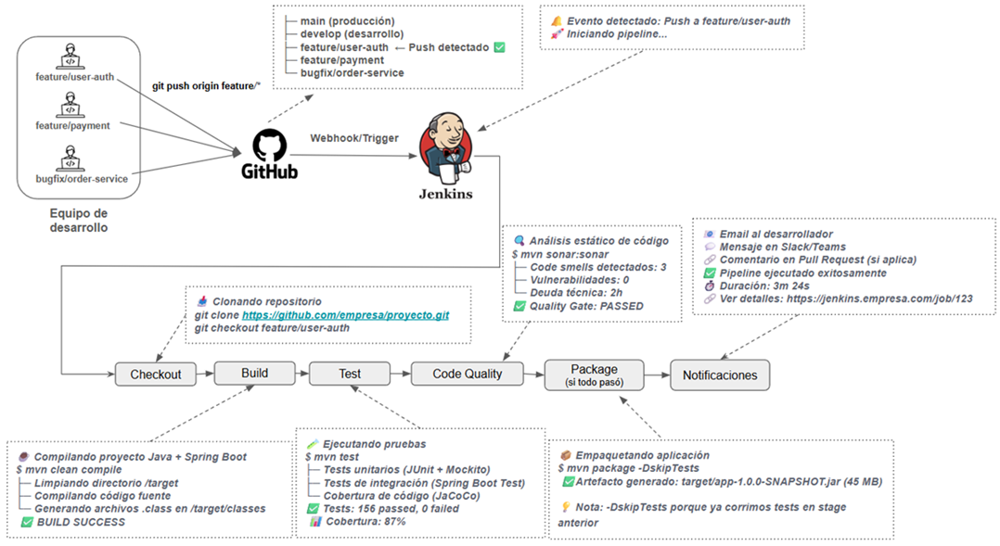

# [La Guía de Jenkins: ¡De Cero a Experto! | septiembre 2025](https://www.udemy.com/course/la-guia-de-jenkins-de-cero-a-experto)

- Curso tomado de `Udemy` de `Julián Mac Loughlin`.
- Este curso se utiliza como base de referencia, pero algunos conceptos se ampliarán y aclararán mediante investigación
  adicional.
- Además, se incluirán explicaciones complementarias y ejemplos prácticos que no forman parte del curso original, con el
  objetivo de lograr una comprensión más profunda de cada tema.

---

## 🚀 ¿Qué es la Integración Continua (CI)?

La `Integración Continua (CI)` es una práctica esencial en el desarrollo moderno de software que consiste en integrar
los cambios de código en un `repositorio compartido` de forma `frecuente y automatizada`
(idealmente varias veces al día).

Cada vez que un desarrollador sube código al repositorio (por ejemplo, en `GitHub`, `GitLab` o `Bitbucket`),
una `herramienta de CI` —como `Jenkins`— ejecuta automáticamente procesos que verifican que el nuevo código no rompa
la aplicación.

💡 En otras palabras
> La `CI` permite detectar errores en etapas tempranas del desarrollo, evitando conflictos al fusionar código y
> garantizando que la aplicación esté `siempre en un estado funcional y comprobado`.

### 🎯 ¿Cuándo se activa exactamente el proceso de CI?

El proceso de CI se activa cuando haces `git push` a una rama específica del `repositorio remoto` (no con tus commits
locales). La configuración exacta depende de tu estrategia de branching:

#### 📋 Escenarios comunes en empresas

| Escenario              | ¿Cuándo se activa CI?                             | CI (lo que se ejecuta)                   | CD (lo que se ejecuta)                      |
|------------------------|---------------------------------------------------|------------------------------------------|---------------------------------------------|
| Push a feature branch  | Cuando haces `git push origin feature/mi-feature` | ✅ Build + Tests unitarios                | ❌ No deploy                                 |
| Pull Request a develop | Cuando abres/actualizas un PR hacia `develop`     | ✅ Build + Tests + Code Quality           | ❌ No deploy                                 |
| Merge a develop        | Cuando se acepta el PR y se fusiona a `develop`   | ✅ Build + Tests + Code Quality + Package | ✅ Deploy automático a QA/Dev                |
| Merge a main/master    | Cuando se fusiona `develop` → `main`              | ✅ Build + Tests + Package                | ✅ Deploy a Producción (manual o automático) |

📌 Resumen conceptual

| Concepto | ¿Qué hace?              | ¿Cuándo termina?                            |
|----------|-------------------------|---------------------------------------------|
| `CI`     | Integra y valida código | Cuando se genera el `.jar` o imagen Docker  |
| `CD`     | Despliega el artefacto  | Cuando la app está corriendo en un servidor |

> ⚠️ Aunque hagamos `push` a nuestra rama `feature/*`, la `CI` puede activarse si `Jenkins` está configurado para
> monitorear esas ramas. Esto permite detectar errores antes de crear el `PR`.

## 🔄 ¿Cómo funciona el flujo de Integración Continua?

La `Integración Continua (CI)` se activa automáticamente cuando un desarrollador realiza un `git push` de sus cambios
a una rama específica del repositorio remoto (por ejemplo, `GitHub`, `GitLab` o `Bitbucket`). Este evento `desencadena`
un flujo automatizado que verifica la calidad e integridad del código antes de que pueda ser integrado al código
base principal.

### 🔔 Trigger del proceso

Cuando los cambios llegan al repositorio remoto, se dispara un `webhook` o `trigger` configurado previamente que
notifica al servidor de `CI` (en nuestro caso `Jenkins`) sobre la existencia de nuevo código.

`Jenkins`, al recibir esta notificación, `inicia inmediatamente la ejecución del pipeline de integración continua`.

> 💡 `Nota importante`: Los commits locales no activan el proceso de CI. Solo cuando haces `git push` y el código
> llega al repositorio remoto es que se desencadena el flujo automatizado.

### 🧱 Etapas del pipeline de CI

El pipeline de CI ejecuta una serie de `stages (etapas)` secuenciales que validan diferentes aspectos de tu código. Si
alguna etapa falla, el pipeline se detiene y notifica al equipo para que corrijan el problema lo antes posible:

### 1.📥 Checkout del código

`Jenkins` clona el repositorio y hace `checkout` de la rama específica donde se realizó el push. Esta etapa descarga
todo el código fuente al workspace del servidor de `CI` para poder trabajar con él.

````bash
$ git clone https://github.com/empresa/proyecto.git
$ git checkout feature/user-authentication 
````

### 2.⚙️ Build (Compilación)

Se ejecuta el comando `mvn clean compile` que limpia el directorio `/target` (si existe) y compila todo el código
fuente Java del proyecto. Los archivos `.class` resultantes se generan en `/target/classes`. Esta etapa verifica que
no existan errores de sintaxis o dependencias faltantes.

````bash
$ mvn clean compile
# Resultado: /target/classes con todos los .class compilados
````

> ⚠️ `Importante`: Esta etapa NO genera el archivo `.jar`. Solo compila el código fuente.

### 3. 🧪 Test (Pruebas)

Se ejecuta `mvn test` para correr todas las pruebas automatizadas del proyecto: `tests unitarios`
(con `JUnit` y `Mockito`), `tests de integración` (con `Spring Boot Test`) y se genera el reporte de cobertura de
código (con `JaCoCo`). Esta es una de las etapas más críticas porque garantiza que los nuevos cambios no rompan
funcionalidades existentes.

````bash
$ mvn test
# Ejecuta todos los tests en src/test/java
# Genera reportes en /target/surefire-reports 
````

Como desarrollador `Java/Spring Boot`, es tu responsabilidad:

- Escribir tests unitarios para tus servicios y componentes.
- Mantener una cobertura de código aceptable (típicamente `>80%`).
- Asegurar que todos los tests pasen antes de hacer push.

### 4. 🔍 Code Quality (Calidad de código)

Se ejecuta un análisis estático del código usando herramientas como `SonarQube`. Este análisis detecta code smells,
vulnerabilidades de seguridad, duplicación de código, complejidad ciclomática elevada y otros problemas de calidad.
El objetivo es mantener un código limpio, mantenible y seguro.

````bash
$ mvn sonar:sonar
# Sube métricas a SonarQube server
# Evalúa contra Quality Gates configurados
````

### 5. 📦 Package (Empaquetado)

Se ejecuta `mvn package -DskipTests` para empaquetar toda la aplicación en un archivo ejecutable. En proyectos Spring
Boot, esto genera un fat `JAR` (JAR con todas las dependencias incluidas) en el directorio `/target`. Este artefacto es
el entregable final de la fase de CI.

````bash
$ mvn package -DskipTests
# Genera: /target/mi-app-1.0.0-SNAPSHOT.jar
````

> 💡 `Nota`: Usamos `-DskipTests` porque ya ejecutamos los tests en el stage anterior, evitando duplicar el tiempo de
> ejecución.

Este `.jar` generado es:

- Autónomo (contiene todas las dependencias).
- Ejecutable directamente con `java -jar`
- El artefacto que se desplegará en los diferentes ambientes (`QA`, `Staging`, `Producción`).

### 6. 📧 Notificaciones

Una vez finalizado el pipeline (exitoso o fallido), `Jenkins` envía notificaciones al equipo a través de múltiples
canales: `email`, `Slack`, `Microsoft Teams`, o comentarios directamente en el `Pull Request` de `GitHub`. Estas
notificaciones incluyen el estado del build, duración, enlace a los logs y reporte de tests.

### 📊 Diagrama del proceso



### 🎯 Objetivo principal de CI

Verificar que el código es válido, se integra correctamente con el código existente y genera un artefacto deployable.
En otras palabras, CI te garantiza que tu código:

- ✅ Compila sin errores
- ✅ Pasa todas las pruebas automatizadas
- ✅ Cumple con los estándares de calidad establecidos
- ✅ Está listo para ser desplegado
